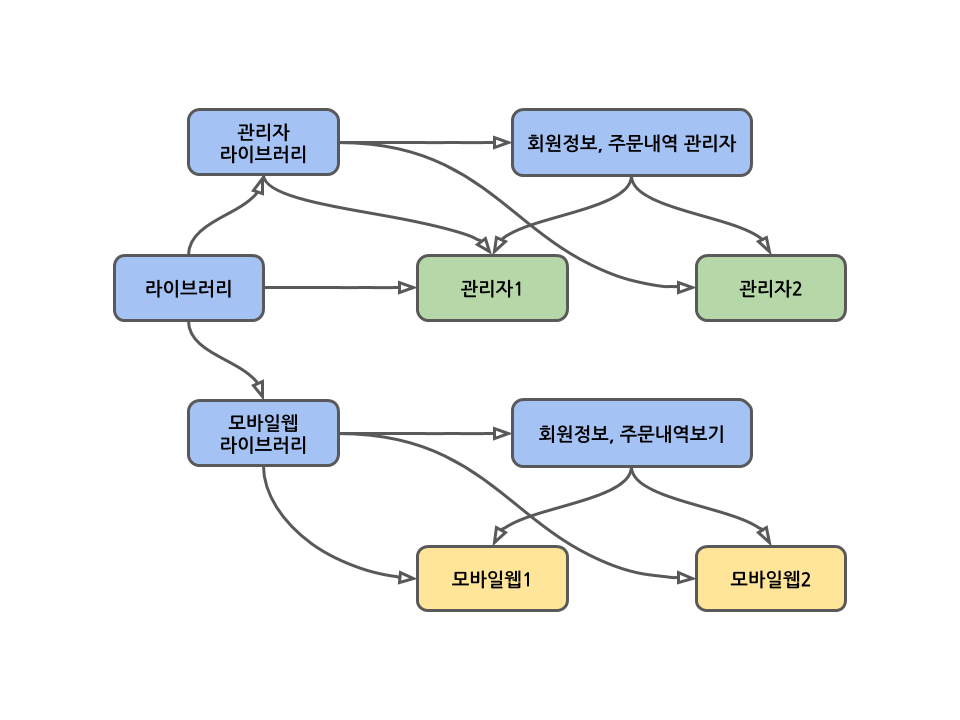

# 공유하는 코드를 어떻게 관리하지?

개발팀이 커지면 라이브러리와 앱이 N:N으로 늘어나 의존성 관리가 복잡해지는 시기가 온다. 쇼핑몰은 보통 웹앱과 관리자와 한 세트 (이하 세트라 함)로 개발하여 관리한다. 한 세트로 운영하다가 만약 회사에서 새로운 서비스를 오픈한다면 총 2세트가 되고. 서비스는 분리되더라도 회원, 주문을 하나로 통합하므로 2세트가 더 추가된다.

결국 총 8개의 웹 앱 리포지토리를 운영하게 된다. 추가로 공통으로 사용하는 코드를 별도의 리포지토리로 만드므로 최소 9개 이상의 리포지토리를 운영하게 된다. 이 시기가 되면 코드를 어떻게 공유해야 하는지에 대한 이슈를 맏닥뜨리게 된다. 먼저 코드를 공유하는 방법은 크게 3종류가 있는데 나열해 보면

1. 중복되는 함수들을 별도의 파일로 만들어 같이 사용한다. 위의 상황에서는 사용할 수 없다
2. 모듈을 npm에 등록하여 공유한다. 버전관리는 덤으로 괜찮은 방법이지만 문제가 있다. 다음 섹션에서 다룬다
3. git subversion을 사용한다. 이것의 장단점도 뒤에서 다룬다
4. 모든 웹 앱과 공유 코드를 하나의 리포지토리에서 관리한다. 이 방식이 Monorepo다



# npm을 이용한 방법의 불편한 점

공유할 코드가 있는 모듈을 npm에 publish 하고. 웹 앱 리포지토리에서 설치해 사용한다. 공유 모듈이 늘어나면 이 방식은 매우 불편하다. 개발할 때는 웹앱이건 라이브러리건 수정이 빈번한데. npm 으로 설치한 모듈은 트랜스파일이 된 코드라 직접 js파일을 디버깅하는데는 불편한 점이 있다.

**npm link** 를 이용하는 방법도 있는데. 이 방법은 npm 전역에 패키지를 임의로 설치하는 방법으로 설치해서 디버깅하고 link를 제거하는 일련의 과정이 너무 귀찮다. B패키지를 설치하고 버그를 수정한 경우 이를 B 리포지토리의 코드에도 반영하여 npm에 다시 publish해 주어야 한다.

예제의 9개의 리포지토리들은 분명 서로 N개 이상의 의존성을 가지고 있을 것인데. 리포지토리 하나하나를 이런 식으로 디버깅하는것은 너무 번거롭다. 위의 그림에서 관리자1 프로젝트가 바로 그런 상황이다.

---

1. 각 웹 앱들이

단순하게는 별도 모듈로 분리하는 방법이 있고. npm과 같은 패키지 관리 도구를 이용하는 방법이 있다. 그리고 이 글에서 다룰 모노레포 방식을 이용하는 방법도 있다.

사실 지금 재직중인 회사가 성장하여 운영하는 서비스가 늘어나고 그에 따라 공유하는 리포지토리도 늘어나고 있다. 초창기에는 모바일 웹, PC용 관리자 웹 두 개와 그 두개의 프로젝트가 공유하는 유틸성 라이브러리가 하나 뿐이어서 단순했는데, 지금은 서비스와 라이브러리가 n:n의 관계가 되었고 점점 확장되는 상황이다.

# 하나의 리포지토리 VS 여러 리포지토리

모노레포를 도입할 때 제일 먼저 고려해야 하는 것은 회사의 모든 앱들이 하나의 리포지토리에서 관리되어도 불편함이 없는지이다. 결론부터 언급하는 느낌이지만 모노레포의 효율은 모든 리포지토리. 최소 사업이 확장됨에 따라 추가, 삭제되는 프로젝트를 하나의 리포지토리에서 관리할 때 최대가 된다.

내가 모노레포의 도입을 검토할 때 시행착오가 있었던 부분도 바로 이것이었다. 적당히 분리된 리포지토리에서 코드의 공유를 자유롭게 해주는 개념으로 받아들였었는데. 아니었다. 하나라도 분리된 리포지토리가 있는 경우 모노레포의 장점은 희석된다. 이 내용은 이어지는 글에서 다룬다.

# 코드를 공유하는 방법1: 유틸리티 모듈

코드를 공유하는 방법 중 가장 단순한 방법은 별도의 유틸 모듈로 분리하는 것이다. 정상적인 코드리뷰를 하면 십중팔구 코멘트 되는 내용이기도 하다. 중복 코드를 별도의 함수로 추출해 외부 모듈에 두고 import 하여 이용한다.

```ts
/**
 * 공유 함수 모음: util.ts
 */
function commifiy(   numStr: string): string {
  return numStr
}


/**
 * a.ts
 */
import {commify} from '../util';

class A {}


/**
 * b.ts
 */
import {commify} from '../util';

class B {}
```

# 코드를 공유하는 방법2: npm
