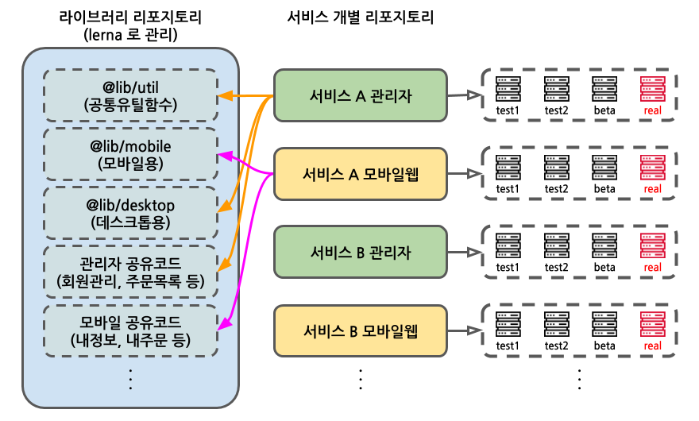
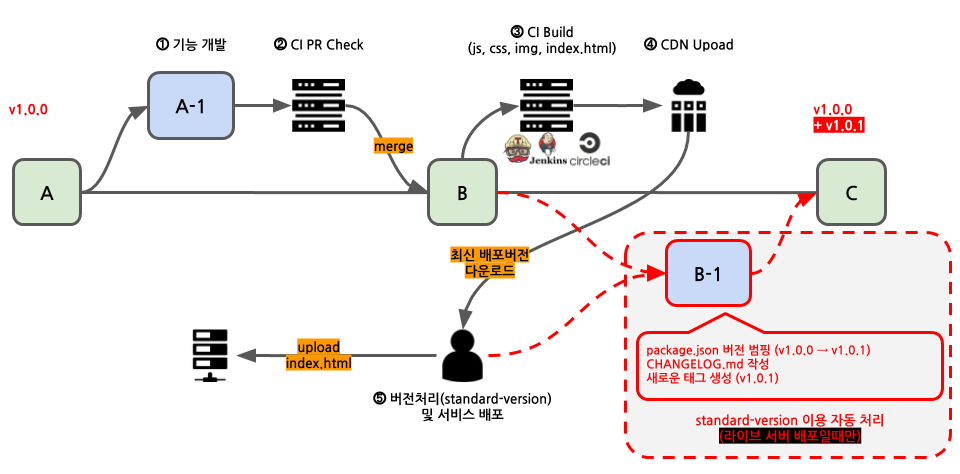

# standard-version 소개

lerna의 버전 자동화 기능을 사용하려면 `--conventional-commits` 인자를 전달해야 한다. 이름에서 알 수 있듯 이 기능은 [Conventional Commit](https://www.conventionalcommits.org/ko/v1.0.0/) 컨벤션에 따라 커밋 로그를 작성한 경우에 동작한다.

lerna외에도 위의 컨벤션 기반 버전 자동화를 제공하는 도구는 여럿 있는데 그 중 [standard-version](https://github.com/conventional-changelog/standard-version)은 컨벤션 사이트 하단에 소개된 또 다른 nodejs 기반의 도구이다. lerna는 모노레포 관리가 중점이라면 standard-version은 단일 리포지토리에 기능을 제공한다.

그래서 lerna가 제공하는 것 보다 **직관적이며 다루기 쉽고 다양한 기능들을 제공**한다. 그 다양한 기능 중에는 배포 시점에 태그의 커밋 메시지 포멧을 변경하거나 changelog를 받아 응용할 수 있는 별도의 훅도 만들 수 있다.

이 도구는 [conventional-changelog](https://github.com/conventional-changelog)프로젝트의 일부이며 여기에는 유명한 커밋메시지 검사 도구 [commitlint](https://github.com/conventional-changelog/commitlint)도 포함되어 있다.

```bash
# 현재 리포지토리를 버전 범핑(버전을 올리는 것)없이 첫 번째 릴리즈로 설정한다
# 0.0.0 git tag를 만들고, CHANGELOG.md파일을 빈 채로 만들고 자동으로 커밋함 (푸시는 안함)
standard-version --first-release
# CHANGELOG.md 생성 커밋을 태그와 함께 푸시하고 npm publish를 직접 수행한다
git push HEAD --follow-tags && npm publish
```

# 서비스를 위한 버전 자동화

지난 번 [모노레포 도입 검토](/post/앱과-라이브러리-관리에-Monorepo)때 사내의 모든 프로젝트를 lerna monorepo로 관리하는것은 **서비스들의 커밋이 섞여 각 담당자들이 라이브러리 수정 코드만을 보고 사이드 이펙트를 예측할 수 있을 지 확실하지 않다**는 문제로 진행하지 않기로 했다. 라이브러리 프로젝트들만 lerna를 적용하여 대략 아래 그림과 같은 구조로 정리했다.



원래 기존의 프로세스대로는 롤백하는 과정이 매우 불편해서 검토를 하게 된 것이었는데 위의 이유로 적용할 수 없게 되면서. **서비스들은 앞서 설명했던 standard-version을 이용하여 전략을 수립**하게 되었고 지금은 별다른 문제 없이 운영하고 있다.

하지만 도입 과정에 아쉬운 부분이 있었고 그래서 도입완료후의 프로세스와 이상적이라고 생각했던 프로세스를 정리해 보려고 한다.

# 새로 도입한 배포 프로세스

> 먼저 그림으로 보고 각 단계에서 하는 일들을 아래에서 설명한다



## 1. 기능 개발

커밋 메시지는 [Conventional Commit](https://www.conventionalcommits.org/ko/v1.0.0/)을 준수해야 한다. 작성이 어렵다면 도움을 주는 [commitizen](https://github.com/commitizen/cz-cli), [commitlint](https://github.com/conventional-changelog/commitlint)을 쓰고 [husky](https://github.com/typicode/husky)를 이용해서 커밋 시점에 메시지가 올바르게 작성되었는지 검사하도록 한다.

```bash
# 커밋 메시지 작성을 대화형으로 도와주는 도구 설치
npm install -g commitizen

# 설치하고 나면 아래 명령으로 커밋 메시지를 대화형 도구로 작성할 수 있다
git cz
Select the type of change that you're commiting: (use arrow keys)
> feat:     A new feature
  fix:      A bug fix
  docs:     Documentation only changes
  styles:   Changes that do not effect the meaning of the code
            (white-space, formatting, missing semi-colons, etc)
  refactor: A code change that neither fixes a bug or add a feature
  perf:     A code change that improves performance
  test:     Adding missing tests
  chore:    Changes to the build process or auxiliary tools
            and libraries such as documentation generation


# 커밋 시 커밋 메시지들을 검사하기 위한 도구 설치
npm install -D commitlint husky

```

husky를 설치하고 나면 아래의 설정을 통해 커밋 시점에 메시지를 검사할 수 있다.

```json
// package.json 에 커밋할 때 메시지들을 검사하도록 수정
{
  "husky": {
    "hooks": {
      "commit-msg": "commitlint -E HUSKY_GIT_PARAMS"
    }
  }
}
```

## 2. CI PR Check

Pull Request를 만들어 코드리뷰를 한다면 PR Check 기능을 이용해 커밋 메시지를 검사해 준다. 개발자가 미숙하거나 인수인계가 미흡하여 잘못된 커밋 메시지가 포함될 수 있기 때문이다. 따로 하지 않는다면 이 단계는 건너뛰고 다음 빌드 과정에서 하면 된다.

```bash
# 커밋 메시지들이 컨벤션에 맞게 작성되었는지 검사한다
git log -1 --pretty=format:"%s" | npx commitlint
```

## 3. CI 빌드 설정

> 전 단계를 건너뛰었다면 이 단계에서 커밋 메시지를 검사하도록 해 준다.

배포 빌드에서는 특정 커밋 메시지엔 빌드가 돌지 않도록 설정해야 한다. 위의 그림에서 **B-1**커밋은 개발 장비에서 배포를 위해 `standard-version`명령을 실행하여 package.json의 버전 범핑과 CHANGELOG.md의 수정사항 커밋이 추가된 경우인데 이때 빌드는 무의미하다.

JENKINS기준으로는 **Git Plugin** > **Polling ignores commits with certain messages** 항목을 추가하고 값은 `(?s).*chore\(release\).*`로 설정하면 된다. 비슷한 기능을 Git Actions, Travis나 Circie 에서도 지원하므로 똑같이 설정하면 된다.

## 4. CDN 업로드

CI가 만든 css, js, jpg, html등의 리소스 파일을 CDN에 업로드하도록 한다. 이 때 서비스가 여러개라면 겹치지 않도록 나누어야 한다. 또 테스트 서버가 여럿이라면 또 페이즈별로 겹치지 않도록 폴더를 나누어 주어야 할 것이다. 아래는 실제로 사용하고 있는 주소의 형태를 변형한 예제이다.

> **서비스 A 페이즈: beta**
>
> 1. `https://mycdn.net/mycompany/service-a/beta/2b30274/`
>
>    위 경로에 빌드 결과물들을 업로드한다.
>
> 2. `https://mycdn.net/mycompany/service-a/beta/latest`
>
>    이 파일에는 1번의 url (최신 버전이 무엇인지)를 기록해 둔다
>
> **서비스: B, 페이즈: real**
>
> 1. `https://mycdn.net/mycompany/service-b/real/2b30274/`
> 2. `https://mycdn.net/mycompany/service-b/real/latest`

이 단계에서는 **빌드 결과물을 어디에 그리고 얼마동안 보관해야 하는지**에 대한 고민이 있었다. 글의 뒷 부분인 이상적인 프로세스에 관련 내용을 정리했다.

## 5. 배포 및 버저닝

### 웹 서버에 리소스 배포하기

이 단계에서는 CDN으로부터 최신 버전의 index.html파일을 받아 웹서버에 배포한다. 최신버전은 전 단계의 url을 보면 알 수 있듯 **서비스명/페이즈/latest** 규칙이다. 배포 스크립트는 각 환경에 맞게 작성하면 된다.

```bash
#!/usr/bin/env bash

PACKAGE_DIR=$(curl https://mycdn.net/mycompany/$SERVICE/$PHASE/latest)
curl -o index.html $PACKAGE_DIR/index.html
curl -T index.html -u userid:passswd ftp://10.10.1.55/www/publish
```

혹시 index.html만을 배포하는 이유를 궁금해할 수 있을 듯 한데. 내용을 보면 이해할 수 있을 것이다.

```html
<!DOCTYPE html>
<html>
  <head>
    <title>Service A App</title>
  </head>
  <body>
    <app-root></app-root>
    <script src="https://mycdn.net/mycompany/service-a/real/2b30274/main.js"></script>
    <script src="https://mycdn.net/mycompany/service-a/real/2b30274/polyfill.js"></script>
    <script src="https://mycdn.net/mycompany/service-a/real/2b30274/vendor.js"></script>
    <script src="https://mycdn.net/mycompany/service-a/real/2b30274/common.js"></script>
  </body>
</html>
```

angular는 빌드할 때 --deploy-url인자를 전달하면 만들어내는 index.html에 위와 같이 script src들과 내부에서 쓰는 css의 url에 prefix를 붙여 준다. 따라서 index.html만 배포해도 리소스들을 사용할 수 있기 때문이다. 만약 상대경로로 포함하는 방식이라면 관련 파일을 모두 업로드하도록 스크립트를 작성하면 된다.

### 라이브 배포 후 버저닝

> ⚠️ 이 과정은 테스트 서버들이 아닌 라이브에 배포 한 직후에만 실행하고 있다. 테스트 서버들과 태그가 겹치는 문제가 발생할 수 있기 때문이다.

배포가 완료되었다면 이어서 버저닝을 할 차례이다. 이 과정은 뒤에서 설명할 롤백을 위해 꼭 필요한 과정으로 standard-version을 이용할 것이다.

```bash
#!/usr/bin/env bash

# 버저닝은 배포할 브랜치(단일)에서 수행해야 한다
# 혹 다른 브랜치에서 수행하는 불상사를 막기 위해 몇 가지 처리를 한다
git checkout master
git pull
npx git-branch-is master


# 서비스는 항상 minor릴리즈만 한다
standard-version --release-as=minor --
# package.json, CHANGELOG.md파일들 새 태그와 함께 푸시한다
git push HEAD --follow-tags
```

minor릴리즈만 하는 이유는 서비스는 semver규칙을 지키

# 롤백 프로세스

앞의 과정으로 라이브 서버의 배포를 1회 이상 했다면 태그 기준으로 검색하면 된다.
