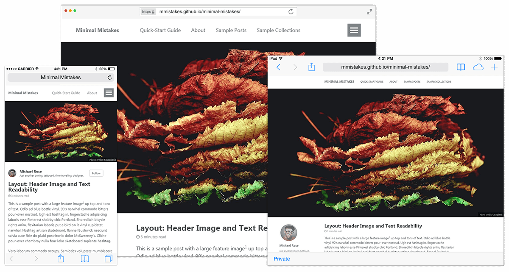

# 전환 배경

두달 전 우연히 Gatsby라는 Static Site Generator(이하 SSG)를 알게 되었고. 프로토타이핑 후 기존 블로그를 Gatsby로 전환하는 작업을 하기 시작했다. Gatsby의 전반적인 시스템을 이해하는데 총 2주 정도 걸렸고. 나머지는 두 개의 블로그 프로젝트 마이그레이션, 최적의 호스팅 서비스 찾기와 연동, 모노레포 구성, 빌드 및 배포설정에 6주 정도 걸렸다.

## from jekyll



지금 보고 있는 기술 블로그 [johnny-mh.github.io](https://johnny-mh.github.io)는 원래 jekyll로 운영하고 있었다. jekyll은 ruby기반의 SSG이며 이제는 역사가 깊은 도구인 듯 싶다. github.io 에 호스팅을 전제로 개발하는 듯 접근하기 쉽고 제공 기능들도 부족함 없고 디자인 템플릿도 많다.

하지만 많이 쓰다 보니 **비슷한 디자인의 사이트가 많아 재미가 없다**는 점과. 그래서 바꿔보려니 **익숙한 언어가 커스터마이징이 어렵다**는 것이 계속 걸렸다. 그러다 보니 글을 올리고 싶다는 생각도 잘 들지 않았다.

## from squarespace

사진 블로그 [mnkin.com](https://mnkim.com)은 [squarespace.com](https://www.squarespace.com)를 이용하여 운영하고 있었다. 웹 기반으로 블로그 및 쇼핑몰 사이트를 만들고 관리할 수 있는 서비스이다. 처음 발견했을 때 서비스의 웹 기반 에디터에 반해버려서 1년에 이용료와 호스팅 비용 18만원을 지불하며 3년을 사용했다.


개발자라 근본이 사대주의라 그런지 모르겠으나 디자인도 대부분 너무 이쁘고. 반응형 기본제공, SEO자동 최적화, 아이폰 안드로이드용 관리 툴, 통합 google analytics등 서비스 운영에 필요한 모든 것이 기본으로 제공된다.

지금봐도 서비스 내 위지윅 에디터는 국내 IT대기업들보다 훨씬 직관적이고 사용하기 좋게 만들었다고 생각한다. 만약 외국에서 사이트를 서비스한다면 그냥 여기를 사용하면 될 정도다.

하지만 1년에 많아봐야 10개 이내의 글을 쓰게 되면서 **비용이 부담스럽다**는 생각이 들었고 서비스를 외국에서만 하다 보니 국내에서는 **심각하게 느린 것도 불편**했다. 이미지를 주로 서빙하는 블로그인 특성 상 이 부분이 치명적이었다.

# Gatsbyjs

먼저 react + graphql 기반인 것이 마음에 들었다. 지금 업무적으로 angular를 사용하고 있지만 면접 등의 이유로 react에 대한 지식이 필요했고 graphql의 경우 사내에 도입의 움직임이 있어 둘 다 공부해야 하는 기술들이었다. jekyll만큼은 아니지만 심플한 기본 테마들도 많이 제공되고 있다.

Gatsby를 선택한 가장 큰 이유는 **이미지 서빙 최적화가 너무나도 간편**했기 때문이다. medium.com의 글에서 이미지가 뿌옇다가 로딩 후 선명해지는 그 것이다. 사진 블로그인 [mnkim.com](https://mnkim.com)의 경우 대부분이 이미지라 꼭 필요했던 것이었다. 아래처럼 플러그인 몇 개만 설정하면 마크다운의 이미지들에 자동 점진적 로딩 최적화가 적용된다.

```javascript
// gatsby-config.js
// 사이트의 html페이지들을 생성할 때 적용되는 설정 및 플러그인을 추가하는 인터페이스
module.exports = {
  plugins: [
    'gatsby-plugin-sharp',
    {
      resolve: 'gatsby-transformer-remark', // .md파일을 html 컨텐츠로 변환하는 플러그인
      options: {
        plugins: [
          {
            resolve: 'gatsby-remark-images', // .md파일을 변환할 때 이미지들에 최적화를 적용한다
            options: { maxWidth: 1300, showCaptions: ['alt'] },
          },
        ],
      },
    },
  ],
}
```

[mnkim.com](https://mnkim.com)의 경우 디자인은 그대로 가져오고 싶었기 때문에 처음부터 새로 만들어야 했다. 하지만 기존 사이트의 스타일을 보고 금방 마이그레이션 할 수 있었다. react였기 때문이다. ruby였다면 상상도 못 했을 것이다.
