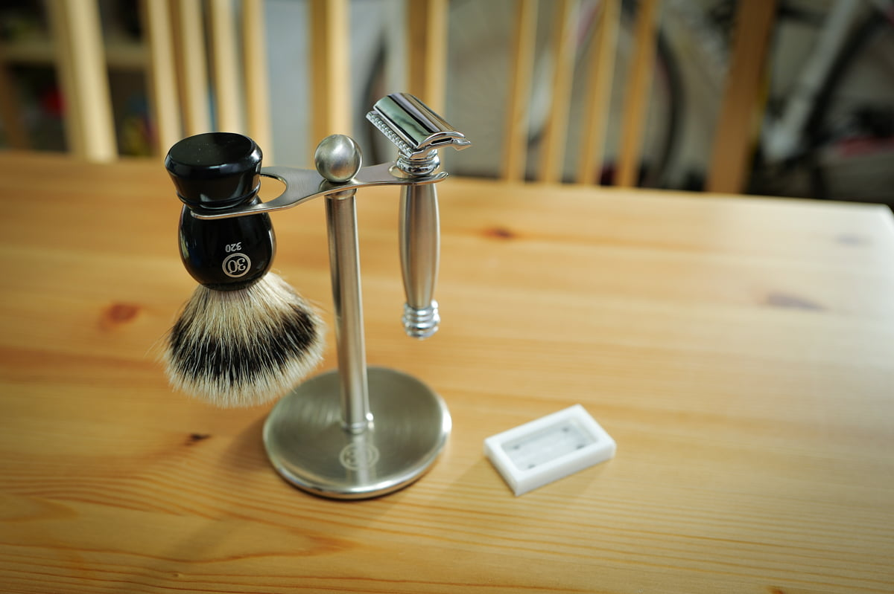
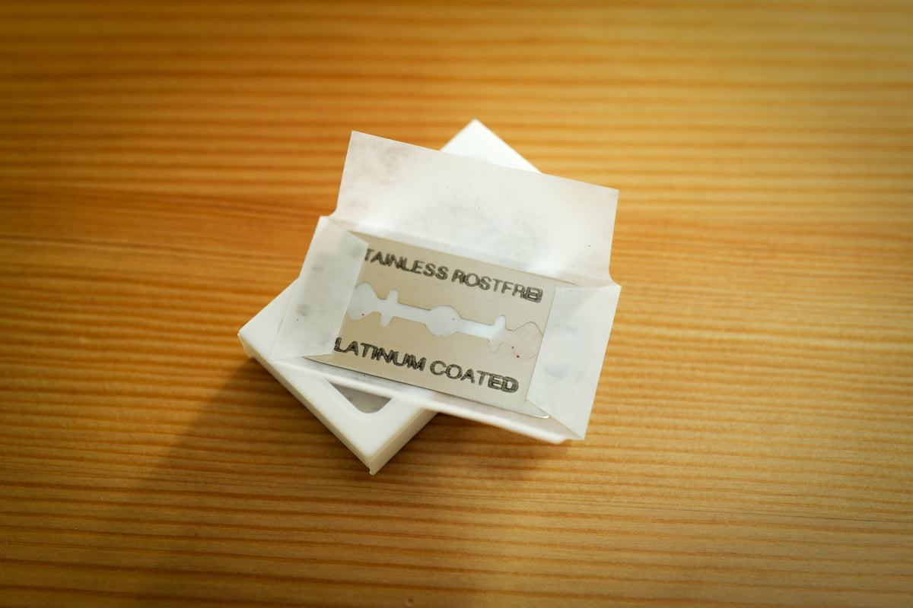

일회용 카트리지 면도기를 쓰다가 한달 전 양날면도기로 바꿨습니다.

일단 면도 후 느낌은 확실히 좋아졌어요. 예전엔 여러 번 면도해도 까끌한 느낌이 조금 남았는데, 지금은 애기피부같이 까끌함이 싹 사라졌어요. 물론 3번정도 면도해야 하긴 하지만요 (정방향, 측면, 역방향 순으로 하면 됩니다)

면도크림과 애프터 쉐이브도 같이 샀는데, 지인 말로는 오래 전 이발소 향기가 난다고 해요. 기분좋은 향이 납니다. 뭐 약간 청승맞다는 느낌도 들 수 있는데 사실 금전적으로도 손해는 없는거 같아요.

보통 카트리지 면도기 + 면도날 2개 하면 2만원 정도 주죠? 거기에 나중에 같은 면도날 4매를 구입할때 2만원 정도 들잖아요? 이 아이는 면도날이 정말 싸답니다

같이 구입한 면도날은 독일제이지만 개당 990원 꼴이에요. 면도날의 교체시기가 중요한 점과 부합하죠. 국내에 쉽게 구할 수 있는 도루코 면도날을 사용하면 그 보다 더 싸게 구입할 수 있어요.

면도기 본체는 가격이 좀 쎕니다. 국내 정식 수입품을 사면 20 ~ 30만원정도 하지만 직구를 하면 10만원 ~ 20만원 선에서 구입할 수 있어요. 카트리지 면도기 1개와 4개들이 날 4번을 사면 딱 비슷한 가격대가 되겠군요. 뭐 그렇다고 해도 카트리지 면도기를 평생쓰실건 아니잖아요? (신제품 나와서 바꾸고, 면도날이 단종되서 바꾸고 그러죠 보통.)

면도 시간이 카트리지 면도때보다 오래 걸리는 건 있어요. 하지만 뭐 그렇게 많이 걸리는 건 아니에요. 숙달되면 빠르면서도 더 깔끔하게 면도할 수 있겠더라고요.

여유가 되신다면 한번 써보시길 바래요. 일회용 물건을 사용하는것 보다 훨씬 만족감도 높고 재미있거든요.