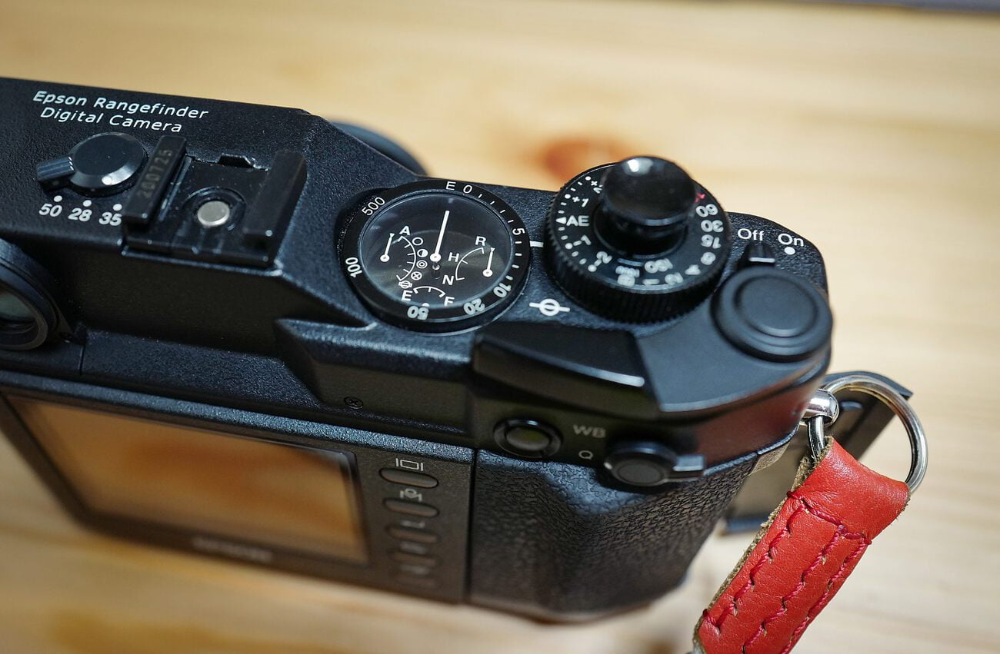

만고의 시간 끝에 받은 r-d1x. 먼저 받았던 바디는 iso가 높을 때 사진 우측에 데드픽셀 세로줄이 생기는 문제가 있었다. 그래서 구매처에 교환을 요구했고 적극적으로 매물을 구해주셔서 내 손에 들어올 수 있었다. 고마워요 [가산카메라](http://www.kasancamera.co.kr)

이틀정도 막 찍어봤는데 확실히 촬영하는 재미가 있다. 이 재미에는 와인딩 레버가 한몫을 하고 있고, 스프링이 튀는 듯한 셔터소리도 한 몫 한다.

사진의 품질만 따지면 딱히 좋은 편은 아니다. iso가 200 ~ 1600 까지만 지원하는 까닭에 밤에 촬영하기가 조금 애매하다. 신기한건 오만 걱정을 하며 사진을 화면에 띄우면 꼭 건지는 사진이 있다는 점이다.

디지털 사진이지만 뭔가 디지털스럽지 않은 감성이 있다. 이 것이 뭔가 흥미를 유발하고 있어 셔터를 한번이라도 더 누르고 싶어 안달나게 만든다. 간간히 Q가 있어 필요하지 않다는 생각이 들 때가 있는데 팔면 된다는 생각으로 한동안은 가지고 있으려고 한다. 뭐 안팔리면 그냥 소장할 계획이다.
