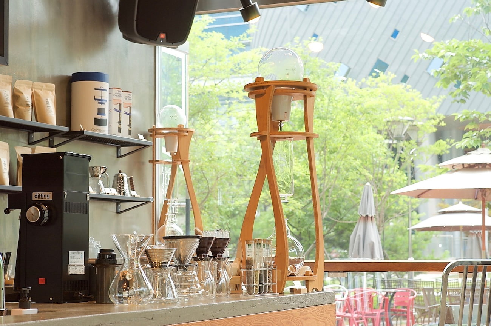

나는 무언가 계획을 따라야 하는 것이 싫다. 세상만사가 계획대로 되는 것이 얼마나 있을까? 내가 착실하계 계획을 세운다고 과연 그 대로 살 수 있을까? 아니라고 생각한다. 어느정도 단기적인 계획은 세우고 사는 편이지만 장기적인 계획을 세우는 편은 아니다.

그런 나에게 인생 최장의 계획이 바로 해외 취업이다. 2년 내에 미국으로 가는 것. 준비해야 할 것이 너무나도 많다. 역시 영어가 제일 문제다. 분위기를 파악하고 나의 의사를 전달하는 것은 가능하지만 취업을 하기 위해서는 한참 모자라다. 가뜩이나 한국말로도 소통이 안되는데 영어는 어떨까.. 직장 동료에게 적어도 언어관련 문제로 배려를 받는 순간부터 문제가 생길 것이다.

이번 프로젝트가 어느정도 마무리 되고 여유가 생기면 영어 학습에 투자를 할 생각이다. 지금까지 내가 뭔가 욕심내서 막 소비를 했던거처럼 영어에 투자를 할 생각이다. 지금은 아직 바쁘고 조만간 시작할 계획이다.

미국을 간다고 해도 절대 예상대로 일이 진행되진 않을 것이다. 몇 달간 직업을 구할 수 없을 수도 있고 구했지만 만족스럽지 못하거나 문제가 있을수도 있다. 그래도 그 과정에서, 필사적으로 노력하는 그 과정에서 얻는 것이 있을 것이다. 물론 끝내 구하지 못하고 귀국하면 안되지만 말이다.

일단은 지금의 일을 착실히 해결하며 때를 기다려야겠다.
