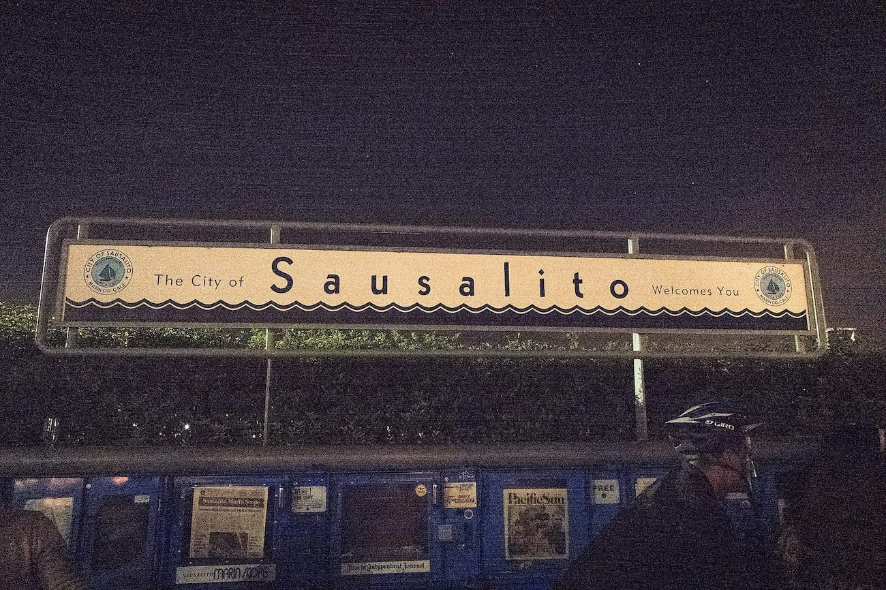

2월 샌프란시스코 여행중 찍은 사진이다. SF에서 페리를 타고 소살리토를 보고 다시 SF로 돌아가는 페리를 기다리는 줄에서 찍었다

나는 이 사진이 제일 기억에 남는다. iso 50000의 고감도 사진이라 노이즈가 심하지만 나름대로의 의미가 있는 사진이다.

Leica Q를 구입한 후에 정말 잘 구매한 것인지에 대한 고민을 했다. 28mm 단렌즈인데다가 가격이 너무 비쌌기 때문이다. 물론 구입 전에 라이카의 디지털 중 탑이라는 여러 리뷰를 봤을때는 정말 가지고 싶었지만 말이다.

결론은 잘 샀다. 이 카메라는 내가 구하게 될 당시의 가격보다 약40만원정도 비싸졌다. 원가 상승으로 인해 본사에서 모든 제품의 소비자 가격을 올렸던 것이다.

나는 Q가 고감도에서도 좋은 품질을 내 줄 것으로 믿고 감도를 신경쓰지 않고 셔터를 눌렀다. 귀국 후 바로 사진을 보았을때는 그다지 좋다고 느끼지 못했지만, 지금 글을 쓰기 위해 필요한 사진을 추릴 때 가장 먼저 떠오른 사진이다.

재미있었던 점은 '디지털 라이카'라는 주제로 현지인들과 이야기를 나누는 시간이 생기곤 했다. 라이카를 가진 타국인을 보는 시선이 어땠을지는 모르겠지만. 이를 통해서라도 여러 헤프닝이 있었단 것에 고맙고 뿌듯하기도 했다.

샌프란시스코는 물론 소살리토에서 보냈던 여행을 너무 좋았다. 여행지였기 때문에 느끼는 감정을 고려하더라도, 그렇게 여유가 있고 분위기 좋았던 여행은 없었다. 발목이 아플정도로 걷는 것을 정말 싫어하지만 여기에서만은 그런 느낌이 하나도 없었다.

언제 또 갈 수 있을까? 내가 세운 계획대로라면 또 갈 수 있겠다는 생각은 들지만 지금은 그저 먼 미래의 이야기처럼 느껴질 뿐이다.
