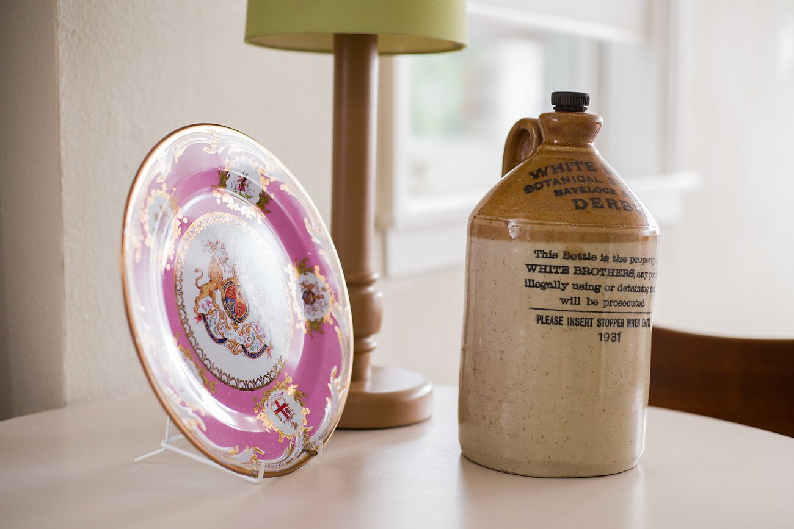
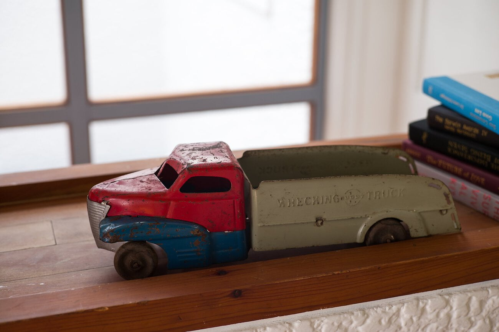
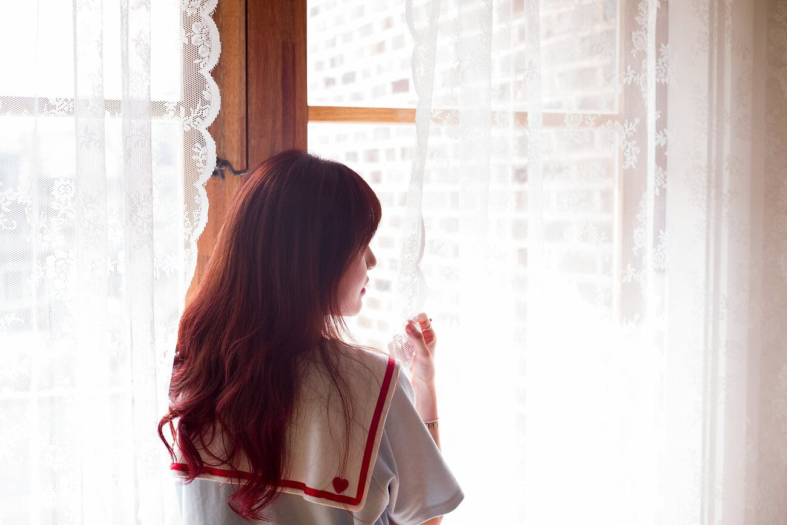
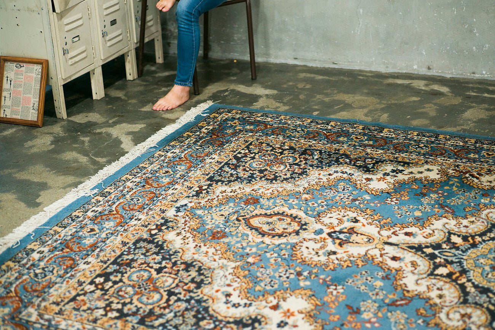
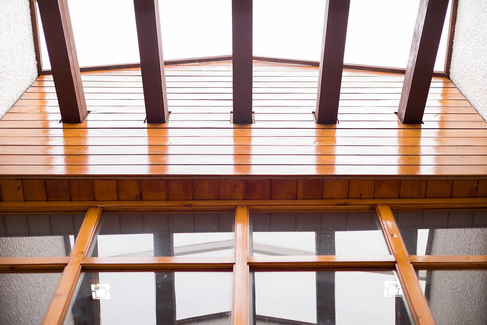

어떤 이벤트의 '첫' 이라는 수식어는 참 신기하다. 어떤 악조건도 느끼지 못하게 되고 그저 즐겁기만 하고 주량도 평소보다 훨씬 세지고 끝나고 나면 한없이 아쉽다. '첫' 동호회는 아니지만 '첫' 스튜디오 인물 출사는 정확히 그랬다.

계속되는 야근과 피곤 때문에 활동반경이 집과 회사 두 군데 뿐이게 된 나에게 '하루에 한장 촬영' 이라는 미덕은 정말 어려운 일이 되었다. 그 좁았던 주변환경 내에서 아쉬운 마음에 환경에 대한 관찰은 늘었으나 정작 셔터를 누르는 순간은 점점 줄어들었다. 약간 부담감을 느끼고 있었는지도 모르겠다.

하지만 스튜디오 내부는 180도 달랐다. 빛은 뭐 말할것도 없고 눈만 돌리면 흥미로운 피사체 투성이었다. 아 뭔가 굉장히 재미있었달까... 이래서 돈을 지불하고 스튜디오를 쓰는구나 하고 한방에 이해됐다. 가방을 구석에 두고 카메라를 꺼내 이리저리 촬영을 하기 시작했는데 다행히도 그 동안 촬영했던 경험이 초점이나 노출을 조절하는 데 도움이 되었다.. 만..

첫 번째 방의 색온도 설정으로 그날 내내 찍고 말았다.. 사진들을 보정하는 과정에도 몰랐고 그걸 출근하고 카메라를 만지작거리다 알아차렸다. 몇몇 사진을 보면서 '색온도가 왜 이렇지?' 라는 생각은 들었는데 그랬던 것이다. 그래도 은근히 건진 사진이 많아 만족스럽다.

이 사진으로 '첫' 초상권 협의를 해봤다. 이런 처음 겪는 일련의 과정들이 너무 재미있고 즐거웠다 오랫동안 기억에 남을 것이다.

출사를 주제로 블로그 글을 어떻게 풀어야 할 지는 조금 생각해 봐야 할꺼 같다. 촬영이나 보정 기술에 관련된 나의 견해가 섞인 일기 정도가 될 듯 한데 올릴 사진이 많으니 글이 화려하지 않아도 어느정도 보완이 될 것으로 기대한다 :)

출사다녀오고 나서 정리한 사진 목록을 비공개 플리커 앨범에 담아두고 몇번을 보았는지 모른다. 혼자 꺼내보면서 마치 내 보물상자를 열어보는거 같은 느낌이 들었다. 잘 맞는 취미이다. 프로가 아니고 아마추어니까 즐겁게 촬영하고 부담없이 소통하고 싶다.
