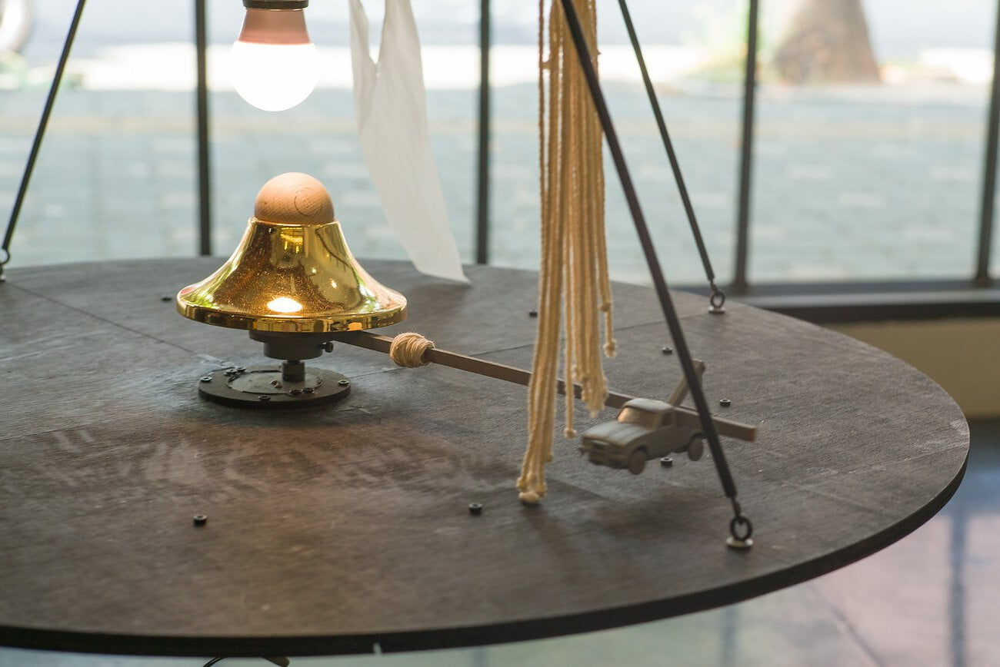
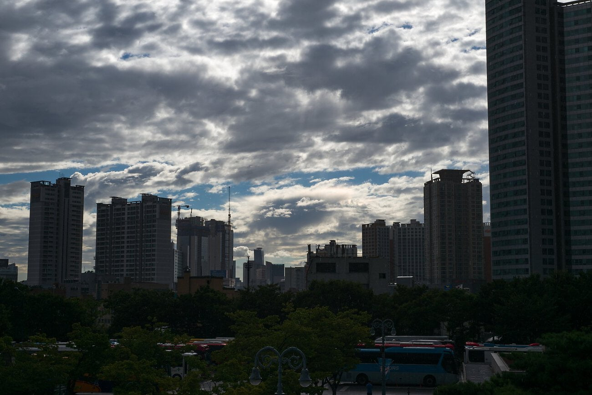

예비군 훈련중엔 많은 생각을 한다. 나의 일 또는 무언가에 임하는 자세를 다시 한번 돌이켜보는 계기가 되곤 하는데 오늘은 내가 왜 사진을 찍고 있나 궁금했다. 그저 무의미하게 컷 수만 늘리고 사진들은 그저 하드디스크에 있다가 내가 죽거나 잃어버리지 않는 이상 그 아무도 볼 수 없는 것 뿐인가 하는 생각이었다.

시간이 흘러 오후 7시쯤 훈련의 막바지가 되었다. 매 훈련때마다 힘든 무언가를 꼭 하나씩 시켰었는데 이번에는 동네 근처 산에 오르는 일이었다. 무거운 군장과 총을 매고 비탈길을 올라 목적지에 도착했다. 온몸에 흐른 땀을 미미하게 부는 바람에 말리고 숨을 고른 다음 주변을 둘러보기 시작했다.

나무들 사이로 내가 매일 다니던 성남 시내 대로가 보였다. 매일같이 다니던 그 대로의 풍경은 정말 볼품없는 모습이었다. 제각각인 건물 색상, 간판 색상, 낙후된 건물들, 지저분한 거리는 셔터를 누르기 주저하게 만드는 피사체일 뿐이었다. 하지만 그 날 저녁 산 위에서 바라본 모습은 달랐다. 카메라가 없어 사진을 남기지는 못해 아쉬웠다.

어쩌면 취미 생활 수준의 사진가의 궁극적인 목적은 눈 앞에 있는 아름다운 순간을 정확하게 사진으로 남길 수 있는 역량이 아닐까 생각한다. 고맙게도 나의 환경은 이 목적에 다다르기에 정말 차고 넘친다. 단지 나의 역량이 부족할 뿐이다.

조금 더 적극적으로 여러 시도를 해 봐야겠다.
