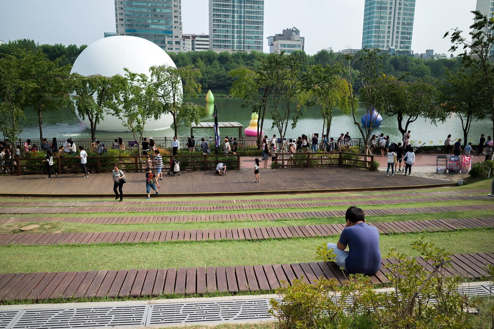

나는 말이 많은 사람이 싫다. 스물아홉의 삶을 살면서 말이 많은 사람 치고 정말 실속있는 말을 하거나 본받을만 하다 느꼈던 사람이 하나도 없다. 하나같이 그냥 그랬다.

지금까지 살면서 봤던 말이 많은 사람의 종류는 두 가지였다. 하나도 남지 않는 우스개 소리로 그 순간을 재미있게 보내는 사람, 표현의 방법이 서툴러 쉽게 이야기 할 수 있는 것을 어렵게 하는 사람이다.

첫 번째 사람은 **공감대가 형성될 경우** 다 같이 재미있게 시간을 보낼 수 있다는 점에서 좋다. (눈치없이 공감대 없는 이야기만 늘어놓는 사람 제외) 다수가 모인 자리에서 이런 대화를 능숙하게 할 수 있는 사람은 항상 유리한 무언가가 있었던 것 같다. 하지만 대개의 경우 하는 소리들이 철없는 애기들이나 할 법한 이야기들이어서 듣다보면 집에 가고 싶더라...

두 번째 타입의 사람.. 내가 들어주는 입장이 되는 경우 너무 힘들다. 이런 사람의 경우에도 이야기 하는 내용이 개연성있게 연결되는 사람은 그나마 좀 낫다. 하지만 마치 의식의 흐름 처럼 대화의 주제가 들쑥날쑥하거나, 남이 알아들을 수 있을 것이라 생각해 이야기를 하는 사람은 너무 힘들다. 이런 사람의 대화를 듣다 보면 어렸을 적 \`책을 많이 읽읍시다\` 라는 권유가 이해되기도 한다. 한편으로는 내가 이러지 않는지 경계를 하는데.. 경계를 하다 보니 말 수가 줄어들기까지 하더라...

말 수가 많으면 불리하다. 말 수가 많아 실수할 확률이 증가하고, 개연성있게 내용을 이어가지 못할 확률 역시 증가한다. 또 듣는 사람 입장에서는 말하는 이의 자신감있는 태도에서 믿음을 얻고 계속해서 듣고자 하는 열망이 생기는데, 말을 많이 할수록 이 믿음을 얻기가 어렵게 된다.

모두의 공감대를 얻을 순간순간의 우스개 소리도 잘 하고 싶지만... 그 부분은 자신이 없으므로.. 난 언제나 자신감있는 큰 소리로 타인에게 의사를 명확하고 짧게 전달하고 싶다.
