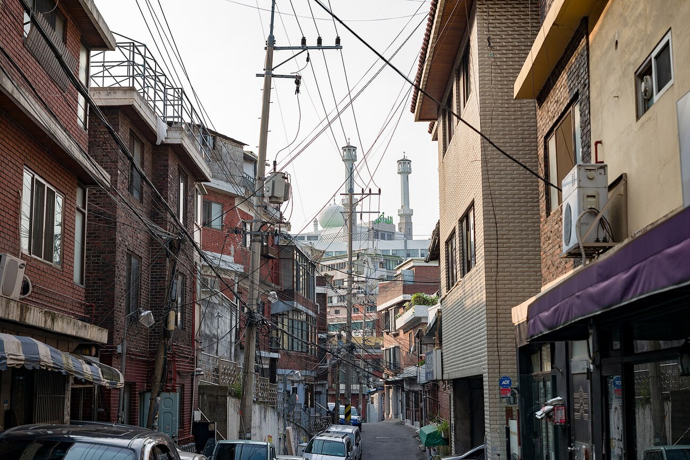

최근 사진에 대한 관심이 커져 관련 서적을 여러 권 구입했다. 그 중 많은 사람들이 추천했던 데이비드 두쉬민의 '프레임 안에서'를 읽고 있는데. 확실히 아무것도 모르는 것 보다, 관련지식을 알고 임하는 촬영은 더 재미있고 깊이가 있을 수 있다는 것을 새삼스레 느끼고 있다.

예술을 분석하는 문서들은 대부분 어떠한 한계(한계라는 표현이 맞을지는 모르겠다)로 인해 이해하기 어려운 부분이나 독자 나름대로의 해석을 필요로 하는 내용이 많다. 그래서 이 책은 처음부터 끝까지 3번째 읽는 중이다. 특히 **사진을 찍는 사람의 비전** 이 소개되어 있는데 설명이 조금 모호하다. 그나마 구체적으로 적힌 구절은 다음과 같다.

> “수십억 명 중의 한 사람인 우리 자신이 아름답다거나 추하다고, 옳다거나 그르다고, 또는 조화롭다고 느끼는 것들에 관한 문제다. ”

아무리 생각해도 이 '비전'이란 것은 '취향' 과 일맥상통하는 듯 하다. 위의 인용문은 결국 '내가 좋다고 느끼는 것' 과 같은 이야기가 아닌가? 그렇게 생각했을 때 이 '비전'을 타인에게 원할히 전달하는 과정은 내 사진을 타인에게 보인다는 것이고. 이 과정에서 타인이 좋다고 느끼도록 하기 위해 필요한 과정은 나의 '취향'이 보편화 또는 대중적이 되어야 한다는 것이다.

만약 나만의 비전을 찾았을 때 그 비전이 대중적이지 않아도 꿋꿋이 그 비전을 고수해야 하는가.. 라는 생각이 든다. 취미로 사진 생활을 하고 있지만 사실 내가 올린 사진에 아무도 관심이 없다면 슬플 것이다. 이전에는 [사진을 찍는 이유](/blog-1/2016/8/23/-)로 타인의 관심에는 무심하려 했지만 가끔은 욕심도 생기더라...

이 '취향'을 대중적으로 만들 수 있는 방법 중 하나를 발견했는데 그건 바로 사진을 보는 사람을 잘 관찰하는 것이다. 사진 목록을 보여주고 좌, 우 키로 쉽게 넘길 수 있도록 환경을 마련해 준다. 한장한장 넘기다 2초 이상 머무르는 사진을 잘 관찰한다. 가능하다면 어떤 점이 그렇게 만들었는지 물어보고 이야기를 듣는다. 많은 사람에게 의견을 듣기는 어렵겠지만 :)

그리고 나의 경우 주의는 필요 하겠지만 남의 시선을 신경쓰지 않고 원하는 언행을 일삼..아니 하는 편이 조금 더 이 '취향'을 세련되게 하는 방법인듯 하다.

결국 순수히 나를 위해 사진을 찍지 않는 한 이런 고민에서 자유로울 수 없다. 그런데도 이런고민을 하는 이유는 조금 더 재미있는 사진 생활을 하기 위함이다.

오늘은 이만 쉬어야겠다.
