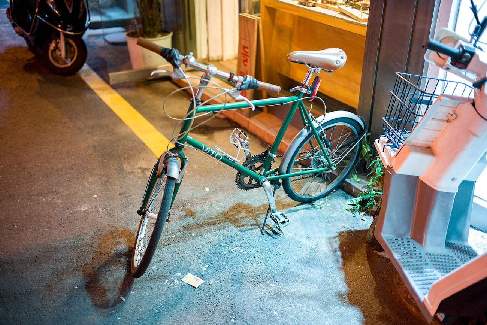
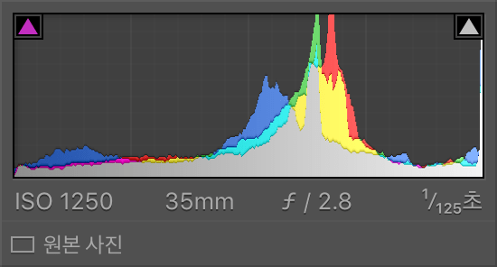

아름다움을 어필할 수 있는 방법중의 하나는 다채롭고 풍부한 변화를 표현하는 것이다. 음악에서는 낮은 저역대부터 고역대까지 능숙히 낼 수 있는 능력이고, 연극에서는 슬픔과 기쁨을 두루두루 전달할 수 있는 연기력이 되겠다.

사진에서 히스토그램을 관리하는 것도 비슷하다. 검은색과 하얀색까지 넓고 풍부하게 표현된 사진은 시각적으로 만족스러운 사진일 가능성이 높다.

히스토그램은 얼마만큼 다양한 색상이 사용되었는지 알려주는 그래프이다. 좌에서 우로 검은색부터 하얀색을 나타내고 그래프의 높이는 그 지점의 색이 얼마나 사용되고 있는지를 나타낸다. 그래서 히스토그램만 보고도 대충 어떤 사진인지 짐작할수도 있다.

예를 들어 우측으로 심하게 몰려있는 형태일 경우 낮에 찍은 하늘일 수 있고, 좌측으로 몰려있는 경우는 실내 또는 밤에 찍은 사진일 수 있다.

여기까지 이해했다면 필터가 어떤 원리인지 짐작할 수 있을 것이다. 이 히스토그램에서 일부 색 영역을 제거하거나 변화시는 행위이다. 예를 들어 워쇼스키 형제의 영화 '매트릭스' 를 보면 어두운 부분에 살짝 녹색이 도는 것을 볼 수 있는데, 이는 어두운 부분에 RGB 중 Green 값을 높이는 형태로 비슷하게 흉내낼 수 있다.

결국 필터는 카메라 바디가 현실에 가깝게 표현하려 노력한 사진을 왜곡하여 새로운 느낌을 주는 일련의 과정이다. 단순히 말해서 일부 명암 영역이 변조된 '모자란 사진' 이 되는 것이다.

신기한 점은 이런 '모자란 사진' 이 더 좋아보이는 경우가 있다는 점이다.  좋은 필터는 여러 복잡한 과정을 거치겠지만 간단히 필름과 같은 효과를 내는 방법으로 암부를 클리핑하는 방법이 있는데 이는 히스토그램에서 좌측 영역을 오른쪽으로 끌어올리는 것이다.

이렇게 하면 어두운 부분만 밝게 되어 조금 빛 바랜 사진의 느낌이 난다. 사진은 우리가 눈으로 보는 현실과 동떨어지게 되며 신비로운 느낌을 갖는다. 필터를 적용한 사진이 좋아보이는 이유는 비현실적이기 때문일 것이다. 보통 국내 사진보다 국외 사진이 조금 더 매혹적이고 좋아 보이는 이유와 같은 이치다. 한번도 목격하지 못한 새롭고 재미있는 광경이기 때문이다.

적당한 노이즈는 결과물을 더 돋보이게 한다. 하지만 조금 더 욕심을 내면 이런 작업의 방식이나 피사체의 선택을 경계해야 할 것이다. 사진을 남기는 이유 중 한 가지는 나중에 다른 곳에서도 사용하기 위해서다. 과한 필터를 적용한 사진은 사용할 당시에는 좋을 지 몰라도, 시간이 흐르면 쓸 수 없는 사진이 되어 버린다.

충분히 좋은 사진이건 그렇지 않건 필터 없이 있는 그대로를 보고 좋은점과 아쉬운 점을 정리한다면 필터 없이도 감명을 줄 수 있는 사진을 만들 수 있을 것이다. 나도 아직 모자라지만 언젠가는 새롭고 독특하지 않은 사진으로도 타인에게 메시지를 전달하는 사진을 찍고 싶다
