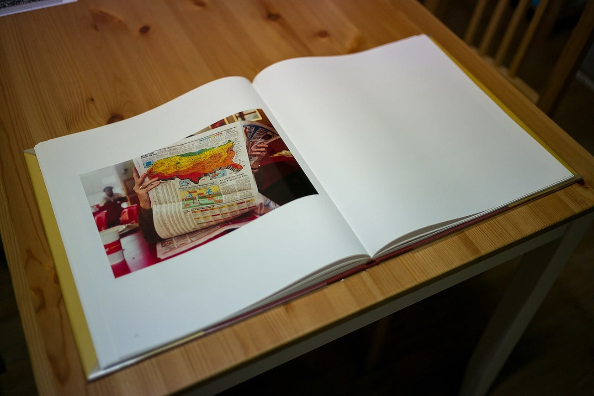

좋은 것을 아는 사람이 좋은 것을 만들 수 있다는 데 나도 100% 동의한다. 예술은 조금 다를 지 모르겠지만.. 기본적으로 다른이의 생각과 아이디어에서 영감을 얻을 수 있지 않을까? 그런 의미에서 사진집을 구입해 보는 것은 매우 좋은 활동이라고 생각한다. '사진을 보는 안목'이라는 영역에 잘하고 못하고의 기준은 없다. 다만 사진집을 보면서 느끼는 감각이 도움이 된다.

근래에 내가 사진집들을 보며 느끼는 것은 첫째 인쇄 방법과 품질에 대한 내용이다. 사진은 일반적으로 모니터와 종이 두 가지의 매체를 통해 타인에게 전달되는데, 이 때 어떤 방법을 사용해야 조금 더 세련되고 좋은 느낌을 줄 수 있는지 알 수 있다. 위에 올린 사진집은 [이라선](http://www.irasun.co.kr) 에서 구입한 윌리엄 이글스톤의 사진집인데 하얀 무광택지에 하얀색을 제외한 나머지 색에만 염료가 입혀져 있다. 손으로 만져보면 색이 입혀진 부분에서 독특한 촉감이 온다. 사진을 볼 때 손으로 만져보기까지 하니 무언가 색다른 느낌인데 그 느낌이 좋아 나도 그렇게 내 사진들을 인쇄해보고 싶다는 생각이 들 정도였다.

두 번째는 역시 다른 사진가의 관점에서 보고 배울 점이 있다는 점이다. 너무 일상적인 것들을 사진집으로 만든 작가가 있는 반면 어느정도 정돈된 독특한 상황을 찍어 만든 사진집도 있다. 이런저런 사진집을 보면서 '이렇게 한번 찍어봐야지' 하는 생각을 할 때 아드레날린이 솟구치는 느낌이다.

세 번째는 어떻게 하면 다수의 타인에게 메시지를 줄 수 있는 사진을 찍을 수 있을까? 라는 생각이다. 사진은 단순히 보이는 것 뿐만 아니라 무언가 메시지를 전달할 수 있는 수단이 된다는 것은 여러 매체를 통해 접했다. 멀리 아프리카에서 너무 굶주려 독수리 앞에서 죽음을 기다리는 어린 소년의 사진부터, 가까운 시위 현장에서 대립하고 있는 전경과 시위대의 사진이 그런 예다.

나는 절대 그런 사진을 찍을 수 없지 않을까 하고 생각하지만, 아주 조그마한 것부터 주제를 잡고 10장 정도를 촬영해 앨범으로 만들어보고 싶다. 일반적으로 그런 형태의 작업을 '프로젝트' 라 한다고 들었는데, 이리저리 검색을 해 보니... 잘 찍는 분들이 너무 많다. 아무것도 내밀 수 없다. 셔터를 많이 눌러야 겠다.
