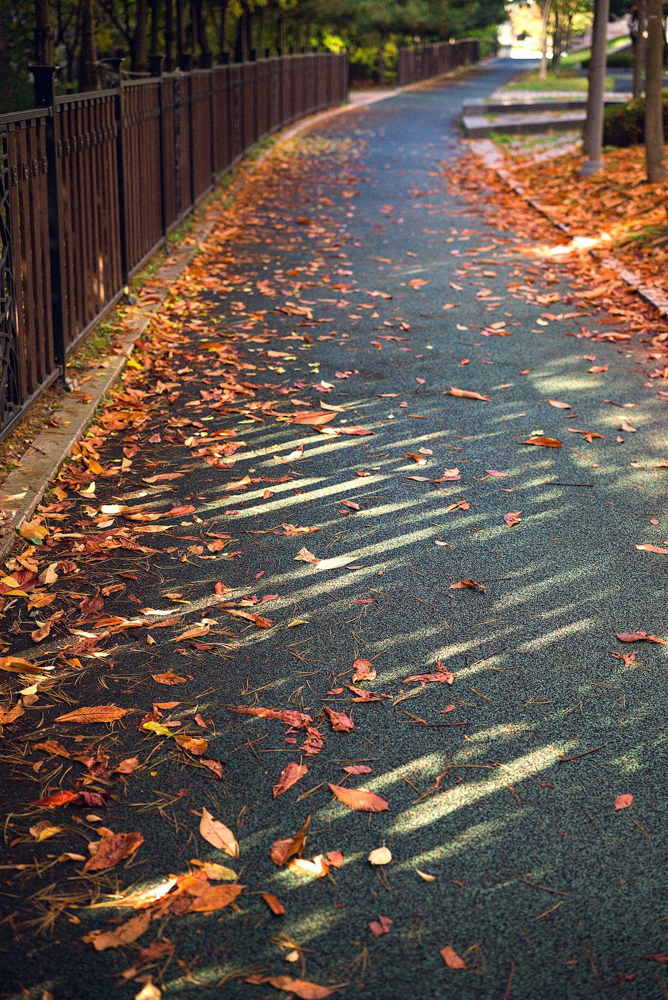

내가 하는 일은 지극히 이성적일 필요가 있다. 당연한 이야기지만 프로젝트를 하기 전에 과연 그것이 유용한것인가 아닌가를 따지고 하는 중간에도 어느 방향으로 진행하는 것이 옳은 것인가 따지고 끝난 후 결과가 어땠는지 따진다.

나는 주로 다른 사람의 이야기를 듣는 편이다. 그런데 듣다 보면 정말 틀린 방향으로 진행되는 경우가 있는데 그 때는 반박을 한다. 이 때 감정적으로 힘들었던 적이 한두번이 아니다. 대화의 목적은 어느 한쪽이 제시한 방법으로 가는 것이기 때문에 이 때 집중력을 잃는 등의 행동을 보이면 주도권을 가질 수 없기 때문이다. '그런게 어디있어' 라고 많이들 이야기하지만 나는 너무나도 많은 상황에서 여러 사람이 이 주도권을 잃는 것을 보았다.

피할 수 없이 이 상황에 처하면 이때부턴 감정적인 소모전이 되는 느낌이다. 내가 왜 옳은지에 대해 논리적으로 정리를 하며, 상대의 이야기에 논리적 오류를 찾아야 하는 것이 어렵다. 이게 문제와 나를 완전히 분리시켜서 이야기해야 하는데 나의 작업물이 도마에 오르면 분리해 생각하기가 너무 어렵다.

아니 아예 분리라는 것이 존재할까? 내가 한 행동에 대한 이야기인데 그게 어떻게 분리가 가능하단 말인가. 지금까지 겪었던 그런 대화의 양상은 상항 그게 옳다와 아니다 두 편이었다. 한번도 대화가 그것과 다른 방향으로 흐른 적이 없다. 분리할 순 없다.

나 혼자 편하고 재미있게 하는 사진 생활은 이런 소모전에서 자유롭다. 이 안에서는 맞다 틀리다의 기준이 없고 그저 좋기만 하면 된다. 너무 느낌이 좋은 사진을 찍고 인쇄해 보면 행복하다. 가끔은 직업으로 해 볼까? 하는 생각도 들지만 그건 좀 오버..

이성적인 일과 감성적인 취미의 조합이다. 이전에 기타 연주를 할때도 그래서 너무 좋았나보다. 여기에 또 관계라는 개념이 끼어들면 피곤해지던데 이젠 그러지 않도록 조심할거다.

A3인쇄기를 사서.. 지금까지 찍었던 사진중에 좋았던 사진을 책으로 만들어보고 싶다. 포토프린터가 좋긴 하지만 내가 '사진집' 같은 너무 좋은걸 봐버려서.. 엽서 사이즈를 붙이면 별로 이쁘지 않을듯.
