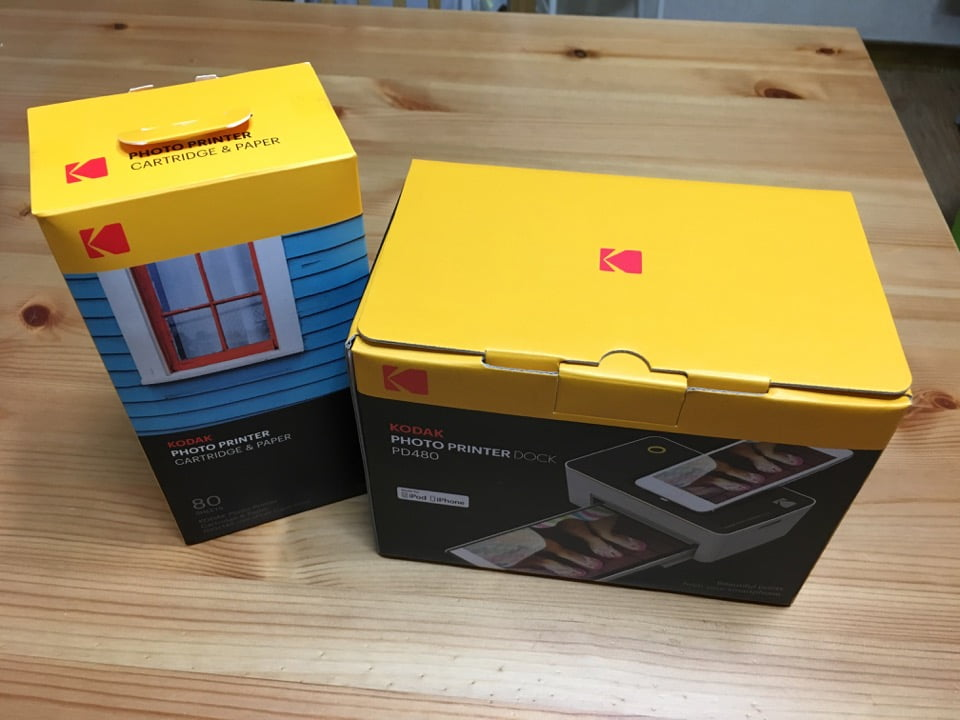
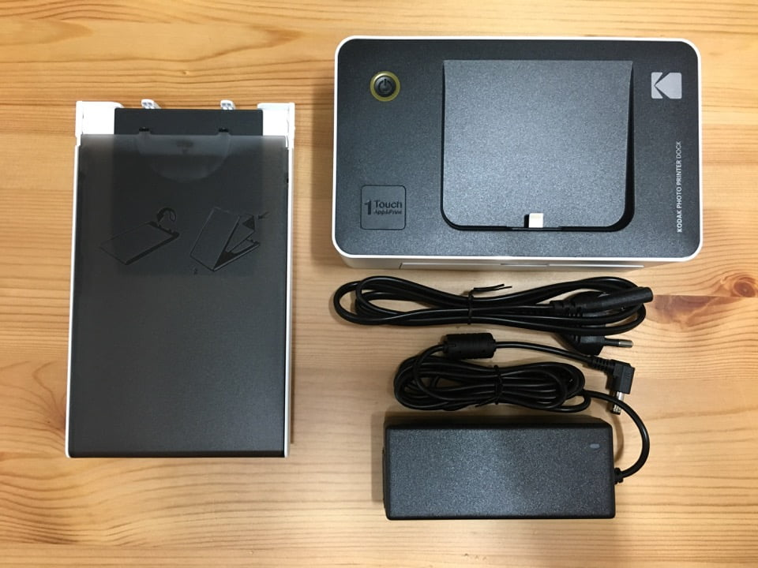
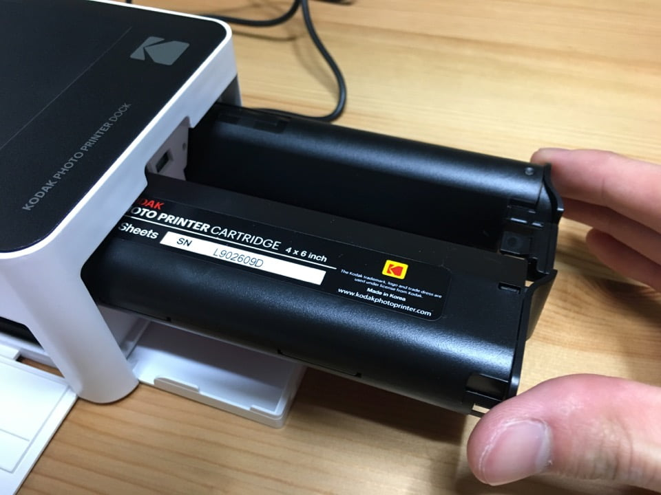
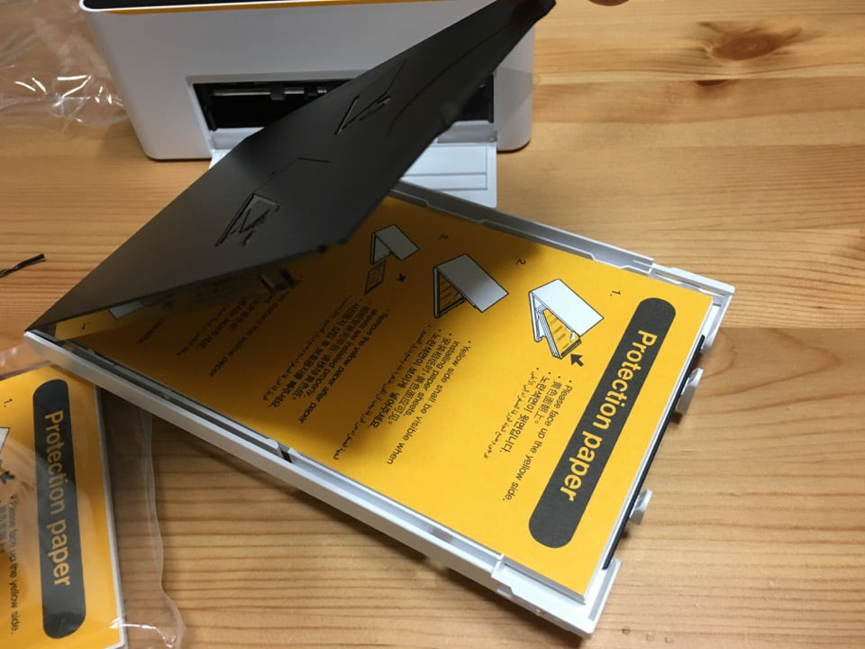
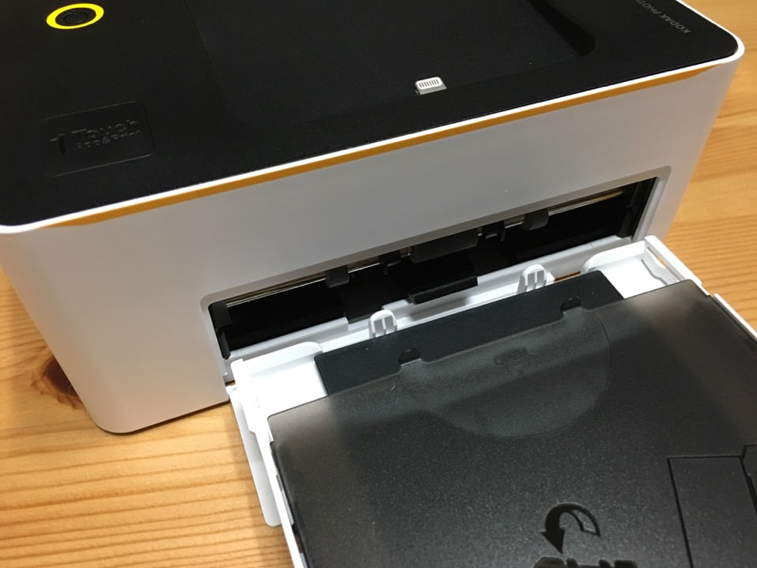
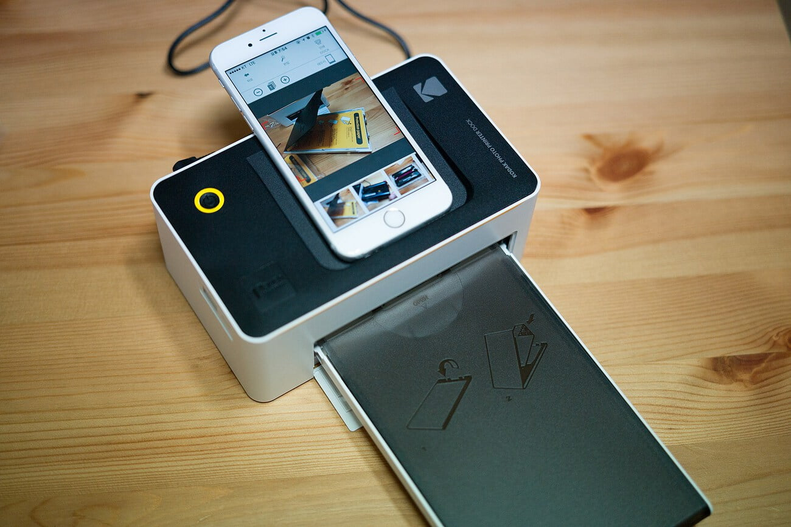
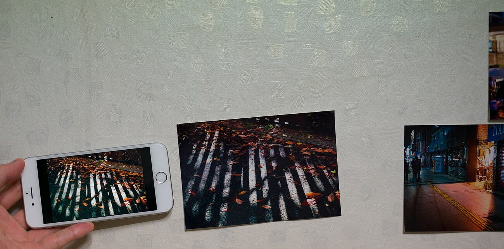

어느날 사진집을 보다 문득 생각이 들었다. 지금까지 내가 찍었던 사진들을 인쇄해 보면 어떨까? 포토프린터에 대해 찾아본 결과 보통 잉크젯, 염료승화 방식의 프린터를 사용한다는 것을 알았다. 염료승화방식은 일반 사진관에서 인쇄하는 방식으로 잉크젯에 비해 소모품은 비싸지만 안정성이 좋다고 했다.

요즘 추새로 봐서는 염료승화도 두 가지로 나뉘는 것으로 보인다. 4x6 정도의 크기를 인쇄할 수 있는 중, 대형 프린터와 소형 엽서 크기까지 인쇄할 수 있는 캐논 셀피와 이 글에서 살펴볼 Kodak Dock 같은 종류다. 두 종류간의 가격 격차가 너무 커서 정말 본격적으로 해보고 싶지 않는 한은 소형 엽서 크기를 인쇄할 수 있는 프린터를 사용하겠다고 생각했다.

소형 염료승화 프린터를 구입해야겠다고 마음먹었을 당시는 Kodak Dock 이 출시된 지 얼마 지나지 않아서였다. 나는 기존의 방식 보다는 새로운 것을 추구하는 사람이기도 하고, 중국으로 넘어갔다는 이야기를 들었지만 여전히 Kodak이라는 브랜드 이미지가 좋아 주저없이 Kodak Dock을 구입했고 받아서 2주정도 사용해봤다.

패키지를 받았을 때 패키지 디자인도 정말 마음에 들었다. 대형 프린터 패키지를 그대로 축소해 놓은 디자인같다. 참고로 본체 사진을 보면 휴대폰을 도킹할 수 있게 되어있는데 때문에 아이폰용, 안드로이드용 2가지로 발매되고 있다 (USB-C 타입은 없다)

본체 박스 구성품은 카트리지 홀더, 본체, 전원 케이블이다. 인쇄를 하기 위해선 소모품을 먼저 연결해야 하는데 소모품은 카트리지, 용지 두 종류이다. 카트리지는 본체 우측의 트레이를 열면 삽입할 수 있고 용지는 홀더에 넣고 본체에 끼우면 된다.

그 다음 전원 케이블을 연결하고 전원을 켠 후 휴대폰을 위쪽에 연결하면 된다. 인쇄할 사진을 선택하는 인터페이스는 바로 휴대폰인데 Kodak Dock 으로 앱스토어에 검색하면 설치할 수 있고 이 앱에서 사진을 고르고 간단한 보정 후 인쇄할 수 있다.

아래 사진처럼 휴대폰을 연결하고 좌측 하단의 1-Touch 버튼을 누르면 연결하겠냐는 시스템 메시지가 뜨고 확인을 누르면  앱이 자동으로 시작된다. (이 점은 상당히 편리한 부분인듯)

간단한 보정은 밝기, 대비, 이런 것을 조정할 수 있고 사진을 어떻게 자를지 조절 가능하고, 필터나 스티커 같은 효과를 지원한다.  인쇄할 사진은 한장 또는 여러장을 몇장씩 인쇄할것인지도 선택할 수 있어 편하게 사용할 수 있었다.

인쇄물의 품질은 역시 작은 크기이다보니 머리카락 하나하나까지 쨍하게 표현하는 수준은 아니나 생각보다 자연스럽게 표현하고 있고 무엇보다 만족하는 점은 염료승화 방식이기 때문에 색감이 달라질 수 있는 환경에서 느낌있게 출력이 된다는 점이다.

염료승화방식 프린터답게 살짝 어둡게 나오는 부분도 있다. 하지만 색감이 완전 다르게 나온다거나 하는 것은 아니다.

일상적으로 사진을 찍고 타인에게 추억을 선물한다는 점에서는 딱 적합한 용도이다. 그리고 군더더기 없는 프린터의 모습을 하고있다는 점이 더욱 더 맘에 든다. Kodak Dock 때문에 조금 더 좋은 사진을 찍고 싶다는 욕심이 난다 :)
