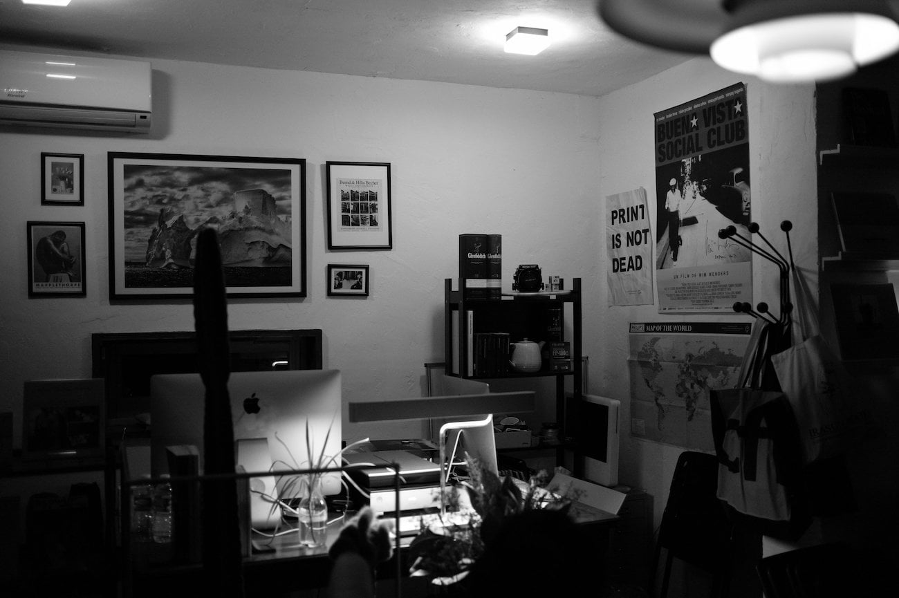

사진에서 작가의 주관을 완전히 배제할 수 있을까? 사진이 예술로 인정되지 않던 시절. 사진은 있는 그대로를 보여주는 '다큐멘터리' 이기 때문에 예술로 분류하지 않았던 1930년대 최초로 [MoMA](https://www.moma.org) 에서 사진으로 개인 전시회를 가졌던 작가 [워커에반스](https://en.wikipedia.org/wiki/Walker_Evans)의 생각이다. 취미 사진가의 입장에서 그의 사진들은 그닥 매력적이지 않다. 대부분 미국의 건축과 일상을 단조로운 선으로 표현한 사진이었다. 그런데도 이런 기회를 가질 수 있었는지 궁금했지만 대략적인 이야기를 들으니 어느정도 이해됐다.

다시 글의 제목으로 돌아가보자. 정말 사진에서 주관을 배제할 수 있을까? 배제할 수 있다면 작가가 어디까지 개입하는 것이 객관적인 사진을 찍을 수 있는걸까? 셔터를 누르는 대상이 사고력이 없지 않는 한 불가능할 것이다. 하지만 작가는 끊임없이 고민했던 것으로 보인다. 그의 사진집 [Many and Called](https://www.moma.org/learn/moma_learning/walker-evans-subway-portraits-1938-41)에서 작가는 '주관의 배제' 를 위해 카메라를 목에 걸고 유선 원격 셔터를 코트 안으로 해 손에 잡고는 지하철에서 사람들을 최대한 무의식적으로 촬영했다. 하지만 어느 비평가가 '이미 그 사진에 있는 사람들은 자신의 모습을 꾸몄기 때문에 목적을 달성할 수 없었다.' 라고 이야기했고. 본인도 인정한 듯 하다.

또 작가는 그 당시 사진가들의 신념이었던 프로파간다를 거부했다. 사진으로 사회를 비롯한 무언가를 바꿀 수 있다는 생각이 위선이라 생각했다. 앞에 언급한 철학과 꾸준히 유지하고 사진을 찍었다고 한다. 이런 부분에서 내 생각과 비슷한 점을 느꼈다. 누군가에게 '내 방식이 옳다' 라고 이야기하는 것은 좋은 방식이 아니다. 문제가 발생한 상황이 근본적으로 다른 것인데 나의 상황에서 했던 방식이 과연 옳을까? 과거의 방식이?

작가의 '주관의 배제'에 대한 탐구는 이런 생각에서 비롯된 것이 아닐까 조심스럽게 생각해 본다. 대단한 것은 아무도 사진을 그렇게 생각하지 않을 때 그렇게 생각하고 행동에 옮겼다는 점이다. 그런 그의 방식이 주의 사람들에게 좋은 영향을 주었다. 그렇기 때문에 여러 기회를 잡지 않았을까? 어느 부호의 요트 여행사진을 찍어 줄 기회도 잡고, 당시 소작농의 삶을 담으려 했던 프로젝트에서 다른 작가를 제치기도 했다. 무엇을 할 때 실력 하나만 가지고는 어렵다는 말을 입증이라도 하듯.

당일 책방에 있던 워커에반스의 책 모두 너무 재미있게 보았다. 결벽증이라고 까지 이야기하는 건물의 단순한 실루엣을 담으려고 했던 노력은 공감되는 부분이 있어 살짝 피식 했다. 일부는 그런 일관성이 없었는데 찍다가 지쳤던 것은 아닌가 하는 생각도 든다. 사진을 보는 사람의 해석이 다를 수 있겠지만 워커에반스는 워낙 오랫동안 평가가 된 사람이니..

그가 평생 고민했던 '주관의 배제'는 성공하지 않은 것으로 보이지만 그 과정에서 얻은 결과는 오늘날 팝 아트에도 영향을 미쳤다고 이야기하기도 한다.

'주관의 배제'는 어디까지 가능할 것인가는 나도 궁금하다. 앞서 언급한 비평가의 이야기 전에 이미 사진가가 셔터를 누르는 시간을 결정하는 과정에서부터 주관이 개입된다. 이런 면에서는 차라리 '주관의 배제는 불가능'을 인정하고 그 이후의 작품 세계에 신경을 쓰는 [로버트 프랭크](https://en.wikipedia.org/wiki/Robert_Frank) 쪽 사진이 더 흥미진진하게 느껴진다. (흔히 로버트 프랭크의 '주관적 다큐멘터리' 와 워커 에반스의 '객관적 다큐멘터리' 로 이야기하곤 한다)

남에게 자신의 생각을 강요하지 않고 비평을 순수히 받아들였던 사람이 그저 있는 그대로를 보여주는 사진을 예술이라 이야기하지 않았던 시대상을 어떻게 극복했을까? 모두가 공감하듯 지금은 그런 시대가 아니다. 내가 무엇을 하고 있고 어떤 생각을 하는지 드러내지 않으면 무시하기 십상이지 않은가.

남의 삶을 토대로 어떻게 살아나갈것인지 결정하는 것은 잘못된 생각이다. 시대와 환경이 다른데 어떻게 같은 해법이 있겠는가? 하지만 그가 어떤 고민을 했었고 어떤 시도를 했었는지 어떤 결과를 얻었는지 보며 고민해보는 것은 시간을 보내는 좋은 방법이다. 우스운 이야기지만 단순히 워커에반스는 MoMA 에 개인 전시회를 했지만, 쑥스럽긴 해도 나는 나의 2016년을 돌아보는 개인 사진집을 만들 수 있고 또 너무너무 아주 까마득한 먼 미래의 이야기이겠지만 전시회도 할 수 있지 않겠는가?

뭔가 나만의 방식을 계속 고집하는 것이 과연 잘하는 것일까. 아니면 타협하고 적절히 융통성있게 하는 것이 좋은 것일까. 고집하다가 정작 찍고 싶은 사진을 하나도 찍지 못하는것은 아닐지 그저 나의 현재와 목표 사이의 연결고리를 어떻게 찾아야 하는것인지.. 그것이 궁금하다.

---

이 글과 관련해서 [artsy.net](https://www.artysy.net) 에서 연락을 해 왔다. 해당 사이트의 로버트 프랭크페이지 링크를 넣어 주길 바랬다. 한번 둘러봤는데 깔끔하게 정리된 로버트 프랭크의 일대기를 볼 수도 있고 그의 작품을 구입할수도 있는 서비스다. 개인적으로 예술 작품을 구입하는 것은 매우 좋은 자극이라고 생각한다. 무리하지 않는 선에서 여유가 있다면 한번 쯤 구입해보는 것은 어떨까? [artsy.net 의 로버트 프랭크 페이지](https://www.artsy.net/artist/robert-frank)
