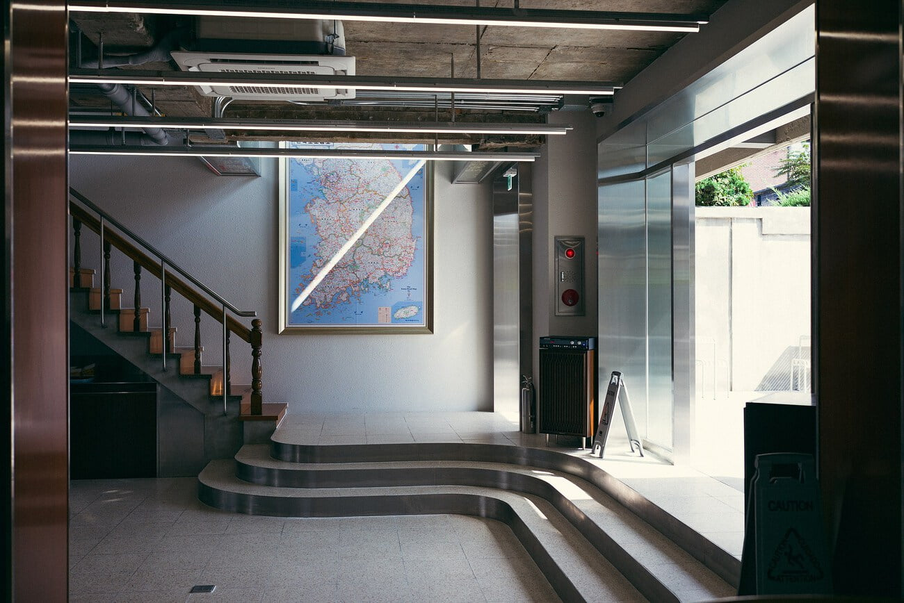
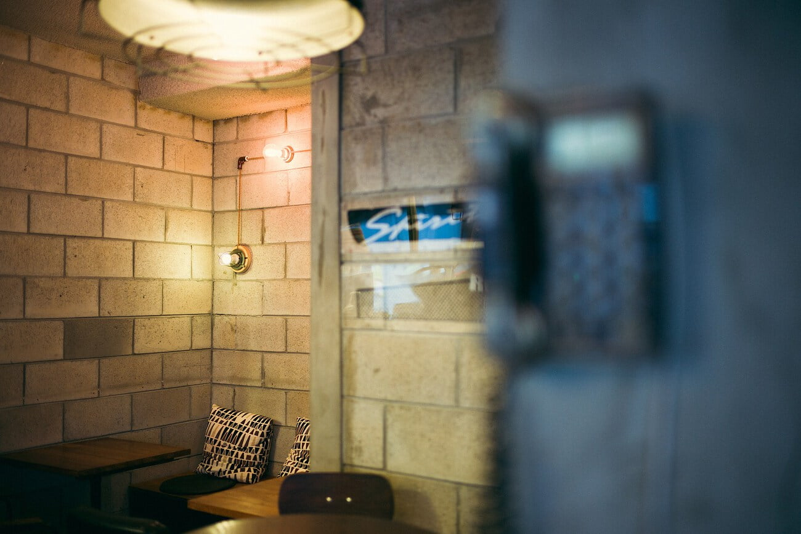

1/13 ~ 1/17 동생과 함께 일본 북해도 여행을 다녀올 계획이다. 여행지는 삿포로, 오타루, 하코다테, 비에이 정도? 누군가가 1년치 눈을 한번에 볼 수 있다고 한 것이 은연중에 떠올랐고 결국 비행기 티켓 구입까지 했다. 동생은 맛있는 것을 많이 먹고 싶다고 했고 나는 역시 사진을 찍을 생각을 하고 있다. M에 35mm, 50mm 렌즈를 들고갈 생각.

추위 때문에 배터리 방진, 결로가 걱정된다. 이리저리 조사해본 결과 가방에 핫팩을 넣어가지고 찍을때만 꺼내면 된다고 한다. 웃긴건 지난번 촬영 때 보니 카메라 배터리보다 내 iPhone 6S 배터리가 걱정된다. 냉각되면 배터리가 갑자기 방전되는 이슈 때문인데... 생각해보니 여행전에 배터리를 교체해야 할 듯 하다. 내일 당장 전화해서 알아보아야 겠다.

원래 디지털을 겨울에 사용하는 것이 걱정되어 생각한 것이 필름 카메라였다. 내 물욕은 후지 gf670을 원했고 약 두 달 전부터 이베이에서 중고를 유심히 알아보고 있었다. 하지만 요 근래 여러 사정이 겹쳐 선뜻 구입을 하지 못했다. 그동안 나는 그저 소형화 된 중형 카메라를 다루는 느낌, 셔터의 감촉만을 원한것이 아닌가 라는 질문을 끊임없이 했었다. 결국 지금 가진 카메라나 잘 쓰자라는 결론을 내렸다.

다시 여행 이야기로 돌아오면 대략적인 계획은 이렇다. 오타루(1일차), 비에이(2일차), 하코다테(3,4일차), 삿포로(5일차). 비에이에서는 렌트를 할 계획이니 정말 마음껏 사진을 찍을 수 있을 듯 하다. 하코다테의 언덕길 밑으로 펼쳐진 항구를 상상하면 벌써부터 일어나서 걷고 싶어진다.

다녀와서 사진 정리하는 대로 여행기를 쓸 계획이다.
