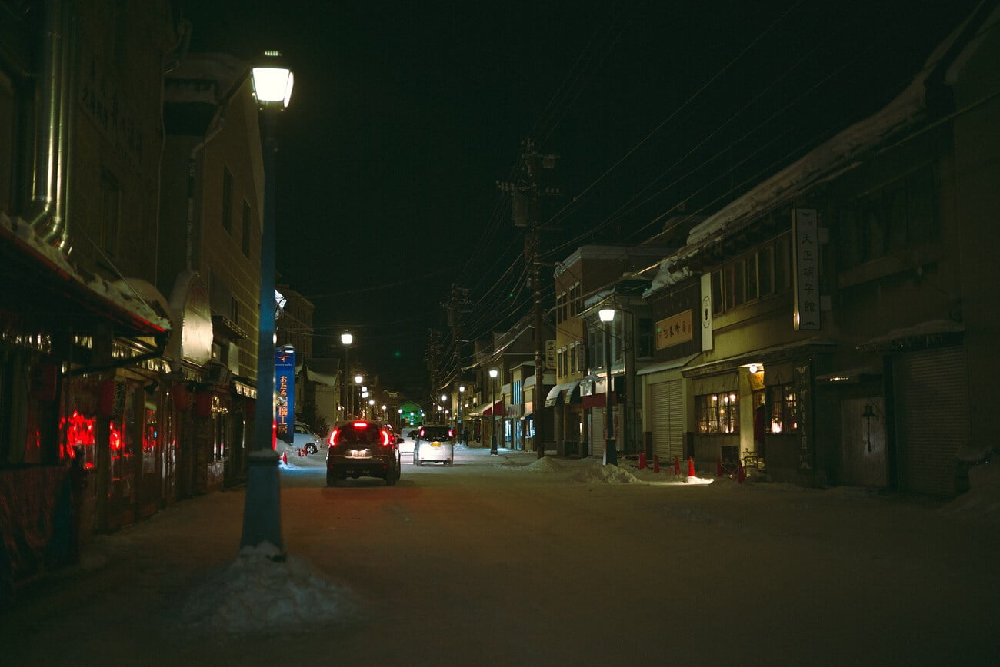
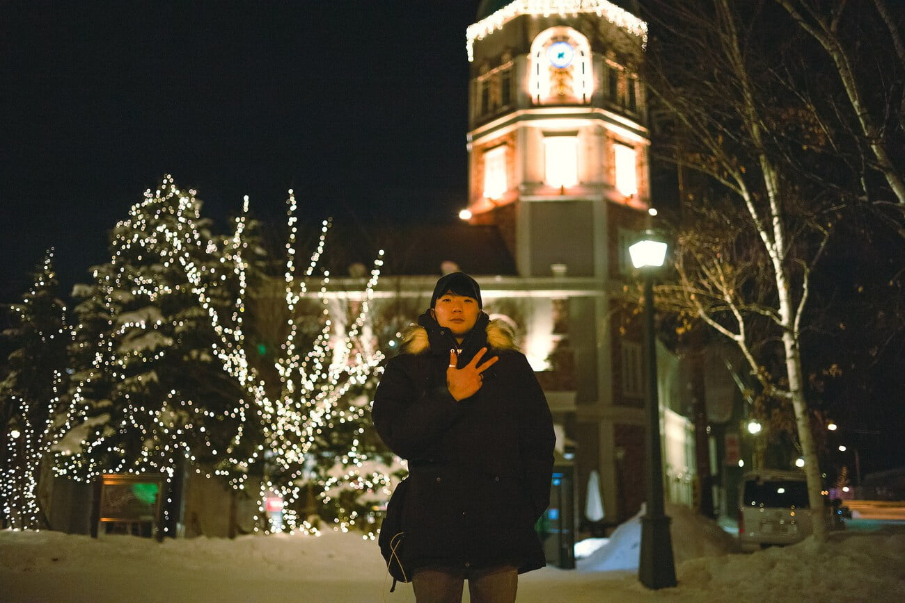

이번 여행을 준비하면서 내 첫 여행을 떠올렸다. 나의 첫 여행은 출국부터 귀국까지 모든 것이 새로웠고 내가 지금까지 성장할 수 있는 힘이 되었지만 기록이 부족하다 보니 아쉬웠었다. 내 동생은 이번 여행이 첫 해외 여행이었기 때문에 그 모습을 잘 담는다면 간접적으로라도 나의 그 당시 기분을 떠올릴 수 있을 것이라 생각했다. 그래서 이번 여행의 내 촬영 컨셉은 '첫 해외 여행'이었다.

특히 내가 가지고 있는 아카이브 저널의 Life is a Journal 사진집에서 아이디어를 얻었다. 이 사진집엔 이탈리아의 화가 가브리엘레 스코토라티와 함께 여행하며 그의 모습들을 곁에서 담았는데. 마찬가지로 나도 동생의 첫 여행의 설렘을 담아보고자 노력했다. 잘 안담겼는가? 상관없다. 나는 취미사진가이기 때문에!

공항에서 3종류의 교통편을 위한 티켓을 구입했다. 첫번째는 '홋카이도 패스 3일권' 홋카이도 전역의 JR을 3일간 이용할 수 있다. 두번째는 '삿포로-오타루 웰컴패스' 삿포로-오타루 구간은 JR이 아닌 구간이 있어 별도로 티켓을 판다. 따라서 해당 티켓과 삿포로 시내 전철 1일권이 포함된 이 티켓을 구입했다. 세번째는 공항에서 삿포로 시내로 가는 편도 기차 티켓.

3일권은 오늘 구입해도 사용을 시작한 날짜 기준으로 3일을 계산하기 때문에 미리 구입해도 된다.

신치토세 공항의 날씨는 너무 좋았지만 삿포로로 들어설 때 갑자기 날씨가 바뀌었다. 폭설이 내리고 있었다. 사진을 찍어야했는데 카메라가 방진방적을 지원하지 않아 심히 걱정되었다. 근처 Loft 에서 작고 가벼운 우산을 하나씩 구입했다.

상황이 어떻든 도시의 정취를 느끼고 싶기도 했고. Airbnb로 예약한 숙소가 JR삿포로 역 근처라 전철 1일권은 사용하지 않기로 한다. 걸어서 이동했다.

캔버스 재질인 내 카메라 가방이 젖기 시작했고 지하 보도가 있다는 정보를 토대로 입구를 찾아 들어갔다. JR삿포로부터의 큰 대로들은 전부 대규모 지하보도가 있어서 지하보도로 목적지 근처까지 갈 수 있었다. 이번 여행에서 예약한 Airbnb 숙소들은 전부 체크인 시간이 15시 이후 여서 근처에서 점심을 먹기로 했다.

Tripadvisor에서 저렴한 스테이크 집을 찾아 근처 쇼핑센터로 들어갔다. 근데 식당은 건물에 연결되어 있지 않았고 밖으로 나가 건물 뒤로 돌아서 도착했다. 간단하게 추천메뉴 2개를 주문했고 삿포로 생맥주와 함께 흡입했다.

식사를 끝내고 나니 눈이 그치고 있었다. 계산하고 밖에 나와 숙소로 향했다. 걷는 도중 트립어드바이저에서 알려준 가게를 발견했다. 사실 우리가 밥을 먹은 곳은 다른곳이었다. 음식이 맛있어서 다행이었다.

숙소 체크인 후 바로 오타루로 가기 위해 JR삿포로 역 플랫폼에서 기차를 기다렸다. '삿포로-오타루' 웰컴 패스에 포함된 왕복 티켓을 사용했다.

기찻길이 해안을 따라 놓여 있어 창 밖 풍경은 장관이었다. 열차 안은 난방이 정말 잘 되어 있었다. 옷을 무리하게 껴입으면 상당히 고생할 뻔 했다. 짐이 무겁고 출국과 걸어서 이동했던 스트레스가 쌓여 숙면을 취해 바깥을 구경은 잠시 뿐이었다.

첫째날에는 관광을 하며 방한부츠를 구입해야 했다.. 둘째날엔 비에이를 가기 때문이었고 삿포로 역에서도 둘러봤는데 남자용은 파는 곳이 없었다. 다행히 오타루에서 좋은 신발을 저렴하게 구입할 수 있었다. 이 때문에 관광이 조금 늦어졌지만 후회하지는 않는다.

바닷가 마을이라 그런지 강풍이 계속 불었고 시간이 지날수록 더욱 더 추워졌다. 촬영용 장갑을 가져가지 않았다면 사진을 원하는 만큼 찍지 못했을거다.

바람이 너무 세게 불어서 쌓여있던 눈들이 흩날렸고 가끔 멋있는 장면이 연출되기도 했다. 다만 너무 추워서 손을 주머니에 넣고 있어서 찍지 못해 조금 아쉽기도 했다.

Tripadvisor로 찾은 근처 카이센동 집에서 저녁을 먹었다. 1, 2호점이 있다고 했는데 도저히 2호점을 찾아다닐 수 없어서 상당히 비좁은 1호점이라도 들어갔다.

밥은 정말 맛있게 먹었다. 이 시점 이후로 내 동생은 '내가 한국에서 먹었던거는...' 을 입에 달고 살게 되었다.

늦은 시간이라 오르골당이 문을 닫았다. 간단하게 사진을 찍고 바로 삿포로의 숙소로 귀가했다. 조금 늦어서 많은 것을 볼 수 없었지만 뭐 내맘대로 되는게 어디 있겠나?
