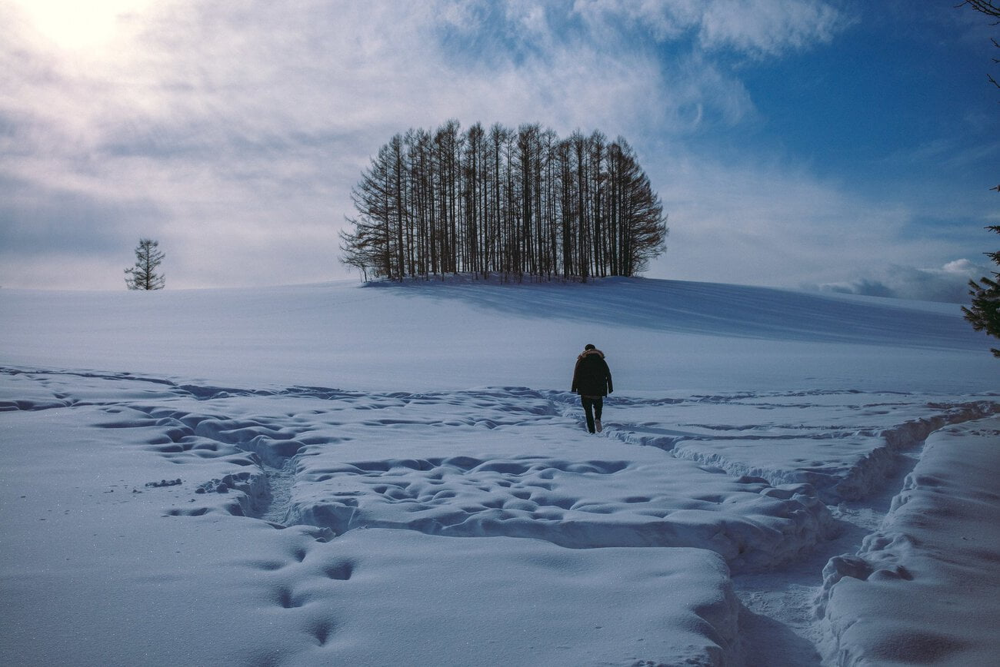
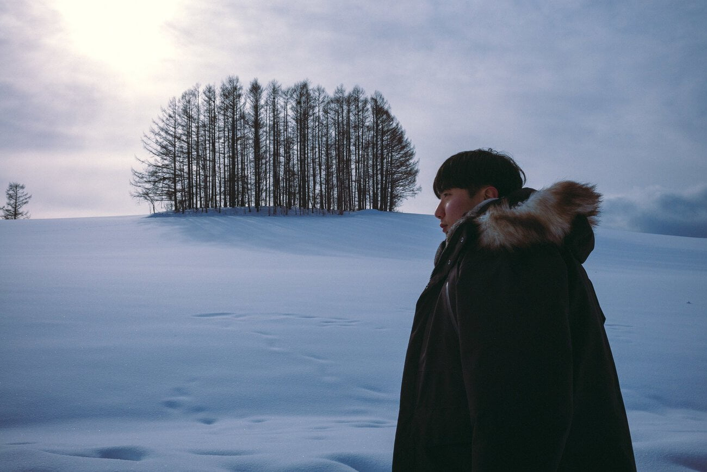
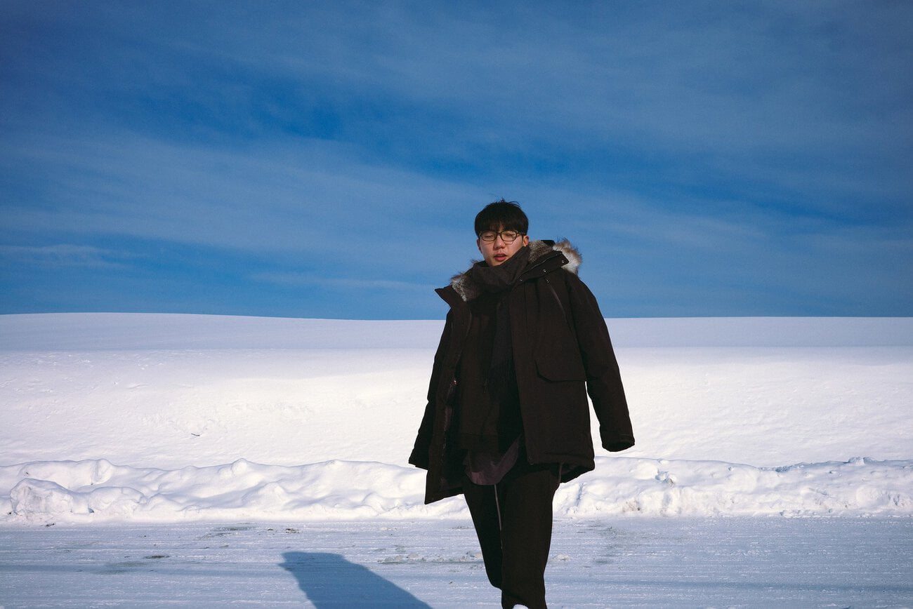
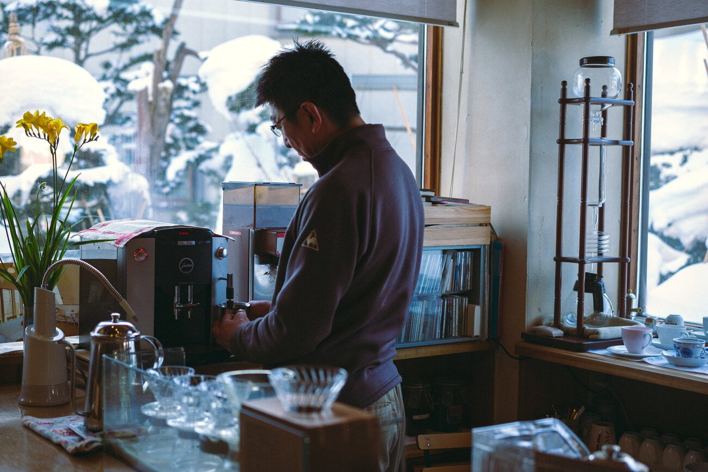

아사히카와 역의 무인양품에서 목토시와 목도리를 추가로 구입하고 차를 렌트했다. 스노우 타이어가 장착되어 있고 여타 다른 점은 한국과 크게 다른 점이 없었다. 보험은 역시 비싸더라도 좋은 옵션을 선택했고 짐을 실은 후 출발했다. 첫 번째 목적지는 바로 마일드세븐 언덕이었다. 일본 마일드세븐 TV CF에 등장해서 유명해진 명소라 했다.

일단 비에이 내의 명소들은 따로 주차장이 없었다. 사실 위에 보이는 사진의 설원이 원래는 다 개인 소유의 농지이고 눈이 치워진 도로가 좁게 가로지르는 형태이기 때문이었다. 다행히 길 폭이 좁지는 않아 짧은 시간 정도는 갓길 주차를 하고 구경할 수 있었다.

모든 명소들이 다 개인 소유의 농지이다. 근데 들어가려는 시도를 하는 사람이 많아 일부 명소의 경우 나무를 베어버리기까지 하는 불상사도 있었다고 한다. 근처 식당이나 편의 시설에도 그런곳에 들어가지 말라는 경고가 있는데 말이다.

눈이 너무 많이 와서 깊게 들어가기가 불가능하기도 했다. 길이 나 있지 않은 곳으로 가려 했다가는 무릎까지 오는 부츠를 신지 않으면 신발이 다 젖었다.

비에이시는 도심과는 거리가 먼 마을의 느낌이다. 높은 건물이 하나도 없고 주택이 대부분이었다. 토요일이라 그랬는지 모르겠지만 거니는 사람도 많지 않았다. 차도 많이 다니지 않아서 동생에게 부탁해 안전을 확보한 후 도로 가운데서 몇 장의 사진을 찍기도 했다.

우린 여기서 점심을 먹기로 했다. 비에이 역 바로 앞에 있는 음식점을 찾았다. 오랫동안 운영한 분식집 같은 느낌이었는데 여기서 돈가스 정식, 치킨가스 정식 그리고 무알콜 맥주 2병을 주문했다. 맛은 말할 필요도 없이 대단했고 동생은 '내가 지금까지 먹었던' 을 연발하기 시작했다.

무알콜 맥주는 조금 요구르트같은 맛이 나서 실망했지만 운전을 해야 했기에 긴장을 늦출 순 없었다.

원래 아침일찍 나올 수 없을 것이라 예상해 9시 열차를 탈 것이라 예상했고 렌트를 13시 이후에 할 것으로 생각했다. 하지만 아사히카와 역에 도착했을 땐 오전 10시였고 생각보다 일찍 렌트를 해서 시간이 많이 남은 상태였다.

카페에서 커피를 마시며 여행 계획을 잡았고 거리가 있어 포기했던 흰수염폭포에 가기로 했다. 비에이에서 흰수염폭포로 가는 길은 30분이 소요되었고 그 중 20분동안은 직진이었다. 추위와 따듯함으로 담금질이 되다 보니 졸음이 오기 시작했고 나는 동생의 어깨를 주물러주며 잠을 깨웠다.

흰수염 폭포를 볼 수 있는 다리를 건너면 산 위로 올라갈 수 있도록 계단이 있다. 이 계단을 끝까지 올라가면 건물이 하나 나오는데 이 건물은 지진활동으로 인한 재난에 대비하기 위한 센터였다. 사실 여기가 뭐 하는 곳인지는 그 건물에서 화장실을 이용한 후 다시 계단을 내려가려고 하며 주위를 둘러볼 때 알았다. 바로 활화산이 눈 앞에 있었던 것이다.

눈으로 덮인 산에서 화산 연기가 나는 광경을 봤을 때 신비로우면서도 미세한 두려움이 느껴졌다. 땅이 넗어 여러 자연환경을 접하고 그에 대한 대비를 하는 측면에서 내가 살고 있는 나라보다 무언가 경험이 많다는 생각을 하게 되었다.

