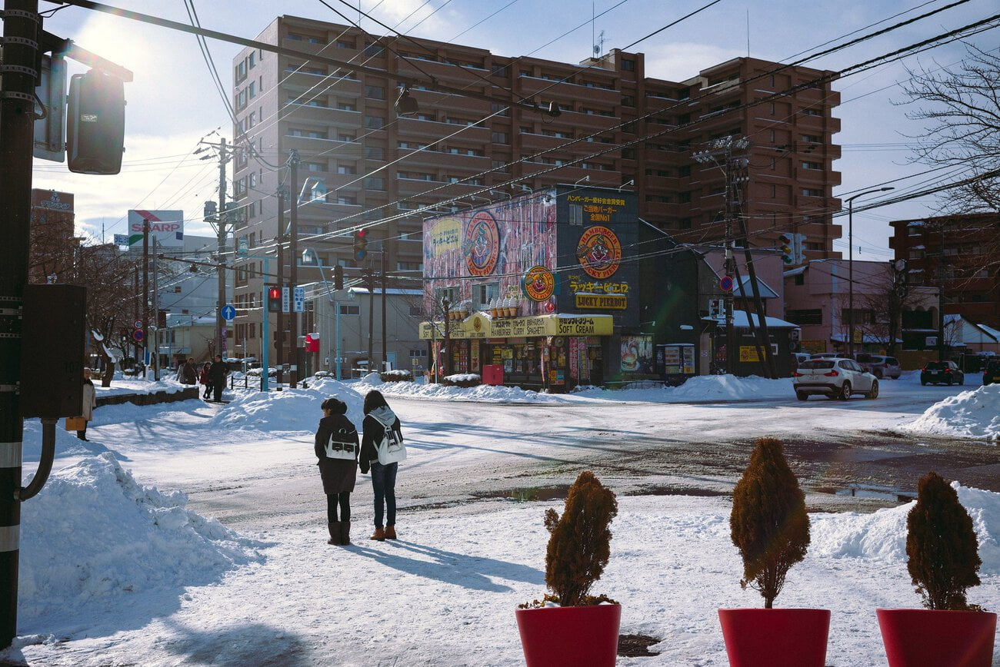

이번 여행에서 가장 기대했던 곳이었다. 이곳에서 1박을 하는 동안 느꼈던 정취가 아직도 잊혀지지 않고 있다. 삿포로에서 새벽 기차를 타고 기나긴 해안철도를 지나 3시간만에 하코다테에 도착했다. 낯선 열차 밖 풍경을 보며 전혀 새로운 세계에 가는 듯한 느낌을 받았다.

한시간 반 정도를 깨어 있었다. 장거리 열차이다 보니 열차 내 판매원을 여러번 마주쳤지만 하나도 사 먹지 않았다. 물 조차 조심스러웠다. 지도를 보니 홋카이도 열도 아래쪽으로는 후쿠시마가 위치해 있었다. 조금 걱정은 되었지만 지도상으로 가까워 보여도 실제는 먼 거리기도 하고 이쪽은 안전하다(?) 했으니 개의치 않기로 했다.

열차에서 내리자마자 니죠시장으로 향했다. 유명하다 했던 '키쿠요식당' 에서 우니동을 먹었지만 생각보다 비리고 맛이 없었다. 더군다나 동생이 먹었던 우니동은 싯가 개념으로 매일 값이 달라지는 메뉴였다. 하필이면 그날은 4000엔이었다. 역시 유명하다 하는 집은 조심해야 한다.

개인적으로 니죠 시장은 실망이었다. 역 근처라 접근성이 좋아서 사람들이 많았는데 그래서 지나치게 상업화된 느낌이었다. 한번 왔다 갈 사람이라 생각하고 대하는것이 느껴졌고 역시나 맛도 별로 없었다. 시장이라 그런지 겨울인데도 비릿한 향이 근처에 맴돌았고 별로 추천하고 싶지 않은 관광지였다.

카페에서 커피와 딸기 파르페를 먹으며 여행 계획을 다시 체크했다. 숙소 체크인 시간은 15시. 시간이 남아 고료카쿠를 보고 내려오기로 했다. 다시 하코다테역으로 걸어가 노면전차 1일권 4장을 구입하고 오늘 날짜를 긁어 고료카쿠로 향했다.

럭키삐에로는 식자재의 신선도를 위해 하코다테에만 있는 패스트푸드 체인이다. 이곳에서 음식점을 찾았을 때 왜 패스트푸드 체인이 1위인지 이해할 수 없었다. 왜 이 먼 곳까지 와서 패스트푸드가 먹고 싶을까. 내가 생각하기에 일단 럭키삐에로는 건물 인테리어가 눈에 상당히 띄고 주요 관광지에 위치해 있다.

그리고 현지의 맛집들은 다들 간판이 눈에 띄지 않아 찾기 어렵거나 들어가기 어렵게 되어 있었다. 따지고 보니 럭키삐에로가 하코다테의 정취를 해치고 있다는 생각이 든다. 저런 인테리어의 가게가 하나 둘 늘면 결국 한국처럼 될 지도 모른다.

해가 저물기 시작할 즈음 로프웨이를 타고 하코다테 산으로 올랐다. 무언가에 이끌린듯이 케이블카를 탔다. 사실 나는 하코다테에서 꼭 찍고 싶은 사진이 있었다. 바로 언덕 위쪽에서 항구 쪽으로 난 도로와 만과 건너편 육지와 그 위로 노을이 펼쳐진 풍경이었다. 날이 좋아야 사진을 찍을수가 있는데 이 날이 그런 날이었고 나는 산 위로 올라갔다.

산 위의 풍경은 무슨 말이 필요할까. 너무 좋았다.

