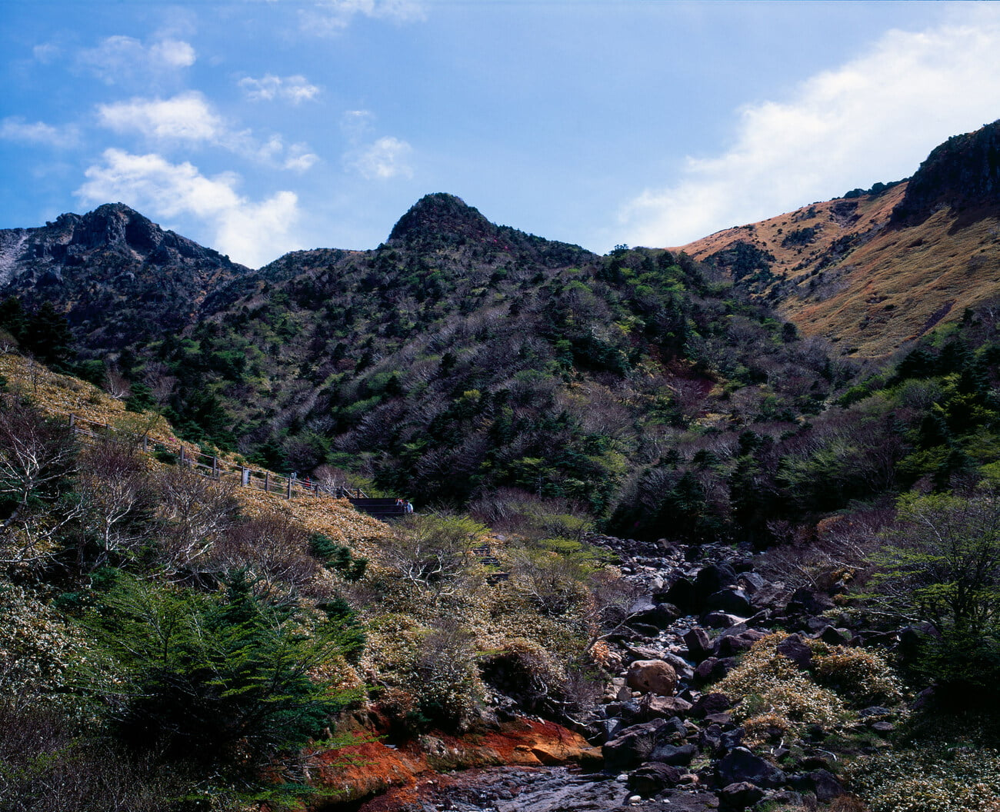
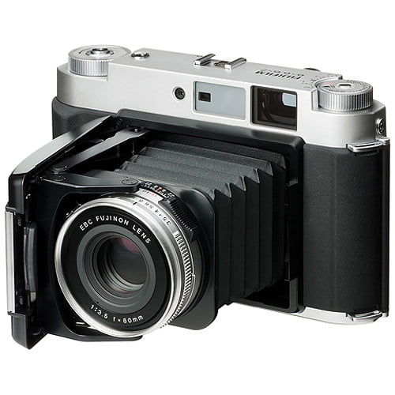
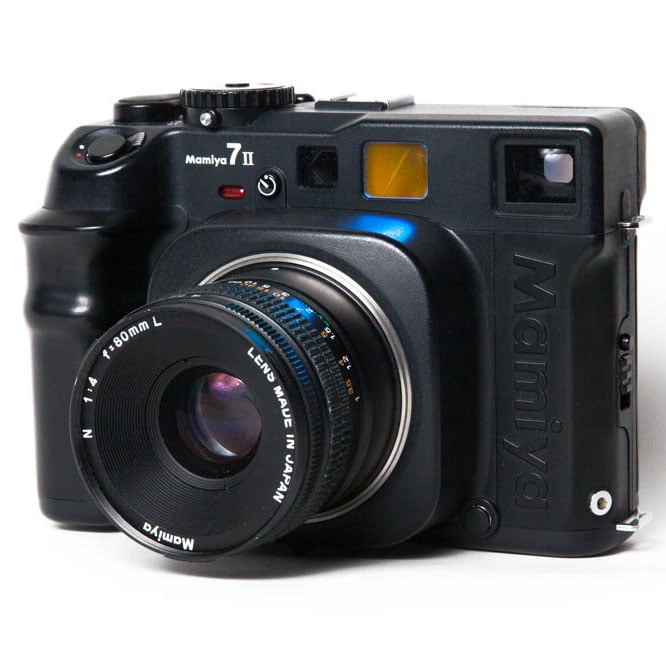
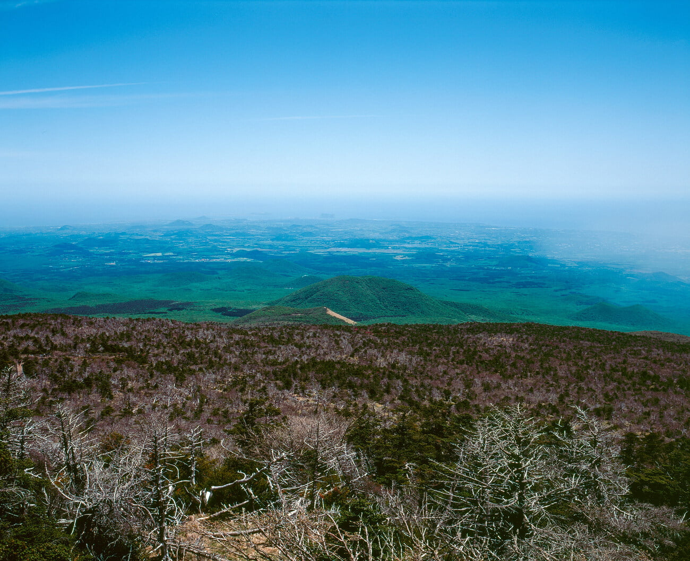

나는 RF카메라를 선호한다. 거의 대부분 RF카메라는 수동 초점 방식이다. 뷰파인더 내의 이중합치와 렌즈 위쪽의 피사계심도표를 이용해서 초점을 잡는다. 자동 초점방식이 편리하긴 하지만, 뷰파인더를 들여다보며 초점링을 돌리지 않으면 뭔가 빼먹은듯한 기분을 느껴서 이제 어쩔 수 없다. 민망한 경험이지만 뷰파인더가 없는 카메라인데 무의식적으로 얼굴에 가져다 댄 경우가 많았다.

최근에 들인 중형 필름카메라의 선택 기준도 'RF이어야 할 것' 이었다. 그래서 들인 카메라가 80mm 고정렌즈(풀프레임 환산 50mm)가 달린 Fujifilm GF670. 중형치고 너무 컴펙트한 카메라라 부담없이 어깨에 매고 다니면서 사진을 찍고 있다. 근데 사용하다 보니 역시 '평가측광'과 렌즈 교환에 대한 욕심이 생기고 있다. 그래서 요새 Mamiya 7-ii 를 Ebay에서 보고 있다.

Mama 7-ii 는 평가 측광을 지원하는줄 알았다. 그런데 얼마전에 아니라는 것을 알았다. 본체 뒤쪽의 버튼은 그저 '다중노출' 을 위한 버튼이었고 이 카메라 역시 스팟 측광만을 지원했다. 게다가 렌즈를 통해 들어오는 빛으로 사진의 밝기를 계산하지 않는다. 렌즈를 통해 들어온 빛으로 무언가 계산하는 것을 TTL(Through the lens)이라고 하는데 GF670, Mamiya 7-ii 둘 다 그런 방식이 아니다. 렌즈 윗 부분에 빛을 체크하기 위한 별도의 창이 있다. 이게 무엇이 안좋으냐면. 차근차근 설명해보겠다.

역사 교과서나 TV프로그램에서 '사진기의 발명' 이라면서 어떤 아저씨가 카메라 앞에 뚜껑을 열고 시간을 재다가 얼른 닫는 모습을 보았을 것이다. 그게 오늘날의 셔터속도다. 사람이 뚜껑을 여닫던 것을 기계적으로 구현한 것이다. 오랫동안 뚜껑을 열고 있으면 빛을 많이 받아들인다(사진이 밝게 나온다). 대신 흔들릴 확률이 증가한다. 뚜렷한 사진을 얻기 힘들어지는 것이다. 반대로 짧은 시간만 열어두면 빛은 적게 받아들이지만(사진이 어둡게 나온다) 흔들릴 확률이 감소한다.

뚜렷하면서도 밝게 나오게 하고 싶으면 어떻게 하면 될까? 빛이 들어가는 구멍의 넓이. 그러니까 빛이 지나가는 통로를 더 넓게 만들면 된다. 이것이 오늘날의 조리개 (F) 이다. 뚜껑을 짧은 시간을 열어두어도 구멍이 크면 (셔속이 빨라도 조리개를 열면) 흔들림 없는 밝은 사진을 얻을 수 있다. 그리고 부가적으로 피사체를 부각시키는 데 응용할 수 있는 아웃포커스 현상이 발생한다. 아마 처음 이 현상을 접한 사람은 이 문제(?)를 없애려 하지 않았을까 한다.

정리하면 적절한 밝기의 사진을 얻기 위해서는 위의 두 가지 (셔터속도, 조리개)를 조절해야 한다. 단순하게 생각해서 셔속이 빠르면 조리개를 열어야 할 것이고, 셔속이 느리면 조리개를 닫아야 할 것이다. 반대로도 그렇다. 그런데 우리는 이걸 매번 직접 계산하지 않는다. 그냥 다 알아서 찍어주지 않는가? 그게 바로 카메라의 '측광' 시스템이다.

여기서 상황을 하나 가정해 보자. 다음 컷에서 아웃포커싱 효과를 꼭 이용하고 싶다. 그렇다면 조리개를 무조건 열어야 할 것이다. 햇빛이 적절하면 상관이 없는데, 막 내리쬐고 있다. 이 때 적절한 밝기의 사진을 얻으려면 셔터속도가 엄청 빨라야 한다. 보통 1/8000초 1초에 8000번을 열었다 닫았다 할 수 있는 정도의 속도로 뚜껑을 열었다 닫아야 한다. 그런데, 일반적인 카메라들이 자동으로 뚜껑을 여닫는 시간은 최소 1/4000 까지이다. GF670, Mama 7-ii 둘 다 최소 1/500 밖에 지원하지 않는다. 이러면 그냥 하얀 사진만 찍히고 말 것이다. 절대 피사체를 찍을 수 없다.

그럼 뚜껑 대신 무얼 하면 좋을까? ND필터를 사용한다. 눈부시면 선글라스 쓰는것처럼 투명한 필터를 렌즈 앞에 끼우는 것이다. 그럼 1/4000으로 사진을 찍더라도 빛이 덜 밝게 들어온다. 이 ND필터도 수치가 따로 있는데, '이 필터는 두배 어둡게 해줘요', '이 필터는 세배 어둡게 해줘요' 그런거고 그냥 어둡게 해준다고만 생각하자.

이제 다시 딜레마 이야기로 돌아와서. 카메라가 '측광'을 통해 적절한 밝기로 사진 찍고싶으면 셔터속도 몇, 조리개 몇. 계산해줄것이다. 근데 여기에 선글라스를 끼워 빛을 줄였다. 카메라가 그걸 인지할까? 여기서 두 가지 상황으로 나뉜다. 카메라가 렌즈를 통해 들어온 빛으로 계산을 할 경우 (TTL) 렌즈 앞에 선글라스를 끼웠으니 어두워졌다는것을 인지해 셔터속도를 느리게 한다. 그럼 만약 렌즈를 통해 들어온 빛으로 계산하지 않는 카메라는?

손가락을 꼽아 가며 수동으로 계산해주어야 한다. 손가락 꼽다가 찍고 싶은 타이밍을 놓치거나, 계산을 잘못해서 너무 어둡거나 너무 밝은 사진이 나와버리는 것이다. GF670, Mamiya 7-ii 둘 다 이런 방식이라 사용하기 까다로운 부분이 있다. 이것 말고도 몇가지 불편한 사항들이 있지만 위에 설명한 내용이 제일 불편하다.

그렇다고 렌즈를 통해 들어오는 빛으로 계산하는 중형 필름 카메라를 사용하기는 싫다. RF방식이 아니라서다. 카메라가 RF초점 방식을 가지면 구조상 DSLR보다 더 작고 가볍게 만들 수 있는데 그 컴펙트함을 좋아한다. 미러리스도 작고 가볍지만 별로 쓰고 싶지 않다. RF이어야 한다. 내가 왜 RF를 고집하는지까지 이 글에서 다루면 너무 길어질 듯 하다. 지금 밑에 적어두긴 했는데 메모장에 옮겨 두고 나중에 정리해서 따로 올려야 할 듯 하다.
