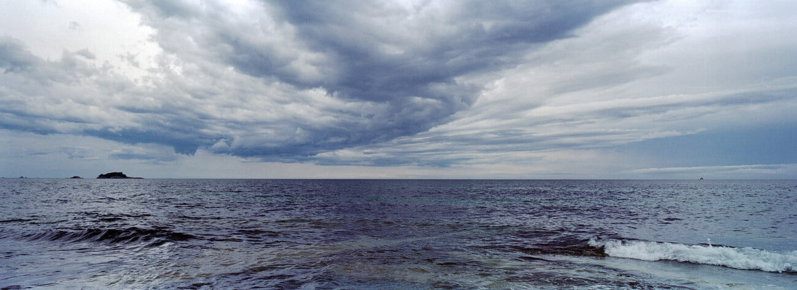

호우주의보로 거의 반 이상 포기하고 갔던 바캉스에서 드라마틱한 날씨 변화를 경험했다. 서울에서 비를 쏟던 먹구름이 태백산맥에 걸쳐 속초, 양양으로 넘어오지 못하고 있었는데. 그 풍경은 한국이 아닌 듯 한 느낌을 주었다. 그 구름들 중에서 간신히 산맥을 넘어 동해바다 너머로 가던 구름들은 바다 위에서 난생 처음보는 진풍경을 그렸다.

이번에 새로 장만한 중형필카로 그 풍경들을 담았다. 신기하게도 135필름 어댑터를 사용하면 풀프레임 파노라마를 한컷에 담을 수 있었는데. 결과물도 상당히 마음에 든다. RF방식 중형 필름 카메라의 종착지이지 않을까 싶은데. 정말로 그랬으면 좋겠다. 적어도 팔 생각은 안들듯. 📷 #mamiya7ii 🎞 #KodakProImage100

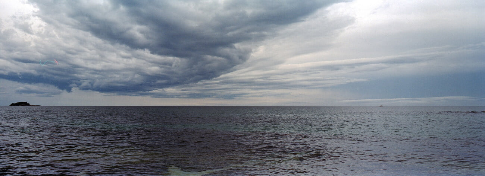

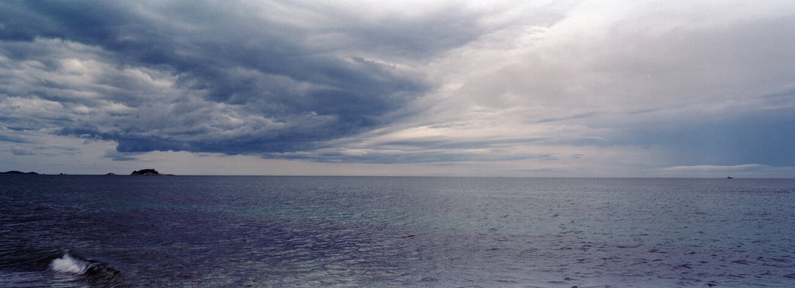

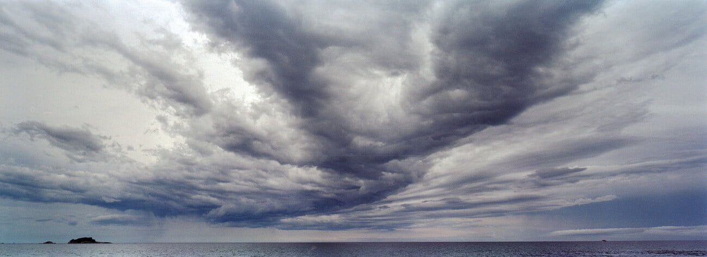

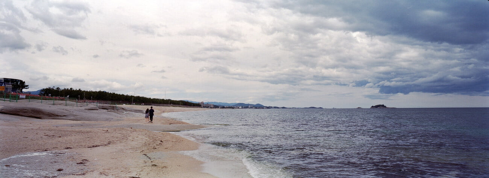

---

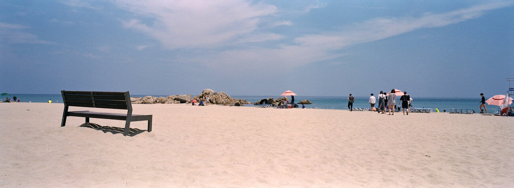

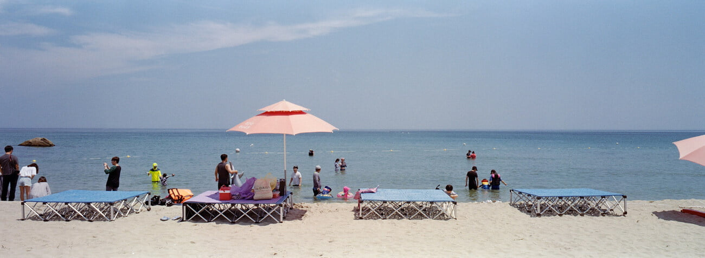

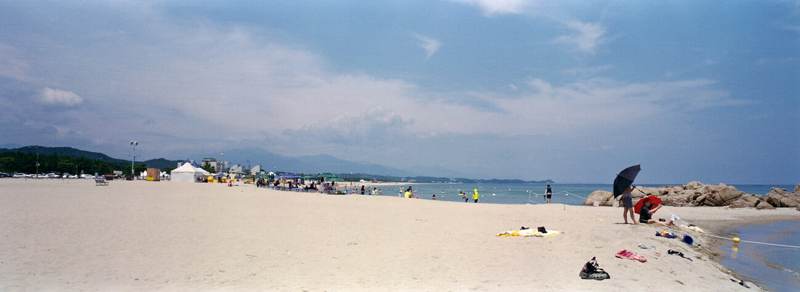

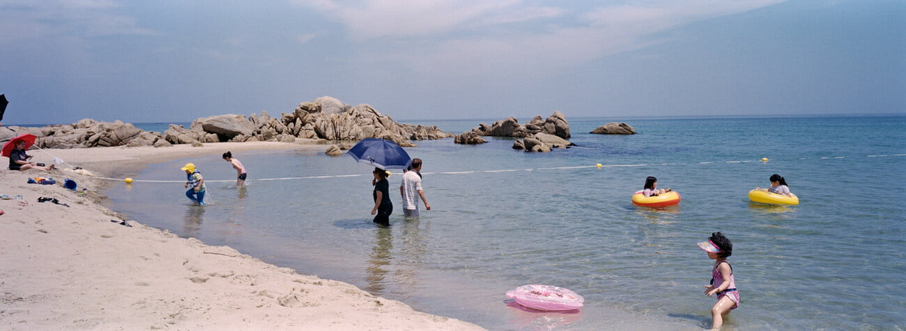

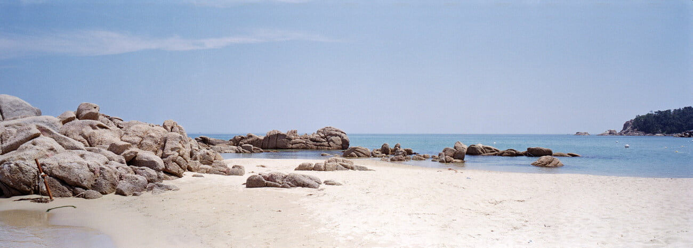

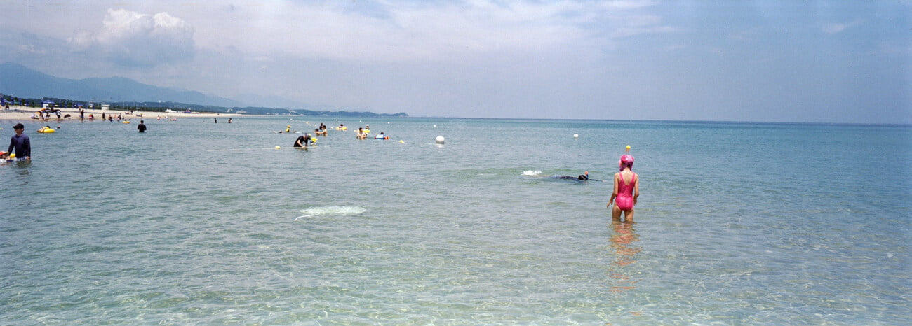

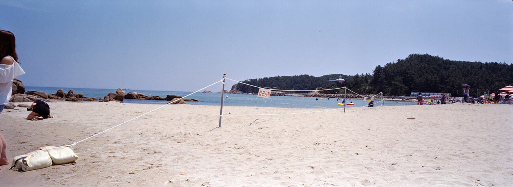

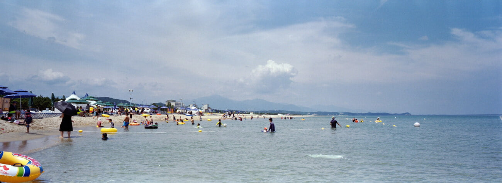

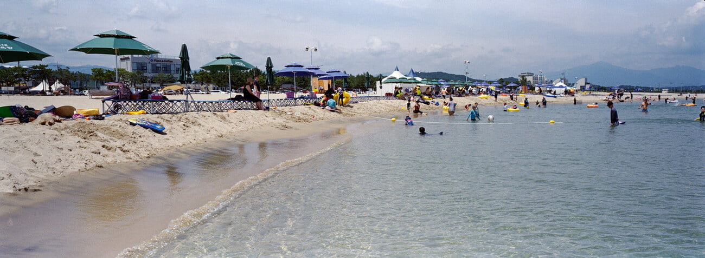

