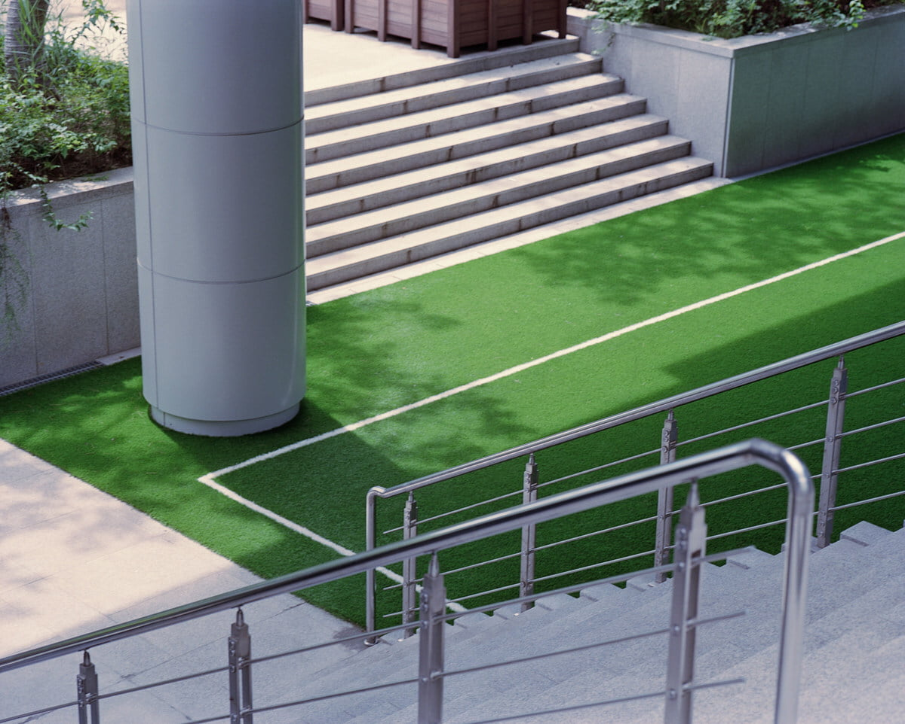
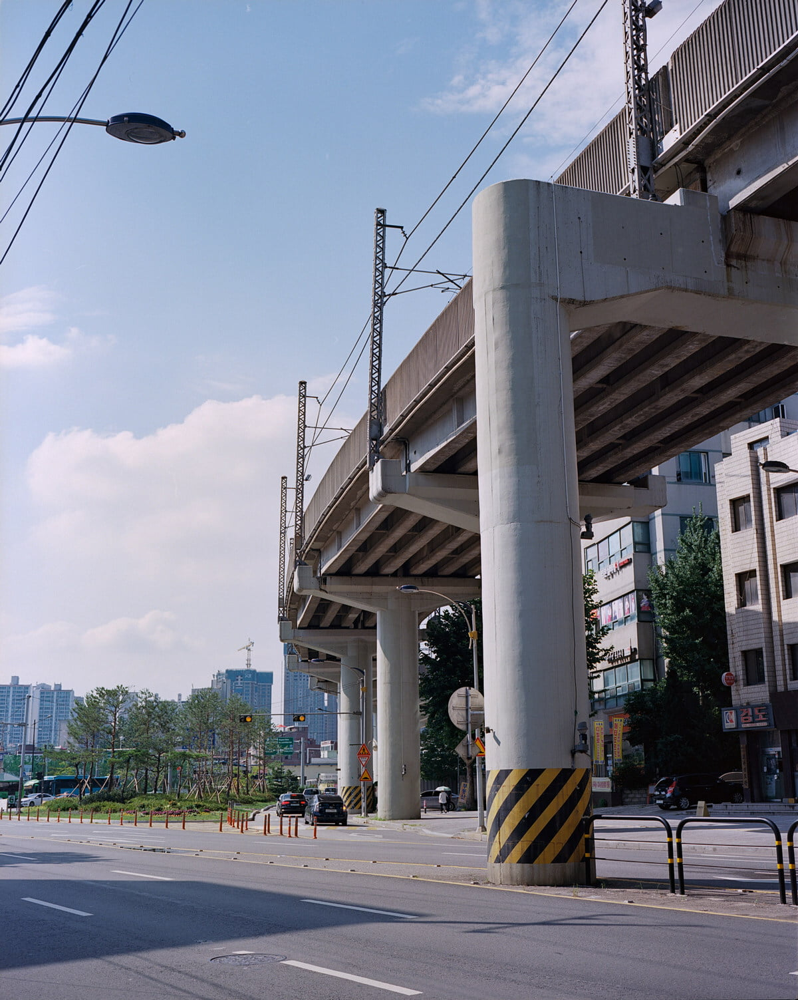
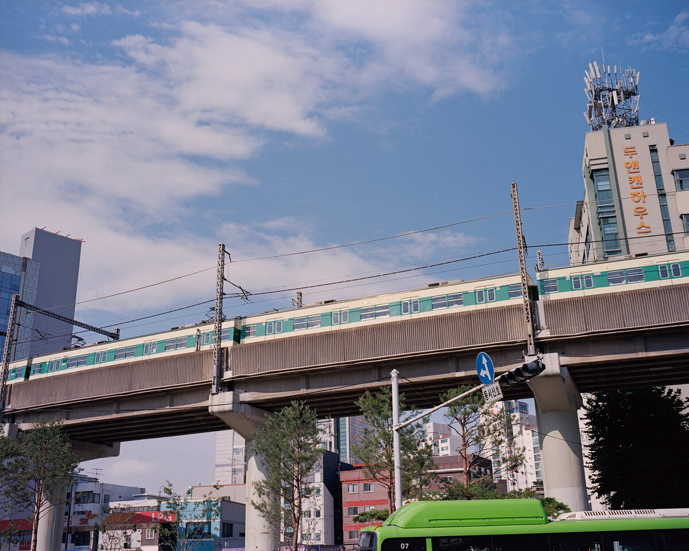
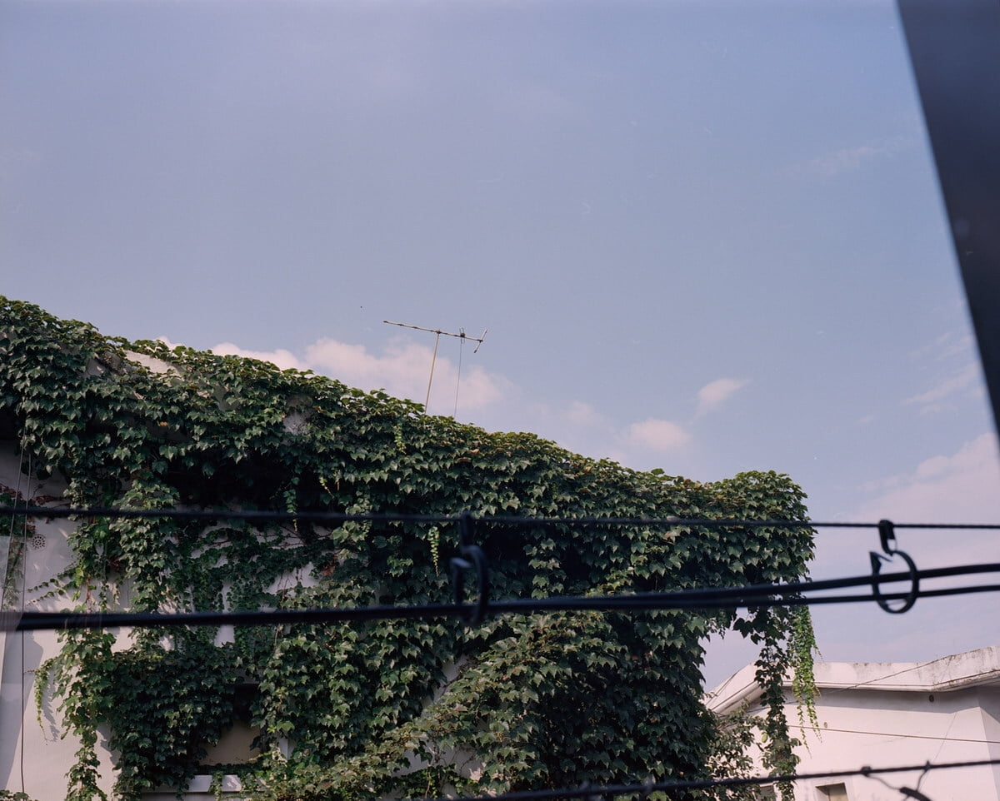
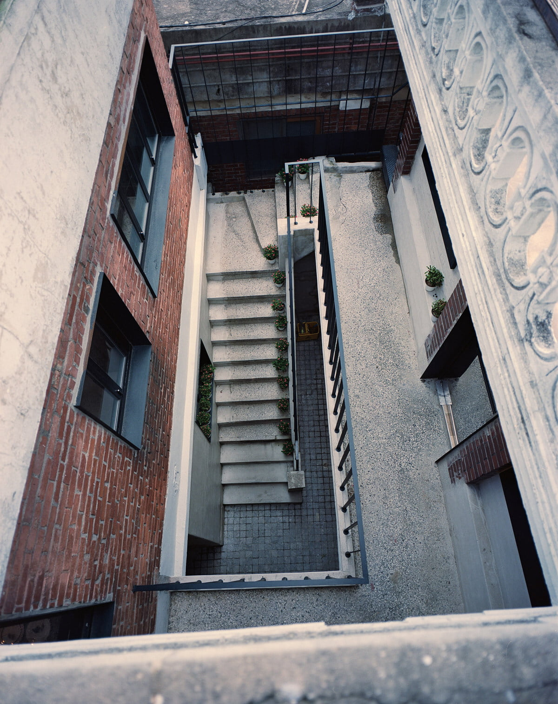
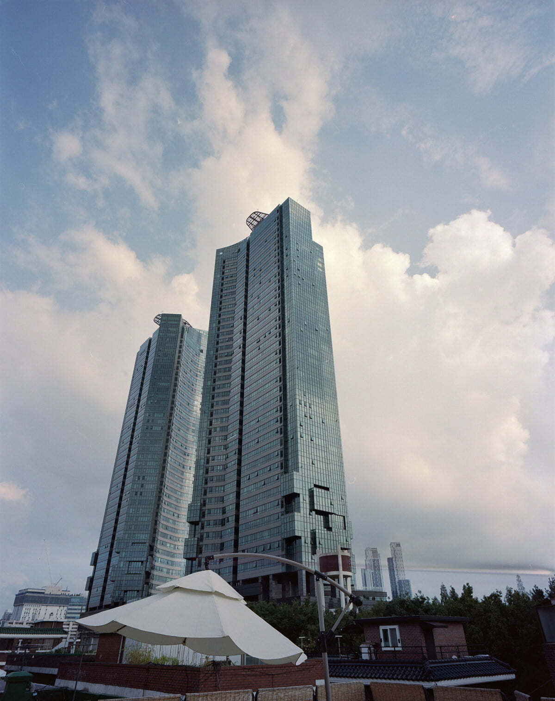
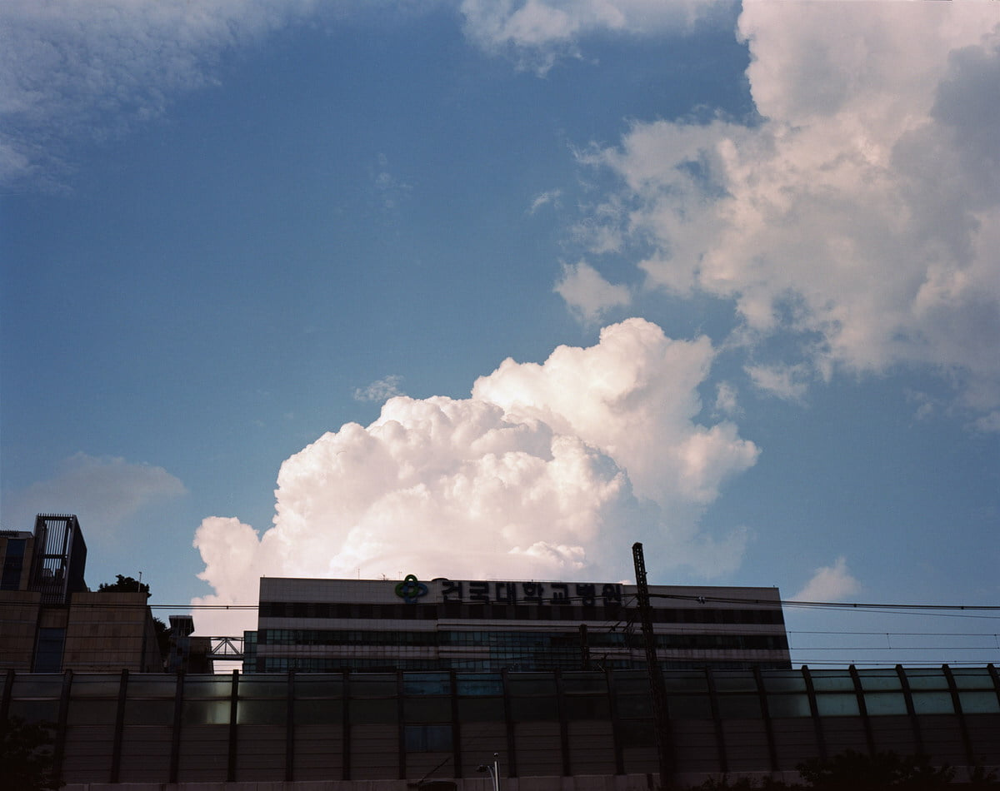
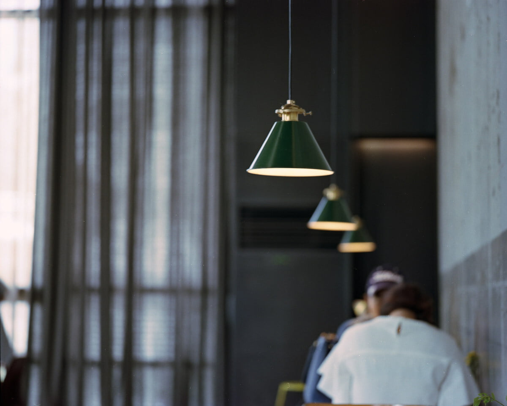
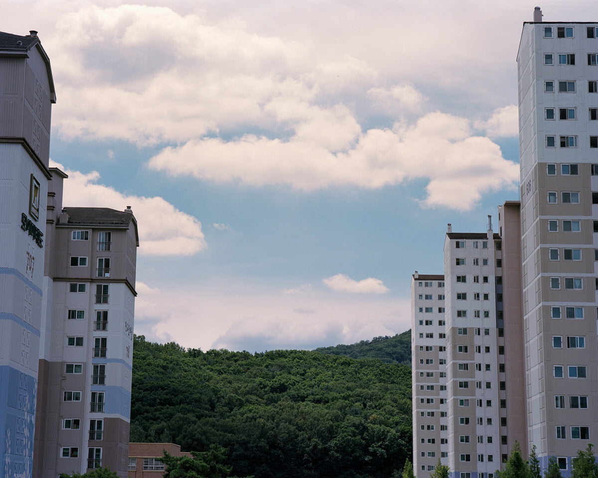

거짓된 듯한 8월이 끝나간다. 언제 내가 솔직했고 언제 내가 꾸밈이 있었는지 분간할 수 없다. 예전에도 그랬지만 좋은 사진을 찍을 수 없을거 같다. 한계가 보인다. 이렇게 사진들을 올리면 기분이 좀 나아질지도 모르겠다. 우연히 들렀던 서판교하고 성수동에서 몇 컷 담아보았다.

43mm, 150mm를 사용했다. 중형이니까 풀프레임 환산하면 21mm, 80mm정도일듯. 내가 사용했던 화각 중 제일 넓고 제일 좁은 화각이다. 표준화각과 다른 느낌이 드는 것은 역시 눈에띄는 사진의 3요소 못보던거, 이쁜거, 좋은색감 중 '못보던거'를 만족하지 않나(뭐 원근압축 이런거 있자나) 싶다. 📷 #mamiya7ii

