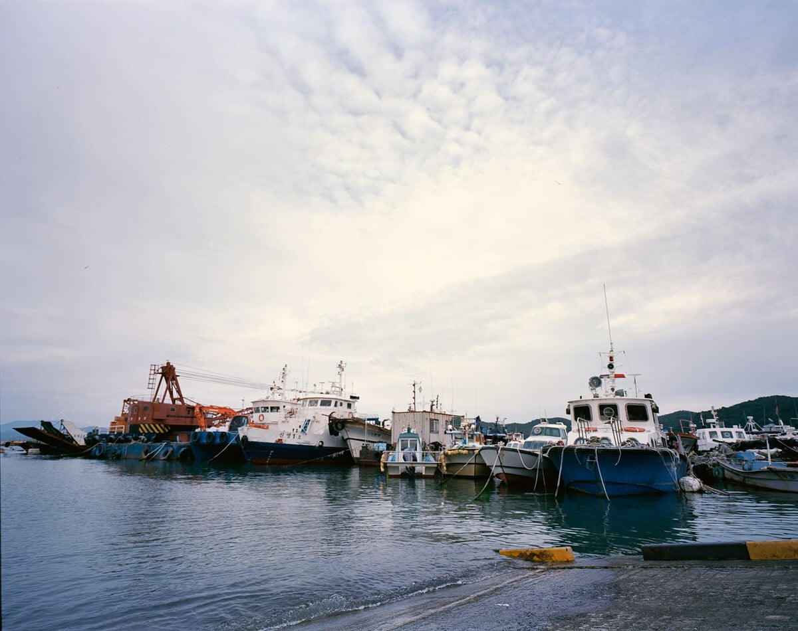
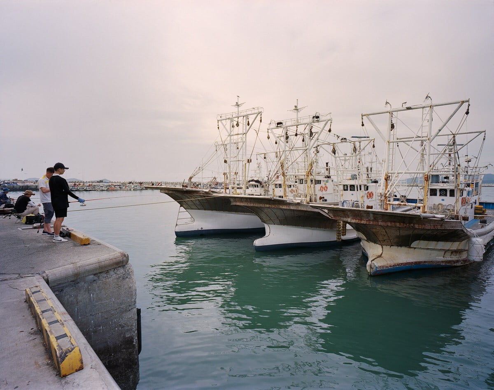
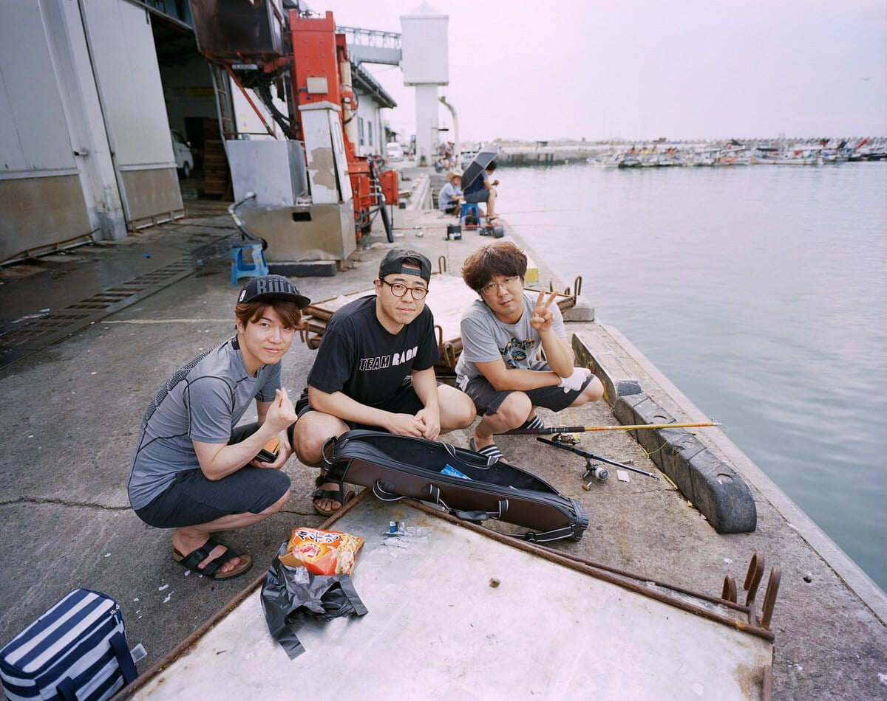
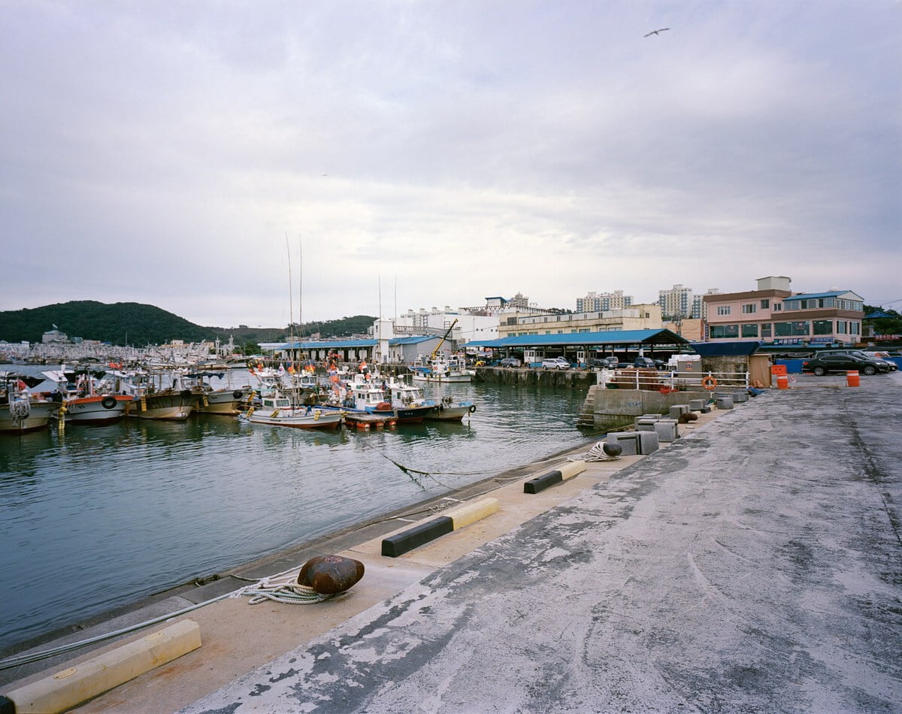
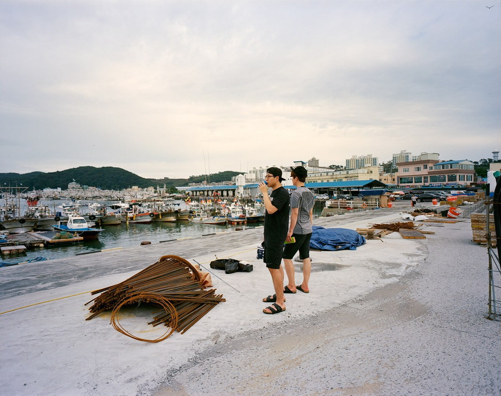
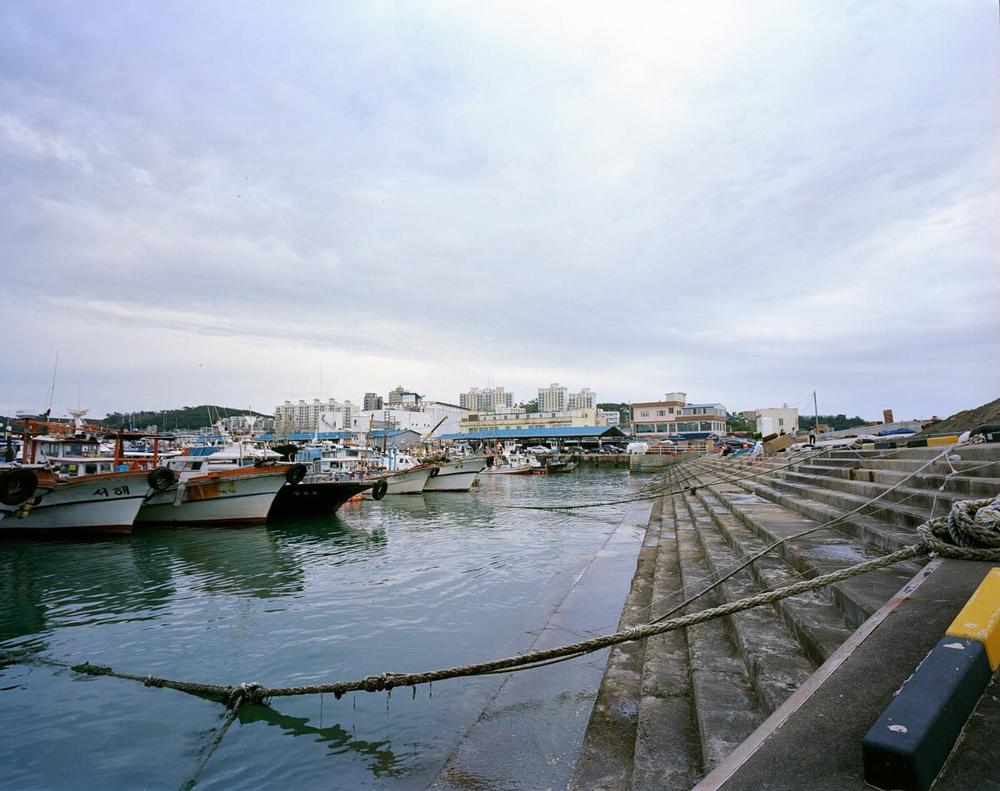
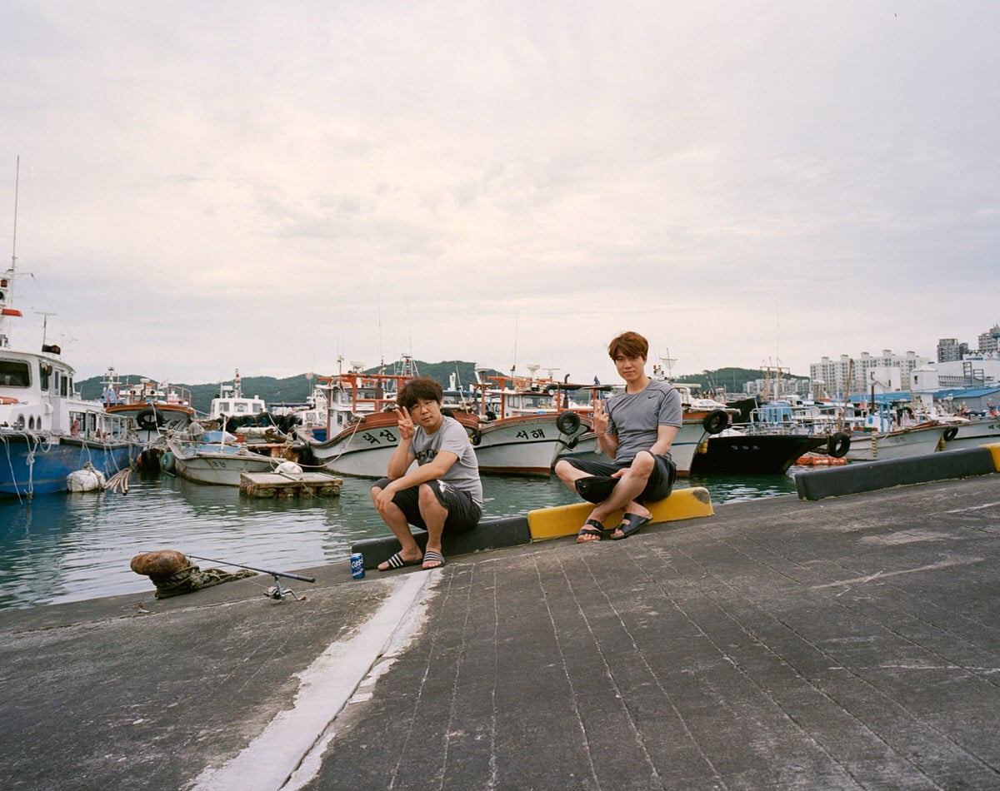

무엇을 해도 마음이 차분해지지 않는다. 서늘해진 날씨에도 에어컨을 틀고 방구석에 앉아 지난 여행사진을 올린다. 낮에 대천해수욕장에서 실컷 해수욕을 하고. 캔맥주와 새우깡을 사들고 낚시를 하겠다는 친구를 따라 갔다. 7월의 대천항은 손질하고 남은 고기를 제대로 정리하지 않아서 그런 것인지 원래 그런 것인지 알 수 없지만 참을 수 없는 짠내가 진동했다.

큰 물고기를 낚는 것을 한번도 경험하지 못해 사실 큰 기대는 하지 않았다. 이 날도 역시 물고기는 잡지 못했다. 재미있던 것은 큼지막한 물고기가 맨 윗 사진에서 물과 내려가는 길이 만나는 부근 발목 정도의 깊이에서 돌아다니고 있었다. 뜰채만 있었다면 분명 잡을 수 있었을텐데. 그저 놀러온 우리에게 그런 것은 없었고 결국 놓쳤다. 잡을 수 없었다. 📷 #mamiya7ii

