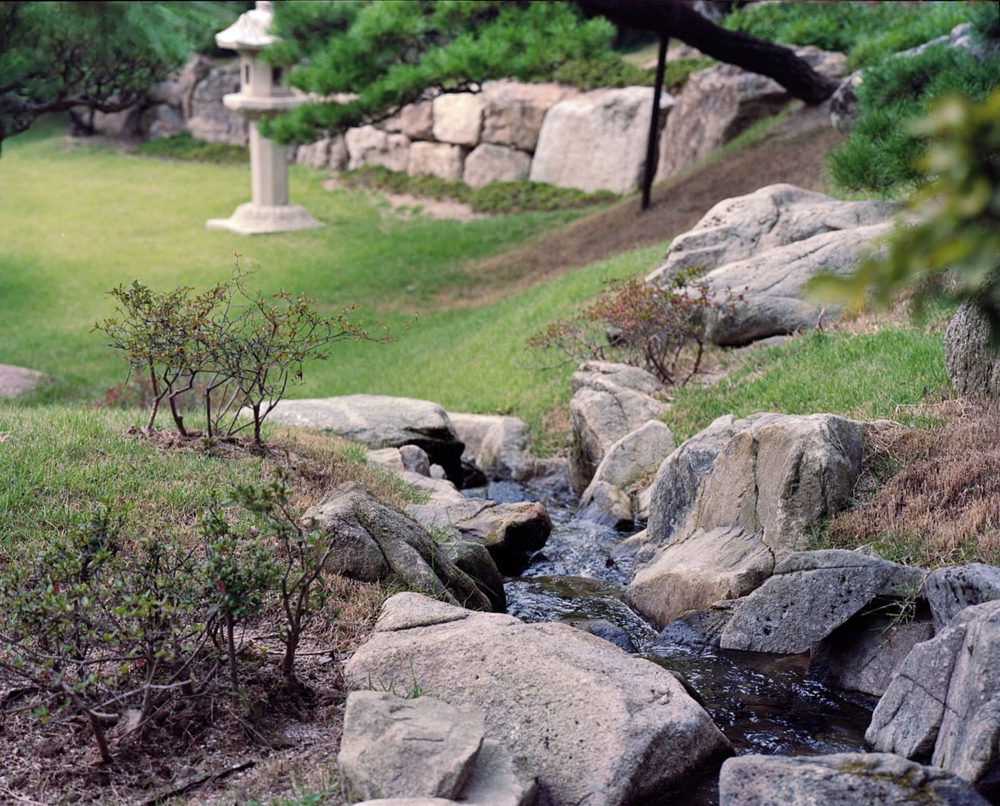

일이 바빠져서 한동안 사진을 안찍다가 저번 주 일요일 필자의 생축 겸 가족끼리 경기도 광주에 있는 화담숲에 다녀왔다. 산 비탈을 공원으로 조성해 올라갈때는 산림욕을 하고 내려갈때는 소나무와 분재들을 구경할 수 있게 잘 꾸며진 곳이었다. 한 바퀴를 돌아서 입구로 내려오는 구조인데. 모노레일을 타고 구간을 이동할수도 있다. 원래 모노레일을 타려고 했는데 그러면 별로 구경을 못한다고 해서 전체 코스를 걸었다.

구석구석 조화롭게 잘 꾸며놓아서 볼 것이 많았고 약간이나마 신비로운 느낌도 받았다. 다람쥐가 사람 근처에서 아무렇지 않게 털을 가다듬는 것을 보고 로봇 다람쥐인줄 알 정도로 사람과 가까이 하는것을 무서워 하지 않았다. Mamiya 7ii 에 150mm 렌즈를 마운트해 두 롤을 담았다. 35mm환산 85mm 정도 되는데 이전 표준화각 렌즈와는 전혀 다른 느낌을 받았다.

멀지도 않고 가깝지도 않아 만족스러웠다. 밝기가 4.5인데도 심도가 얕아 필요할 때는 충분한 아웃포커싱 효과를 사용할 수 있고. 최소초점거리 1.8m 빼고는 크게 불만인 부분은 없다. 현상은 CineStil에서 출시한 새 C-41킷트를 사용했는데 다루기 쉽고 색도 잘 나오고. 만족. 다만 이게 세관에서 연락이 왔는데 8% 세율이었다고 하고. 디스플레이 제조업체에 들어가는 약품이라 사후관리 의무대상이라고 하는데. 관련 문제를 처리하고 다음 포스트에서 내용을 다뤄 보려고 한다.

