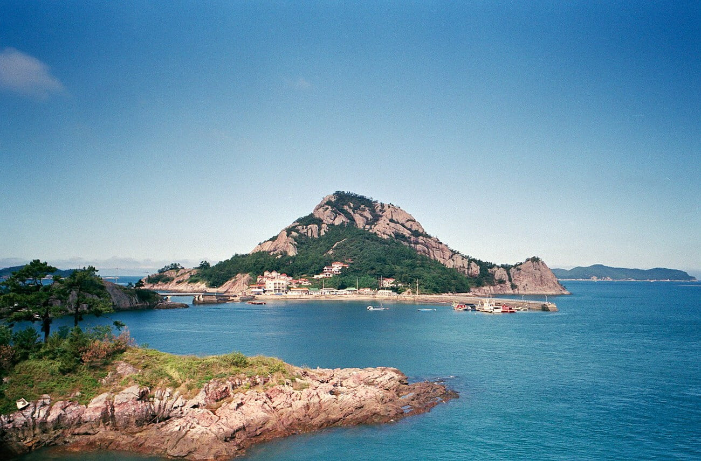
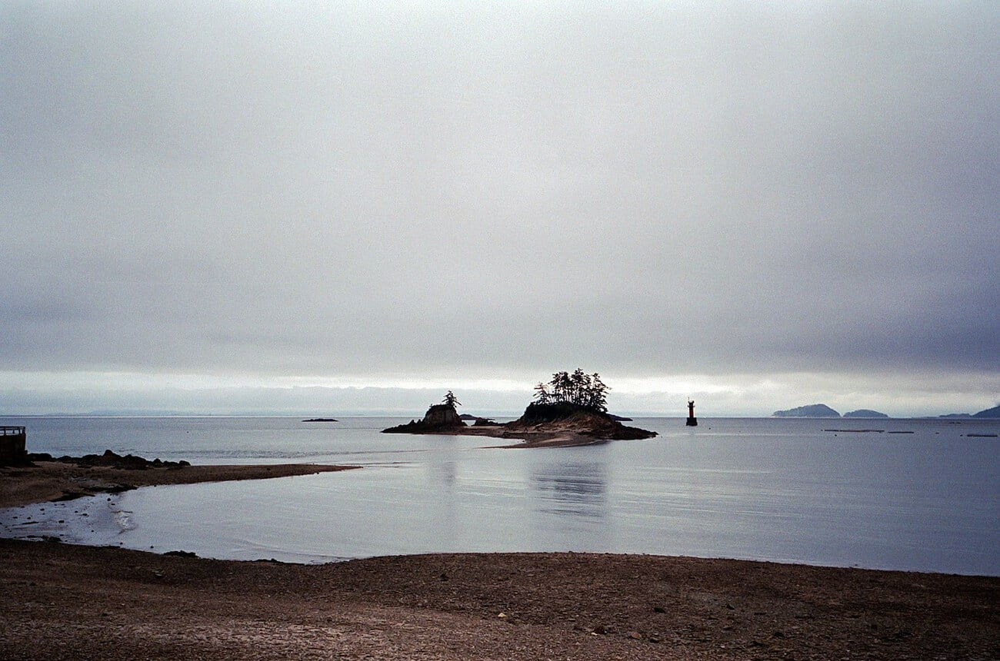
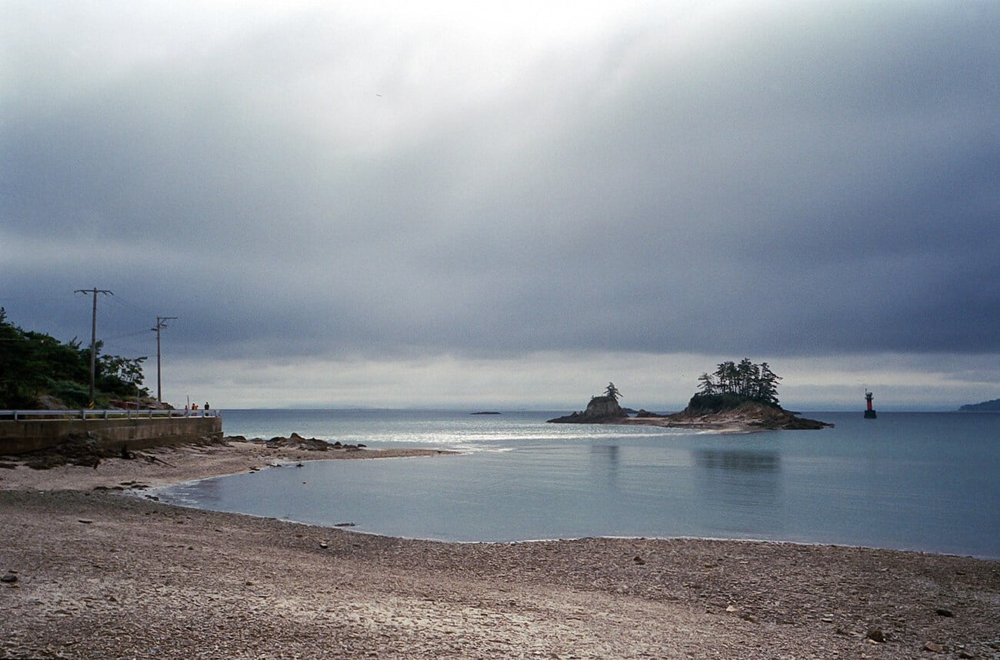
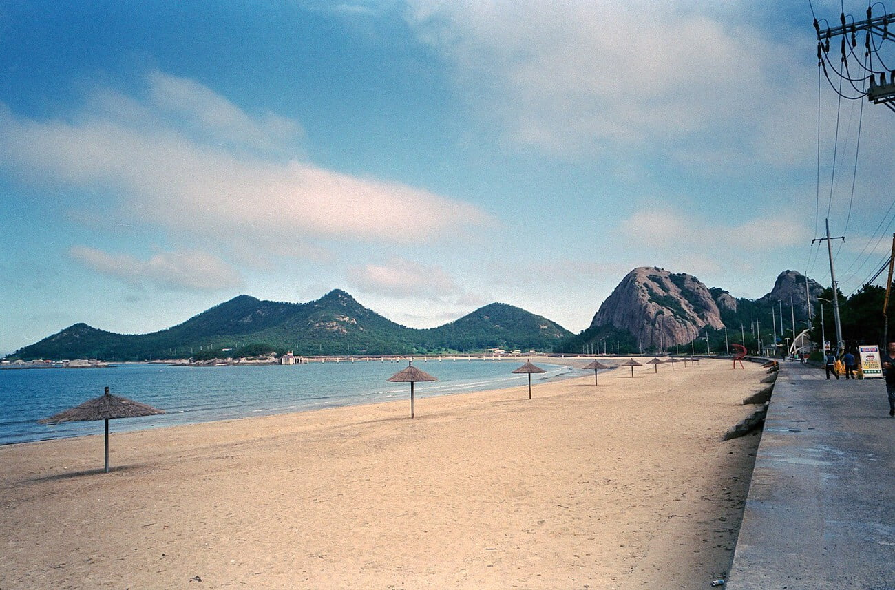
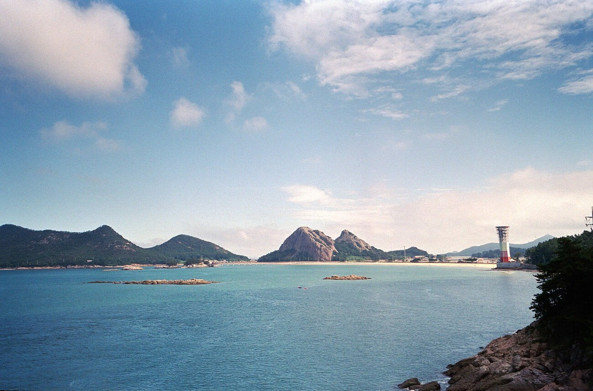
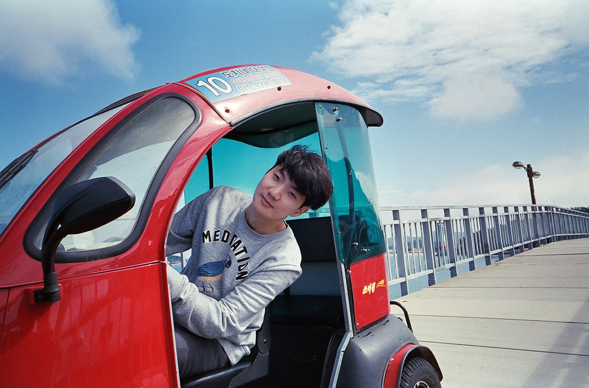
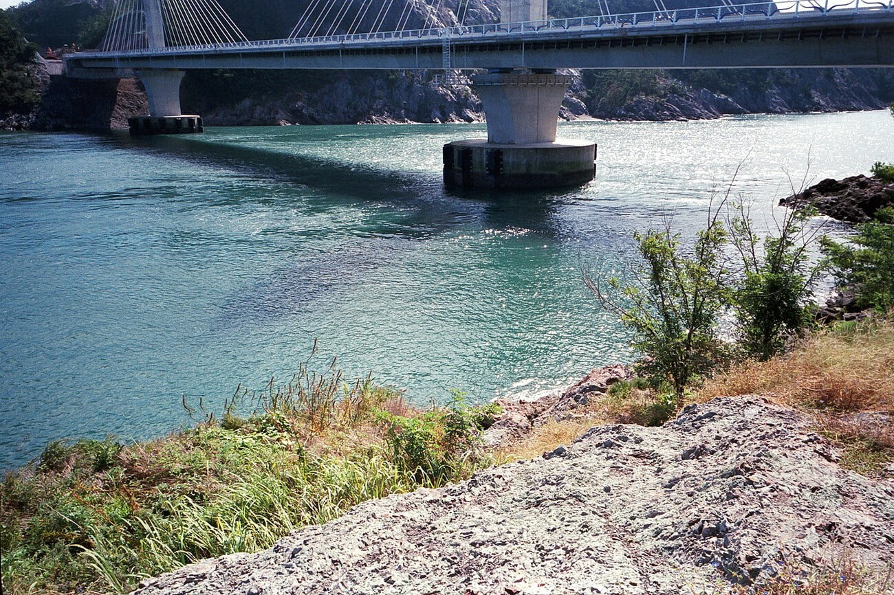
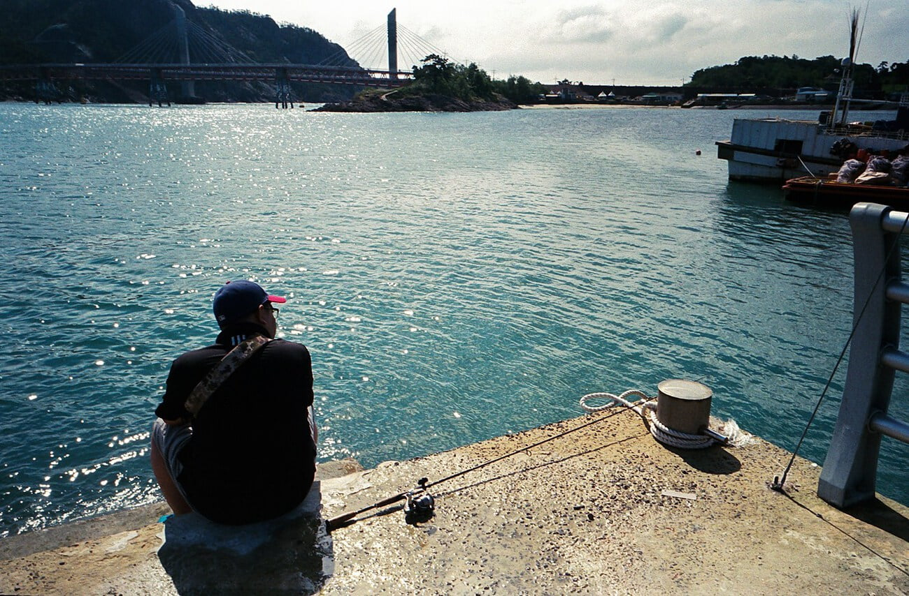
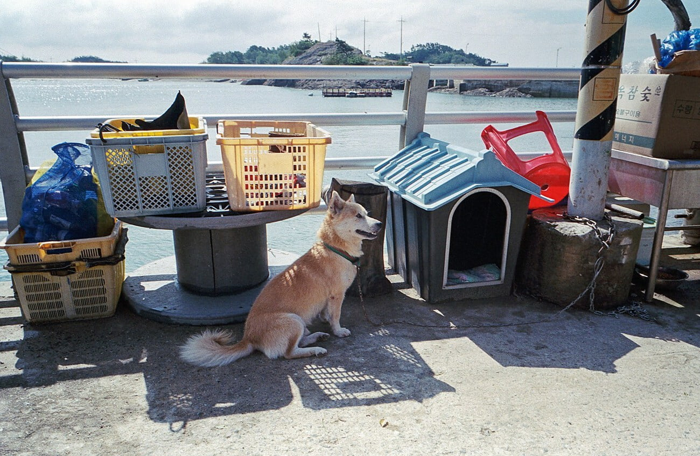

무거운 카메라 대신 새 필름 P&S카메라를 주머니에 넣고 고군산군도에 다녀왔다. 생각보다 할머니댁에서 멀지 않았고 얼마전 각 섬들을 잇는 다리가 개통 되었다는 소식 때문이었다. 주차장을 나오자마자 현지인으로 보이는 사람들이 쓱 와서는 대뜸 선유도 들어갈꺼냐고 물었다. 자기 차가 무료니까 타시라고. 큰 거부감에 일단 손사례를 치고 천천히 근처를 둘러보았다.

알고보니 공사는 2018년 봄에 끝난다고 한다. 그 전까지 섬 주민과 일부 외부인들은 여기서 관광객을 태우고 돈을 받거나 하는 등으로 불법으로 장사를 하고 있었다. 원래 섬까지 태워주는게 5,000원 정도의 금액이었는데 안으로 들어가서 돈을 써주십사 하고 무료로 운영한다고 주장하더라. 실제로 관광을 끝내고 나올 때 승합차를 타려던 우리 가족에게 '전기자전거 타셨어요?' 라고 묻더라. 내부 밥집 사장에게 물어보니 안타면 밖으로 나가는 차를 안태워 준다고 한다. 섬에 쓰레기는 없어서 좋았는데 이사람들이 쓰레기였다.

고군산군도 내부는 그런 것들은 모두 잊어버릴정도로 아름다웠다. 한국 안같다. 아직 개발이 덜 되어서 공사자재같은것들이 많았는데, 그래도 볼만했다. 아마 다리가 개통되고 나면 이곳도 가지각색인 콘크리트 건물에 덮여 못난 관광지가 되려나 싶다. 안타까운 마음에 셔터를 눌렀다.

📷 Ricoh GR1v-Date  
🎞 Fujicolor Superia 200

