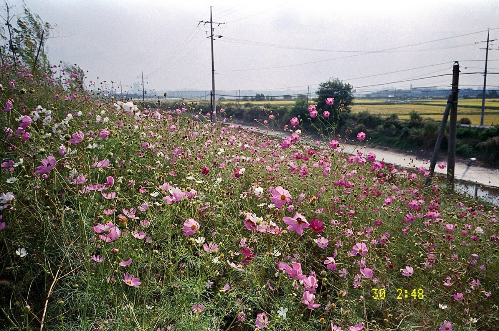
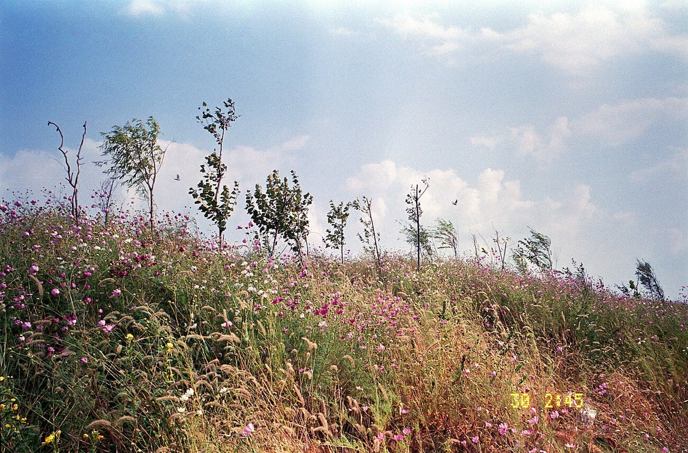
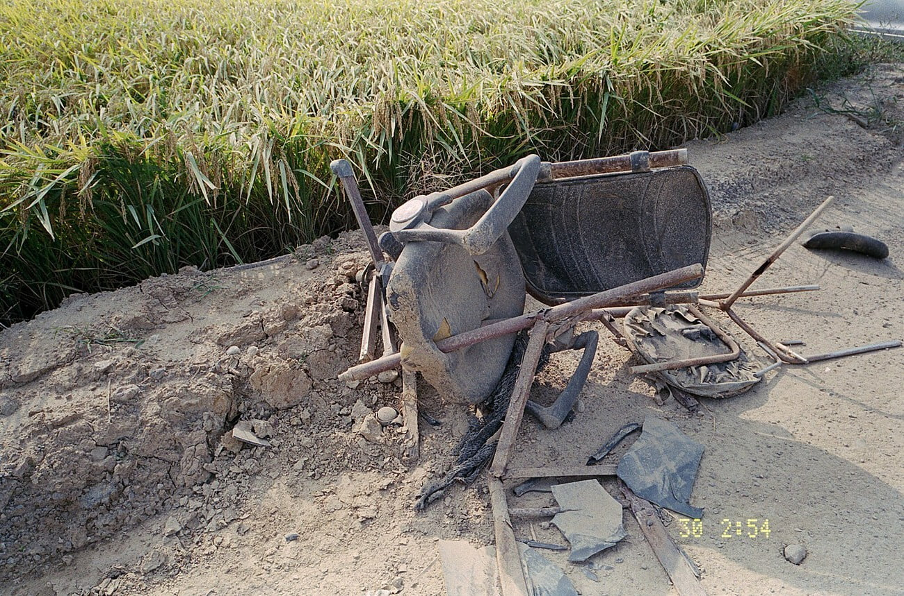
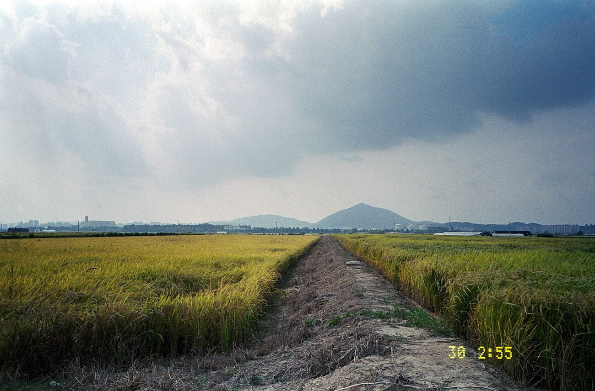
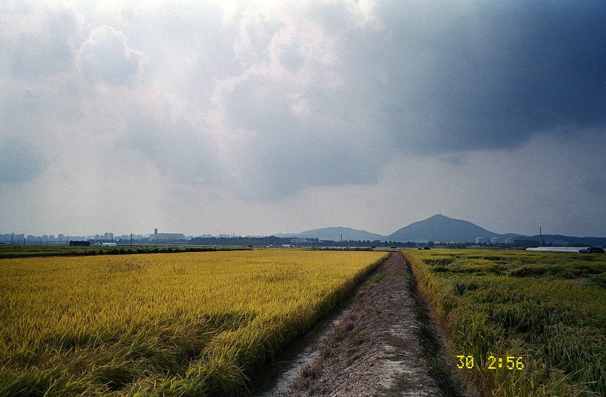
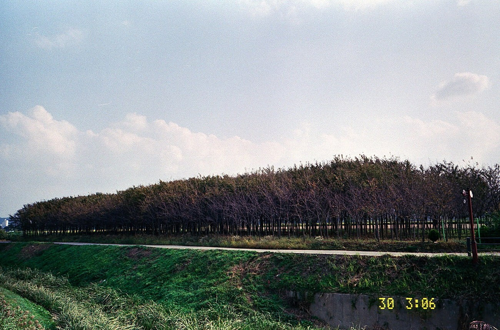

면허를 딴지 5주가 흘렀다. 그런데 렌트 보험은 면허취득 후 1년이 지나야 들 수 있다고 하여 결국 '동해 국도 여행'은 내년 9월 이후로 미뤄졌다. 1년이라는 애매한 시간이 보험사가 안심할 정도로 운전자를 준비시키는지는 의문이지만 뭐 그렇다니까 안타까울 뿐이다. 차에 각종 카메라 장비들을 싣고 동해 해안도로를 쭉 달리면서 멋진 풍경을 담고 싶은데 당장은 그럴 수 없으니 답답하다. 차를 구입할 생각도 하고 있는데 일단은 버텨 보려고 한다. 내년 하반기에 생산되는 전기차를 예약해두었고. 상황을 지켜보다가 구매를 결정할 때 판단해도 무리가 없을것이다.

필름 카메라를 주머니에 넣고 아버지 차로 운전 연습을 하던 중 대장동 근처의 들판을 지나고 있었다. 아버지의 지시 대로 차를 논길 옆에 대고 나와 쉬는 중에 몇 컷 찍어 보았다. 구름이 많아 하늘이 파랗지는 않았지만 들판에 핀 코스모스와 구름 사이로 쏟아지는 햇빛이 사진을 심심하지 않게 해 주었다. 손바닥 하나로 가려지는 조그마한 이 필름 카메라가 얼마나 잘 찍힐지 의문이었는데, 결과물은 '매우 만족' 이었다. 뭐 사실 필름 카메라는 렌즈하고 필름이 거의 다 하니까 크게 영향을 받지는 않지만.

고질적인 문제라고 하는 액정 표기 부분도 그냥 '풋'하고 웃고 넘어갔다. 평소에는 잘 나오다가 어쩔때 한번 안나오게 되는데, 기다려 보면 또 잘 나오고. 오랬동안 잘 나온다. 잘 나오니까 그냥 웃기더라. 영원히 안나오게 되면 웃음기가 없어지겠지만... 자동 필름 카메라중 제일 작고 가벼워 부담이 없어 좋다. CL필터 장착을 위한 액세서리를 주문한 상태이고. 오면 더욱 더 진듯한 풍경 사진을 찍을 수 있으리란 생각에 마음이 부푼다 :D 이 카메라와 마미야를 남기고 다른 카메라를 정리할까 고민 중이다.

📷 Ricoh GR1v-Date  
🎞 Fujicolor Superia 200

