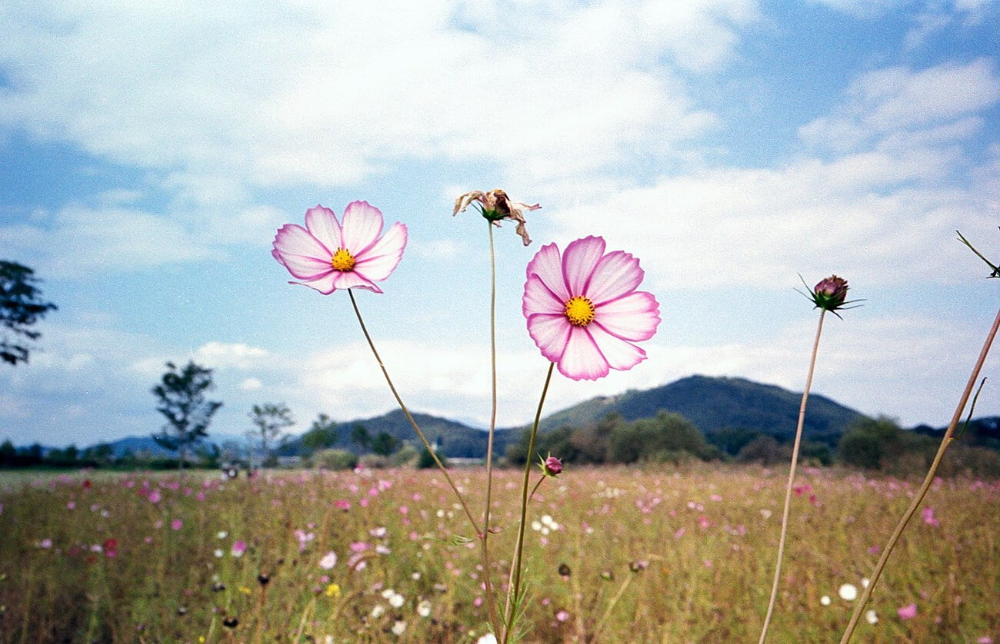
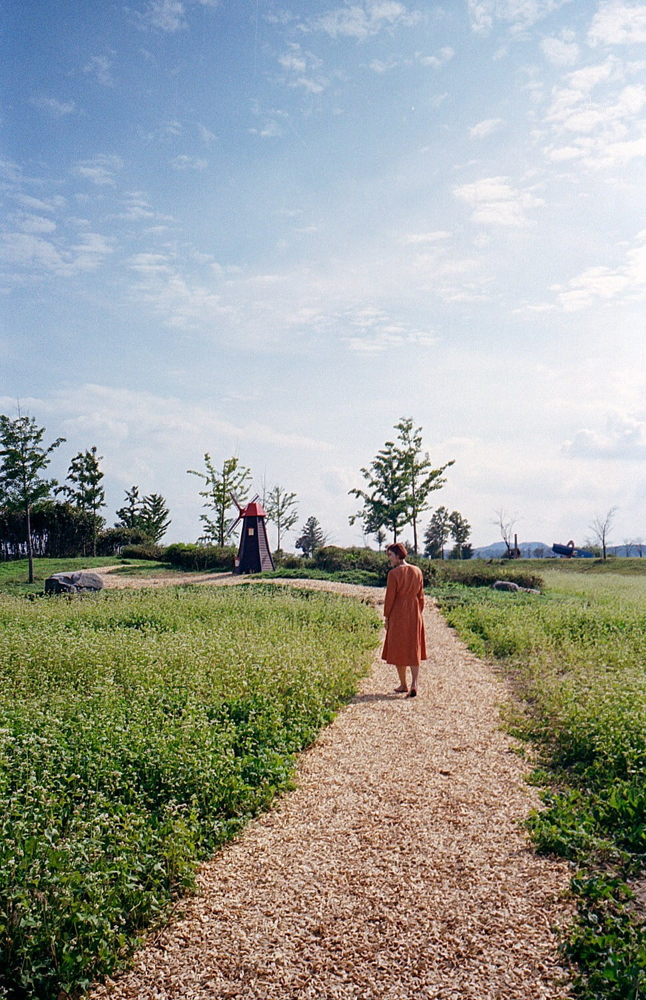
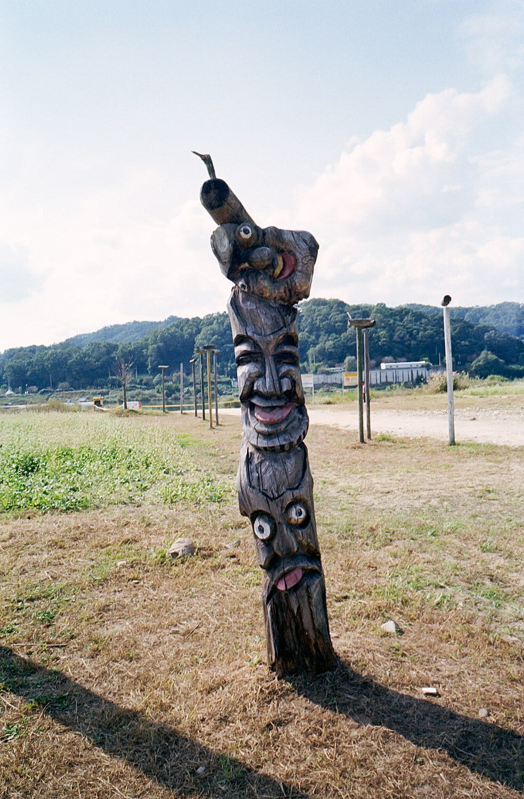
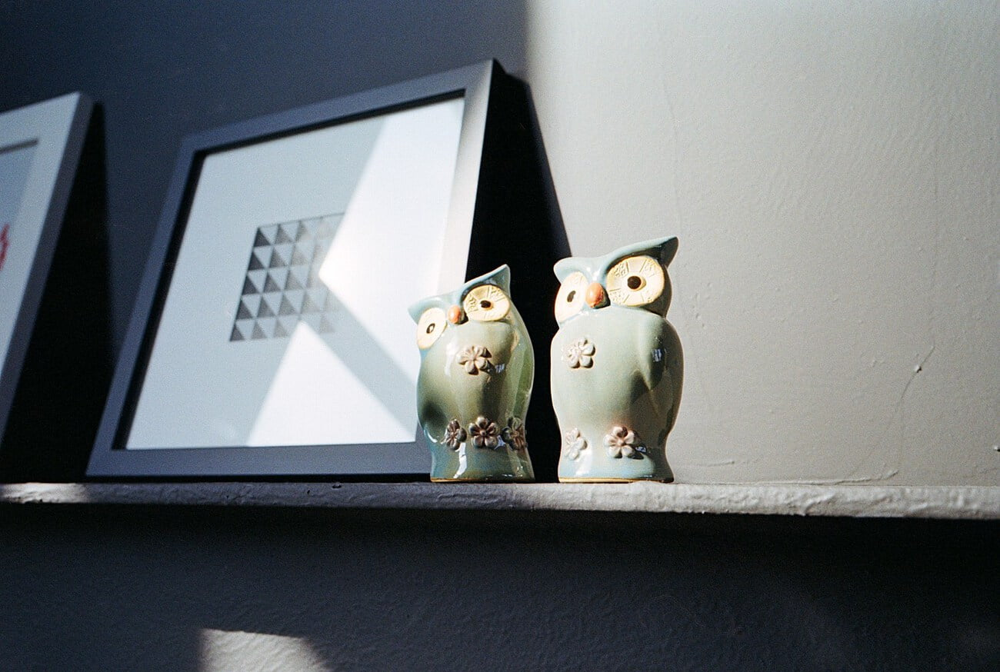
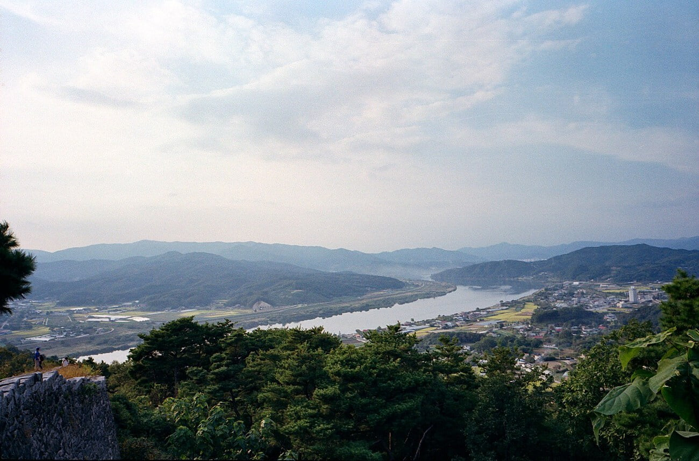
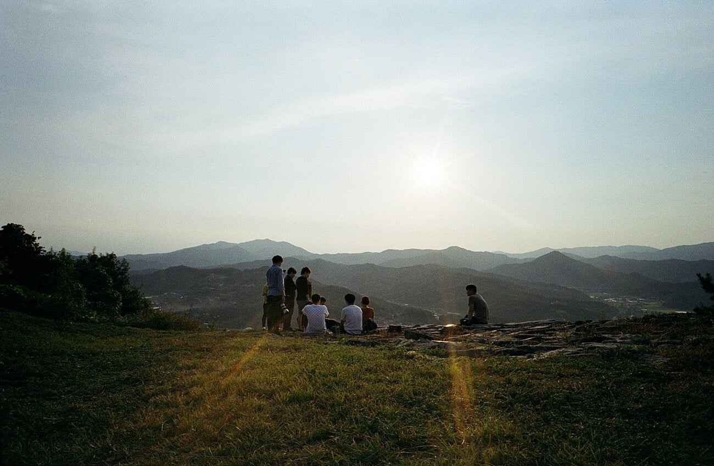
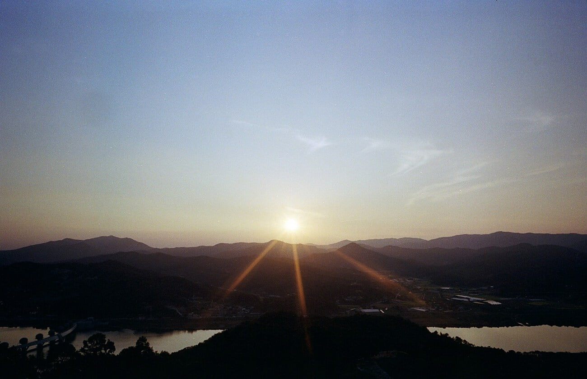
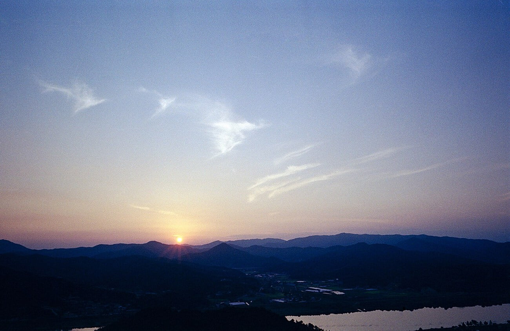

한 4개월만에 동호회 출사를 따라갔다. 모임에 참석하지 않았던 시간 동안에는 시간적 여유가 없기도 했지만. 감정적으로도 큰 기복이 있던 시기였다. 출사에서 사람들과 이런저런 이야기를 나누면서 뭐 이것이 나만 그런게 아니라는 것도 깨닫고. 그냥 아무일도 없었던 것 처럼 털고 일어나려는 느낌도 들었던 느낌이다. 그때는 이럴거면 아예 처음부터 시작을 하지 말걸 이라는 후회를 했었지만. 지금은 뭐 그냥 그렇다. 이게 시간이 해결해준다는 그건가 보다.

이번 출사에서 찍은 사진들을 보면서. 차가 있으면 좋겠다는 생각이 더 또렷해졌다. 필름 현상 프로세스를 조금씩 개선하면서 아직 모서리의 미세한 얼룩은 잡지 못했지만 발색은 잘 잡은 듯 하다. 생각보다 현상온도는 중요했다. 뭐 아직까지는 디지털이 그립지 않다. 현상해서 나온 사진의 색을 잡는 일이 줄어들었다. 원래 필름 색감이 참 좋으니까. 손대면 더 이상해지더라.

존 시스템 관련 촬영 노하우 두개를 메모해서 적용해보았는데. 생각보다 노출이 잘 맞아서 다행이다. 혹시 궁금한 사람이 있을지도 모르고. 기록을 하기 위한 글이니 내용을 적자면 아래와 같다.

> “Zone3 : 어둡지만 디테일 : 측광 후 -2  
> Zone7: 밝지만 디테일 : 측광 후 +2”

📷 Ricoh GR1v-Date  
🎞 Kodak Proimage 100

