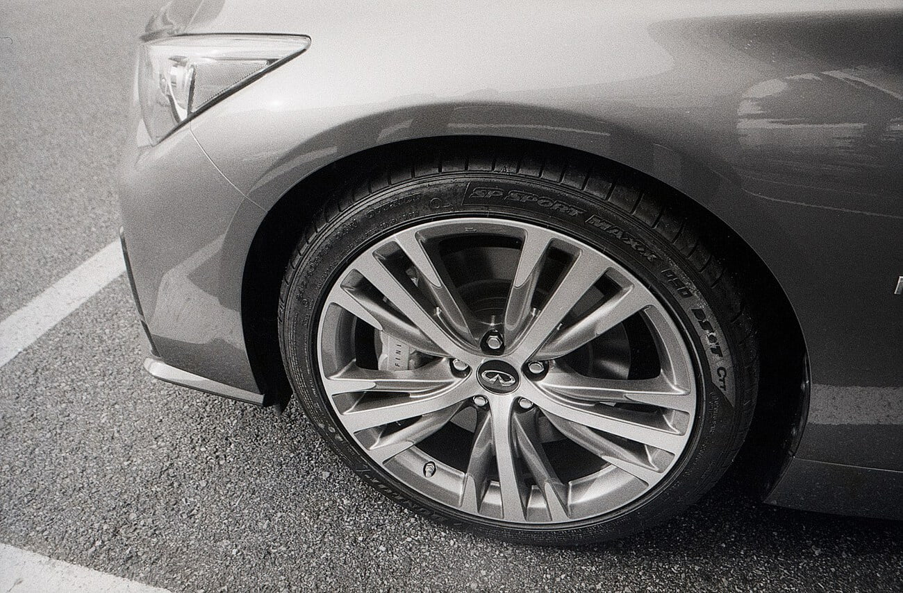
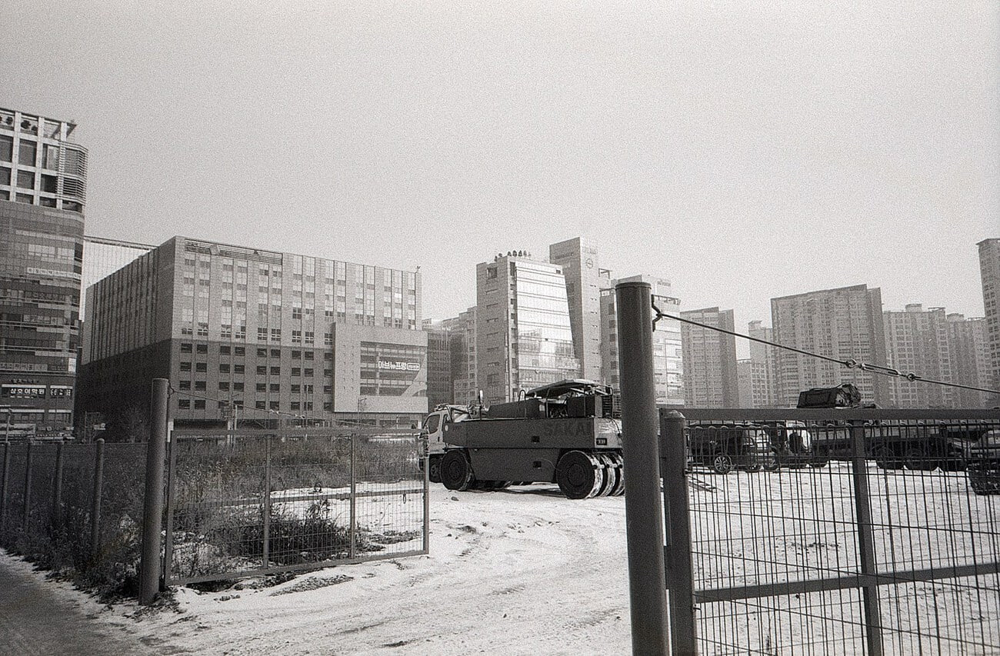
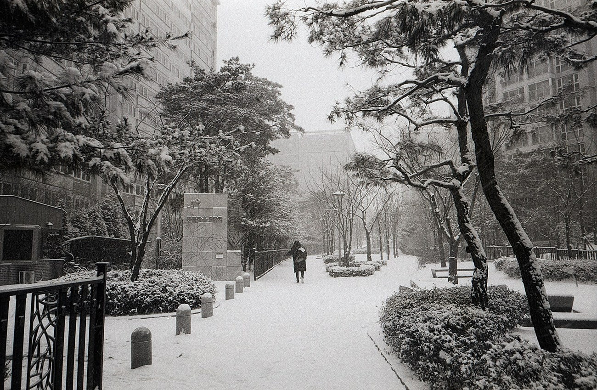
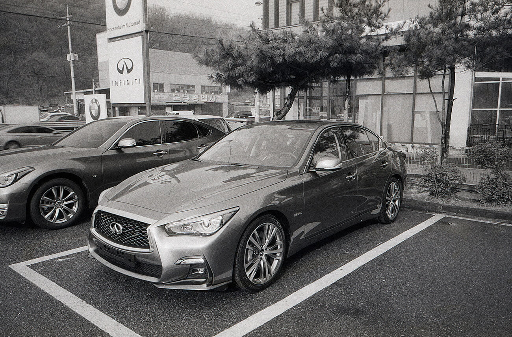
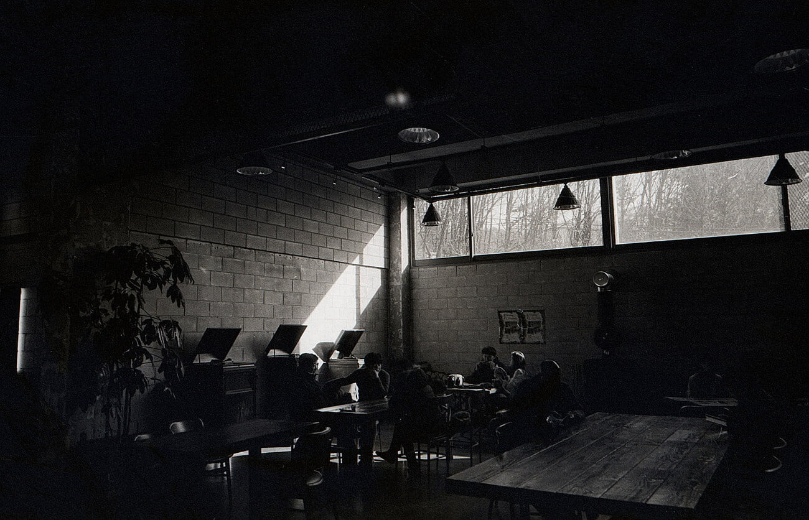

작년 말 제주도를 다녀오고 디지털 카메라를 정리해야겠다는 생각이 들었다. 필름이 디지털에 비해 수고스러운 면은 있지만. 디지털에서 느낄 수 없는 따듯함, 독특함같은 아날로그 감성이 디지털 카메라를 한달 이상 제습함에 모셔두게 만들었기 때문이다. 그리고 사진이 직업이 아니라 가끔 몇장 찍는데 무거운 장비를 운용하는 것은 아니었나 보다. 결국 오래 사용하지 못하고 작년 말에 정리했다.

카메라를 정리하면서 차량을 구입했다. 렌트 여행을 꿈꾸던 내게 면허 취득 후 만 1년이라는 모든 렌트 회사의 공통 규칙은 청천벽력과 같은 이야기었다. 해서 차를 구입하기로 했고. 처음엔 풀체인지된 도요타 캠리를 구입할 계획이었는데. 인피니티를 시승해 보고. 바로 인피니티로 결정했다. 뭐 다들 그렇잖는가. 원래 계획한 수준 보다 더 비싼 차를 사게 된다는 것 말이다. 개인적으로 국산은 싫었고. 어차피 내가 감당할 수 있는 적정선이었다. 지금 정말 만족하며 타고 다니니까 좋다.

그렇게 내 첫 차는 후륜차가 되었는데. 후륜차는 눈길에서 운전하기 어렵다는 이야기를 듣긴 했다. 하지만 이런 정도일줄은 몰랐다. 연초에 가족과 함께 포천을 놀러갔는데. 신발 및창의 두배정도 깔린 경사로의 눈 위에서 엑셀을 밟으니 차가 좌 우로 요동쳤다. 뒤에서 가족들이 밀어서 빠져나올 수 있었다. 지금은 여름용 런플렛 타이어 탓을 하고 있는데. 1월 말에 고성능 사계절 타이어로 바꾸는데 바꾸고도 그러는지 한번 지켜보아야 겠다. 눈때매 왔다갔다 하는건 무섭지 않은데. 후속사고를 상상하니 조금 걱정이 된다.

작년 초 이직하고 지금은 정말 만족스럽게 다니고 있다. 같이 일하는 사람들도 이상한 사람이 없고. 합리적으로 돌아간다. 또라이가 없다면 본인이 또라이라는데. 내가 또라이인가 싶을 정도로 만족스럽다. 아니 그냥 그 미신이 틀린게 아닌가 싶다. 가끔은 내가 사람을 참 못본다라는 생각을 했는데. 그런것일지도 모른다. 새로운 사람들이 팀에 합류했고. 그들도 참 좋다.

그 동안 사진은 찍었었는데. 현상을 안했다. 흑백 필름을 얻어서 찍고 현상액까지 다 준비해뒀는데. 이놈의 희석이 그렇게 귀찮은지 시작을 하지 않았다. 그러다 몇일 전에 현상해보았는데. 역시 좋다. 필름 만세. 장비는 이제 여기서 정착해도 될 듯 싶다.

