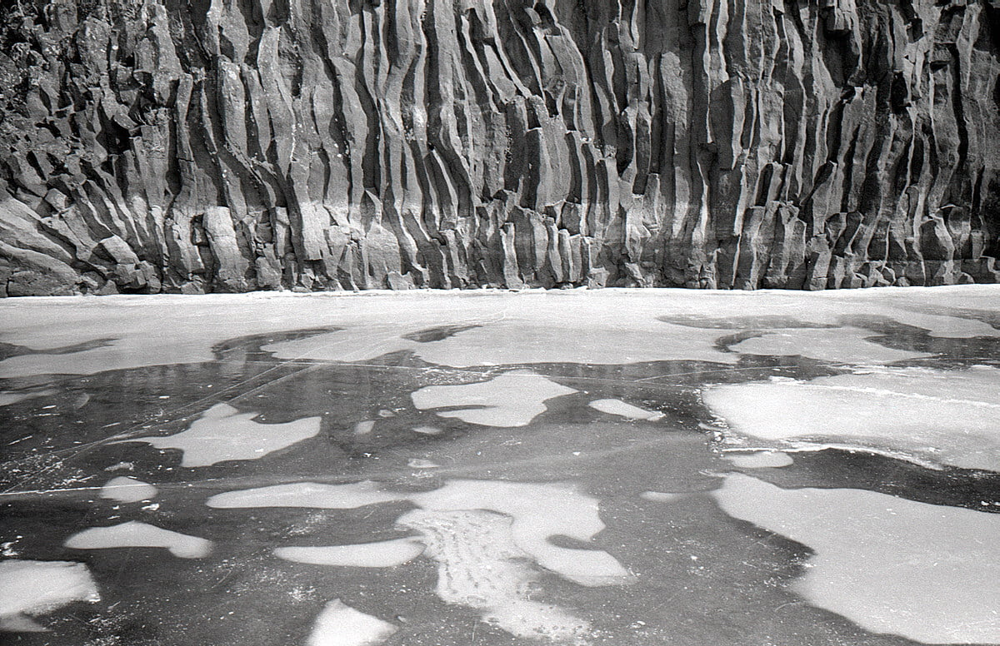
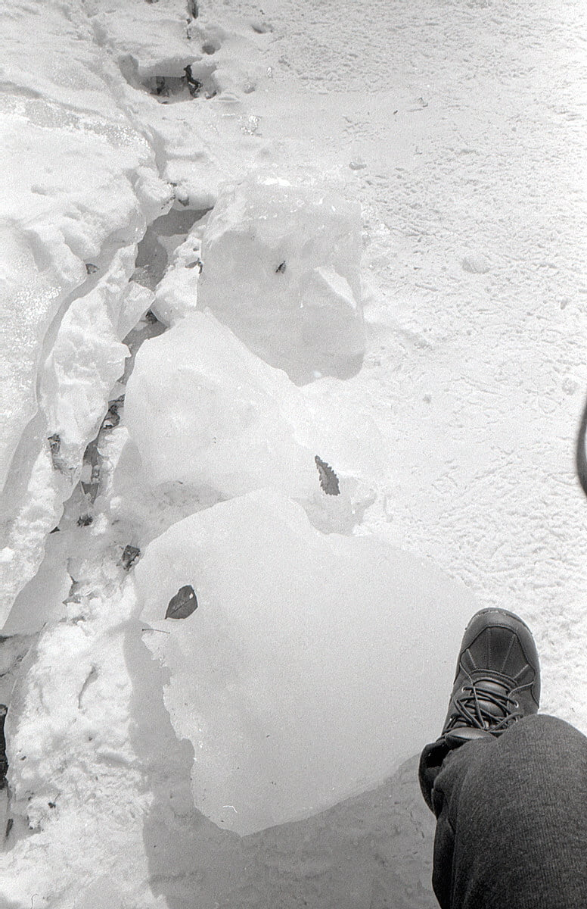
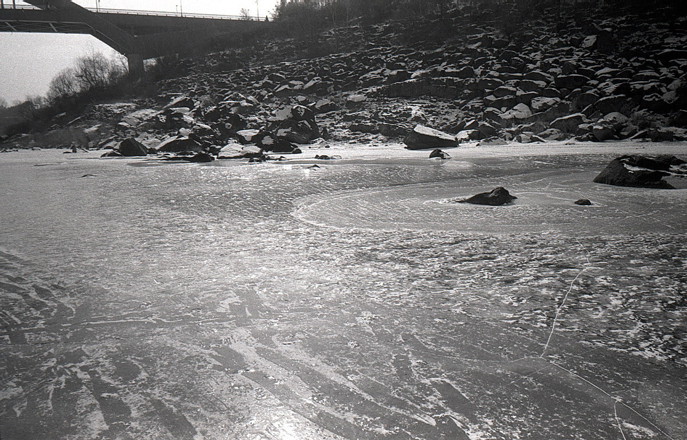
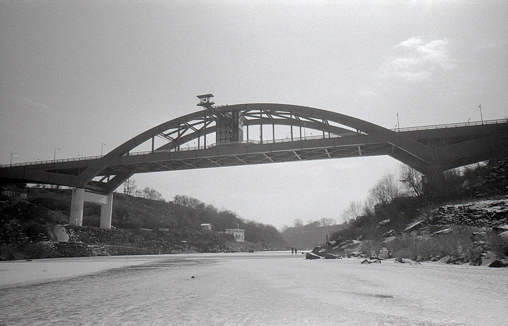
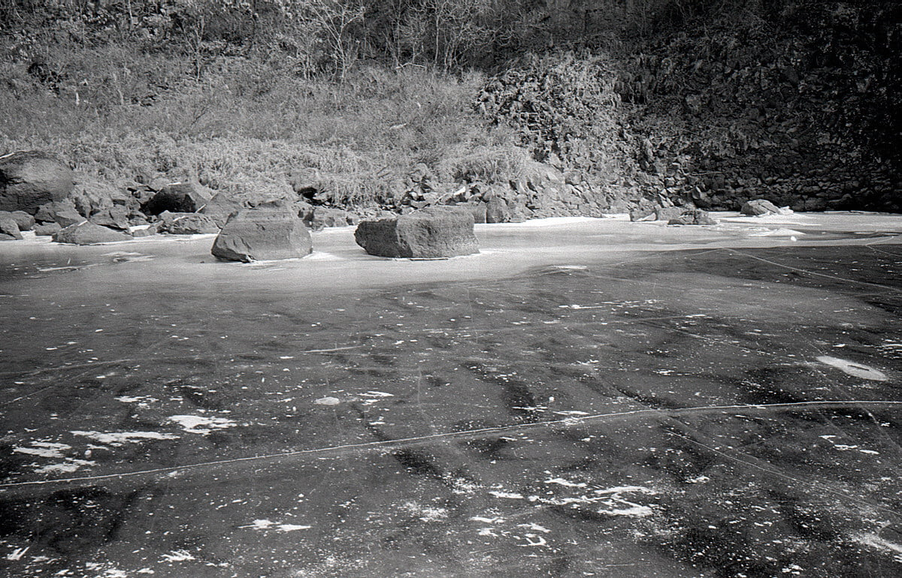
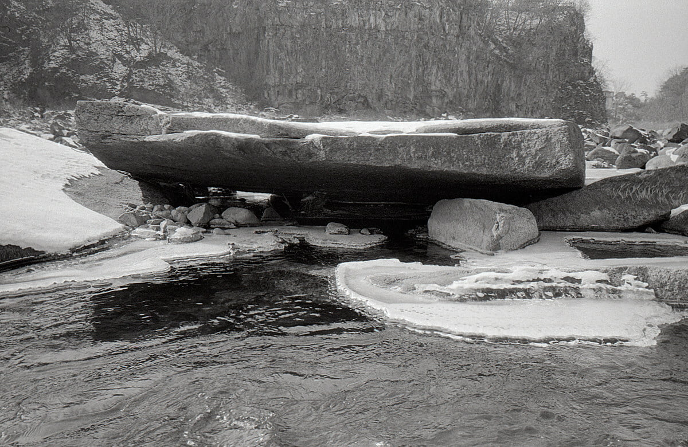
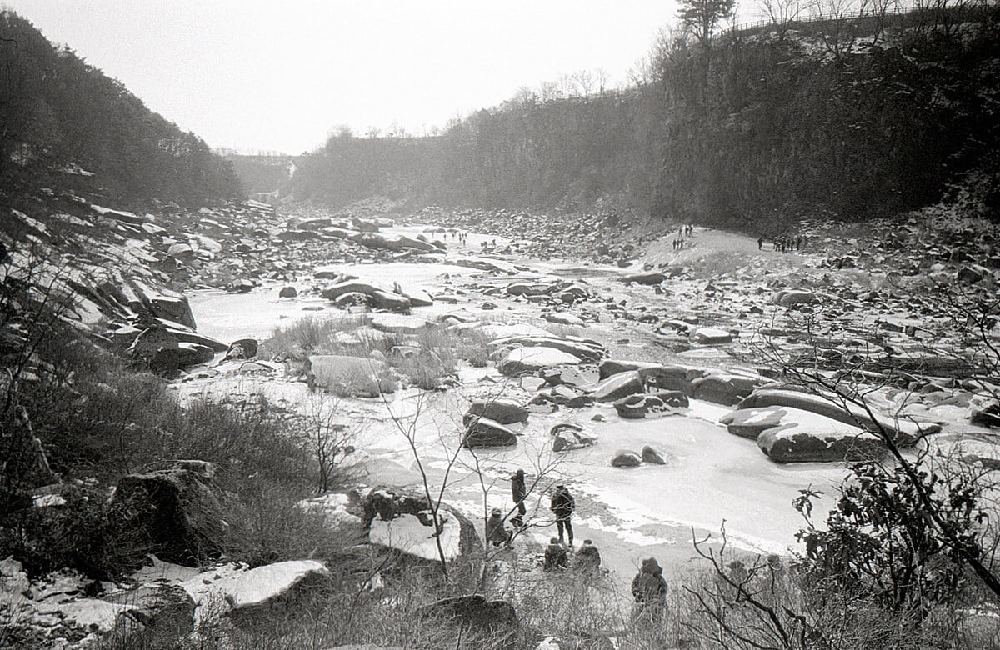
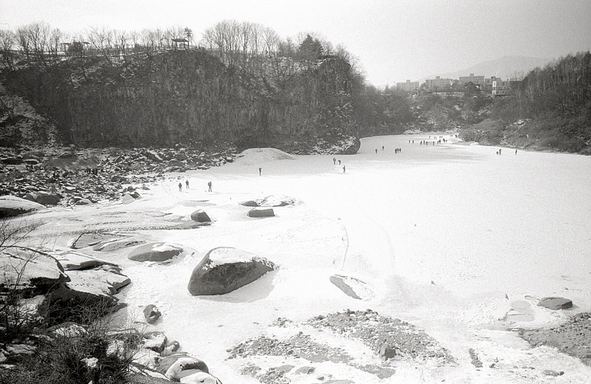
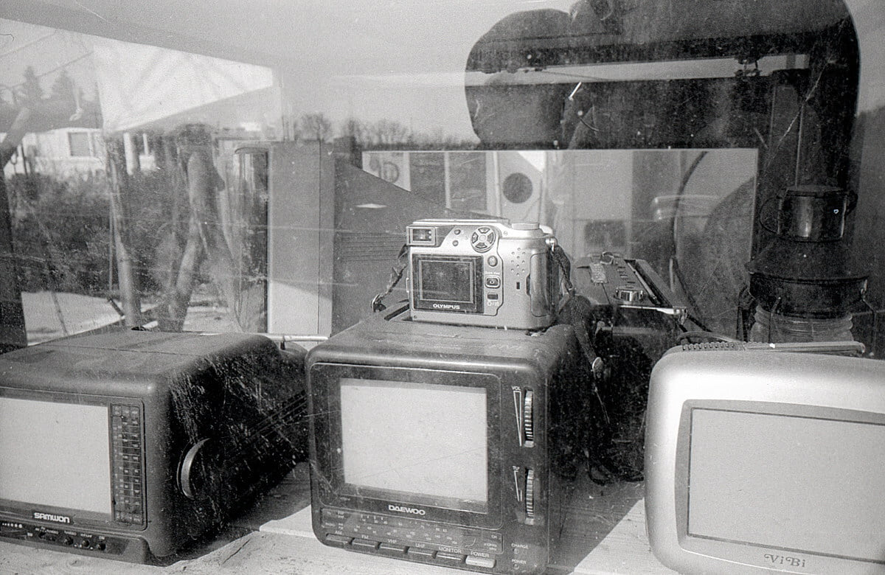

최근들어 여기에 글을 쓰는 주기가 길어졌다. 달랑 사진만 올리는 것 보다 가볍게 읽을 수 있는 글을 쓰면 내 생각도 정리되고 세세히 읽진 않으시겠지만. 혹시모를 피드백도 재미있을듯 해서. 평소에 글쓰기 주제를 고민하고 있다. 그런데 몇몇 주제를 떠올려도 그에 대한 생각이 정리되지 않아. 글쓰기가 참 어렵다는것을 느낀다.

사실 이 글도 '어른은 언제 될까' 라는 주제로 2단락을 적다가. 세부 소재가 너무 연관성이 없어서 지우고 위에 작성하고 있다. 무언가 내가 좋아하는 취미 생활이나 가볍게 할 수 있는 주제가 아니라서 그런지 1단락을 쓰고 읽어보면. 그냥 신세 한탄과 같은 느낌이다. 전 회사에서 기술문서 작성을 위한 글쓰기를 배웠는데. 여기엔 그렇게 딱딱하게 쓸 필요가 없긴 해도 군더더기 없는 글을 쓰고 싶은 욕심에 여러 번 썼다 지웠다 한다.

'어른은 언제 될까'의 글 주제는 여기서 시작되었다. 최근 들어 신체에 작은 흉터가 조금씩 생기고. 이 흉터가 붉게되어 없어지지 않는 현상이 생기고 있다. 아마 겨울에 건조해서 갈라진것으로 생각 되지만. 그런 흉터들을 보면서 나이가 드는 건가 하는 생각에 잠겼다. 외형적으로 생기는 변화 만큼 내 생각도 그 만큼 변했는지가 궁금했고. 노트북이 놓인 식탁 옆에 서서 생각하고 있었다.

그리고 문득 어렸을 때 보았던. 닮기 싫은 사람. 지금 보고 있는 닮고 싶은 사람이 떠올랐다. 나와 닮고 싶은 사람은 상대적이기 때문에 닮고 싶은 사람을 완전히 닮을순 없을것이라 생각했다. 그래서 결국 스스로 판단하는 수 밖에 없다고 결론을 낼까 하다가. 너무 뻔한 이야기를 돌려 말하는 느낌이어서. 머리가 아파서 그만뒀다. 그리고 이렇게 글을 쓰고 있는데. 괜찮은 방법인듯 하다.

나의 일이나 취미에 대한 주제는 재미있게 쓸 수 있을거 같다. 그런데 나는 모든 상황에서 다 정답인 말을 하는 사람은 없다고 믿고 있다. 그래서 내 의견을 상대에게 말할때 상당한 어려움을 느낀다. 이게 컨디션이 안좋을땐 병처럼 아무말도 안하고. 감정의 변화를 숨기면서 묵묵하게 내가 해야할 일만 하게 되는 때가 많다.

나이를 먹으며 생긴 가장 큰 성격의 변화인듯 싶다. 아마 내 생각과 반대로 말을 참 쉽게 생각없이 하는 사람들을 보면서 스트레스를 받다 생긴 변화이지 않을까 싶다. 이걸 좀 다스려야 할 듯 한데. 어렵다.

내가 심리적인 결점이 있는 듯한 생각도 든다. 내가 왜 그렇게 생각했는지. 그렇게 생각하지 않아도 될 여지는 없는지. 조금 더 편하게 생각할 순 없는지. 생각해보아야겠다.

부모님과 함께 2월 초에 다녀온 철원 한탄강 얼음 트래킹중에 한 롤 찍었다. kentmere는 왠지 나랑 잘 안맞는 거 같다. 너무 옛날 느낌이라고 할까. 한롤 더 남았는데 담번엔 다른 필름으로 스냅을 찍어야겠다.

---

