겨울의 홋카이도엔 오호츠크 해풍으로 인해 많은 눈이 내린다. 제설이 안된곳에 들어가면 허리까지 푹 빠지는 정도다. 스케일이 다른 강설량 덕분에 한국에서는 보기 힘든 멋진 풍경들을 볼 수 있다. 러브레터라는 일본 영화로 기억하는 사람들이 많은데. 사실 그 영화를 본 것은 아니고. 2년 전 홋카이도 여행 중 하루 일정으로 렌터카를 이용해 비에이를 다녀왔었는데. 그 때 보았던 풍경들이 여행이 끝나서도 잊혀지지 않아 같은 계절의 비에이를 두 번째 찾아가기로 결심했다.

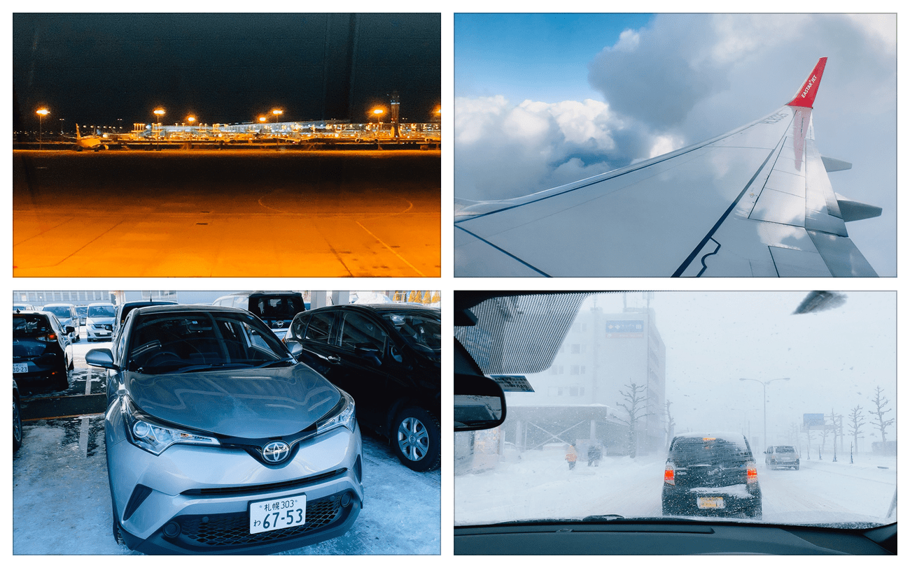

이번 여행 중 비에이에는 6일 머무를 예정이었다. 비에이는 눈보라가 몰아칠때도, 구름이 걷혀 푸른 하늘일때의 풍경도 모두 보고 카메라로 담고 싶었기 때문이다. 하지만 중간에 비에이를 4일로 줄였다. 숙소가 생각보다 만족스럽지 않기도 했고. 6일씩이나 있기에는 갈 곳이 몇 군데 없었기 때문이다. 4일도 충분했다. 렌터카는 Mazda MX-3를 예약했는데 동급인지 모르겠지만 아쉽게도 Toyota CH-R를 빌려주었다. 여행 중 고속도로를 많이 이용해야 해서. 8일간의 홋카이도 고속도로 패스를 구입했다. 렌터카 센터에서 지출한 내역은 - 8일간 차량 렌트비 (약 70만원), 8일간 홋카이도 패스 (¥8,200), ETC차재기 카드 (¥324) - 였다. 빌린 렌터카를 타고 제일 먼저 오타루로 향했다.

차량에 달린 네비게이션에서 오타루를 목적지로 설정하려고 했는데 ‘맵 코드’라는 개념을 알아야 했다. 일본에서는 목적지를 찾을 때 맵 코드나 전화번호로 찾는다. 한국에서 일반적으로 사용하는 매립 네비게이션처럼 검색어 기능이 없었다. 맵 코드는 각 장소마다 부여된 고유 번호인데 이게 찾기가 까다로웠다. 구글맵에서 숙소를 검색하면 바로 찾을 수 있는데. 이를 차량 네비게이션의 목적지로 설정하려면 맵코드를 알아야 하니 어떻게 해야 하는지 모르겠단 것이다. 한참 후에 전화번호로도 목적지를 설정할 수 있다는 것을 알고 목적지를 설정할 수 있었다. 그런데 구글맵 상에 전화번호가 없는 장소도 있어서. 나중에는 그냥 구글맵을 이용했다. 음성안내가 조금 이상한것 빼고는 생각보다 잘 안내해 주었다.

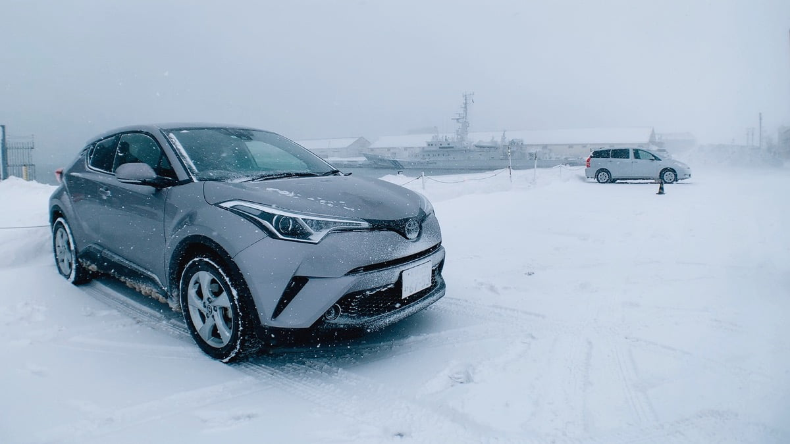

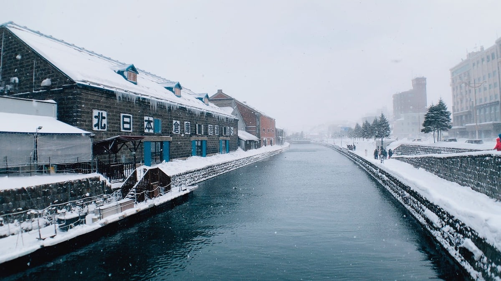

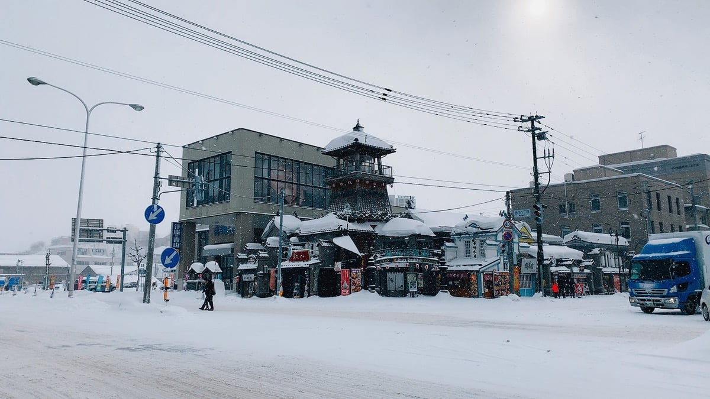

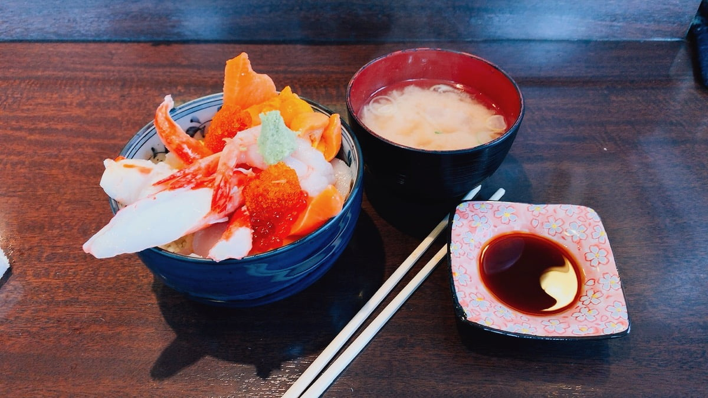

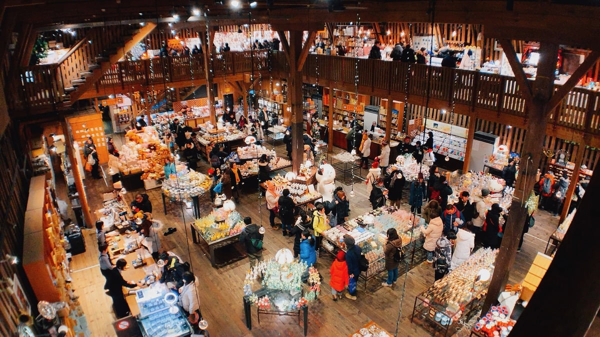

렌터카로 여행을 계획했을 때 제일 고민이었던 부분이 바로 주차 문제였다. 일본 주차요금이 비싸단 말은 계속 들어와서 알고 있었고. 관광지의 경우 주차를 못해 빙글빙글 도는 상황이 생길 것이 우려되었기 때문이다. 그런데 여행 내내 주차 문제로 힘들었던 적이 없었다. 가고 싶은 곳의 주차장을 목적지로 설정하고 영수증을 잘 챙기면 요금 할인도 되니 생각보다 쾌적하게 여행할 수 있었다.

오타루에는 점심 쯤 도착해 관광주차장에 차를 대고 (¥600 1일 요금) 2년 전 점심을 먹었던 식당으로 향했다. 가게에서 제일 잘 팔리는 카이센동을 주문했다. (¥3,500) 따듯한 밥 위에 올려진 신선한 연어알, 게살, 연어회 성게알들을 씹으며 2년전 기억과 비교하기 시작했다. 맛은 변함없었다. 해산물은 정말 신선했고 먹을때마다 ‘살면서 이렇게 맛있는’ 이라는 생각을 할 정도였다. 식사 후 운하부터 시내를 슬슬 걸으며 오르골당까지 찍고 돌아왔다. 2년 전엔 늦은 저녁이었는데 오전에 밝을 때 보다는 노을이 질 때쯤의 오타루가 가장 낭만적이다. 해가 지고 운하를 따라 세워져 있는 가로등의 불빛이 흩날리는 눈과 강물에 반사되며 풍기는 묘한 분위기만이 이 곳에 올 의미를 부여한다.

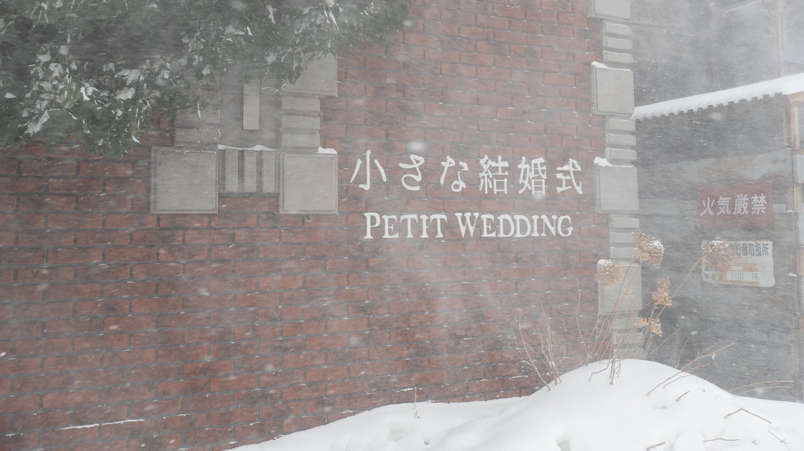

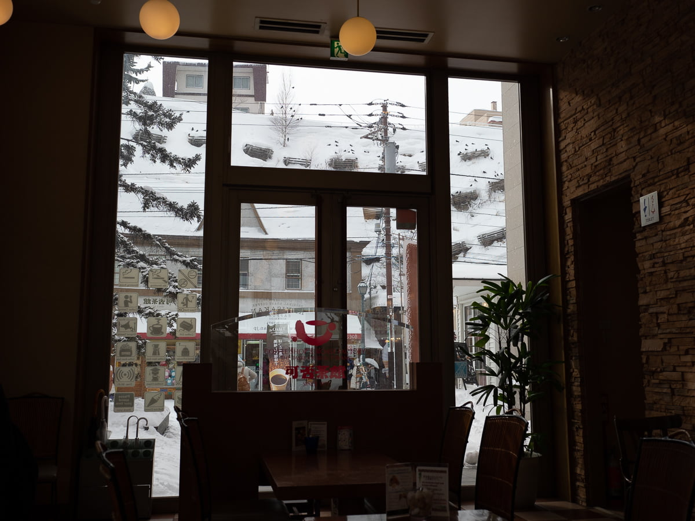

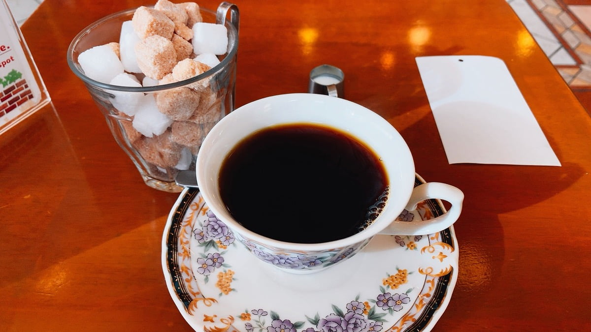

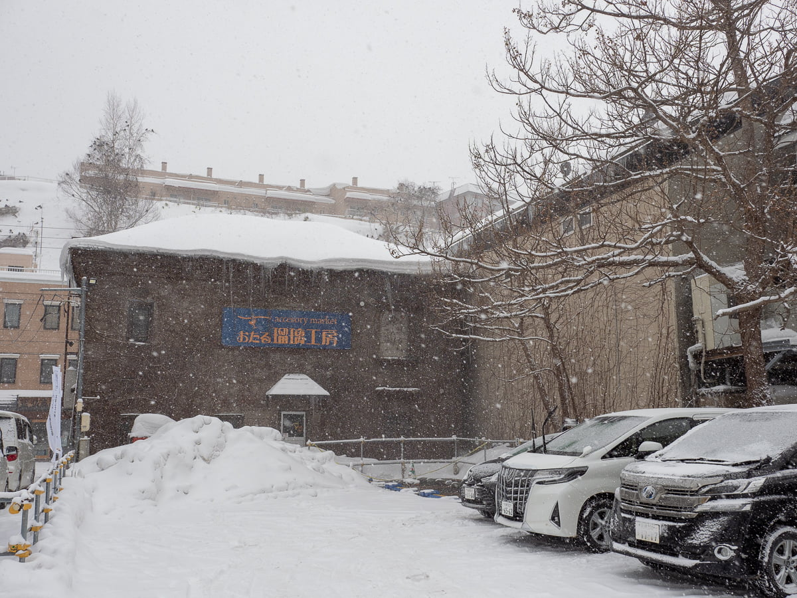

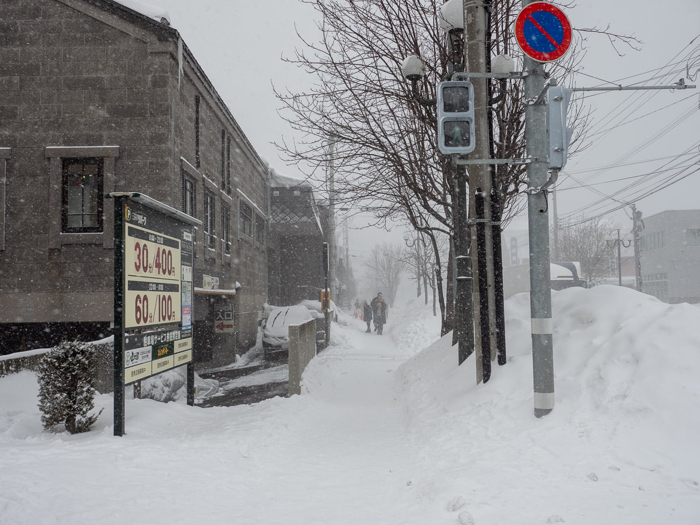

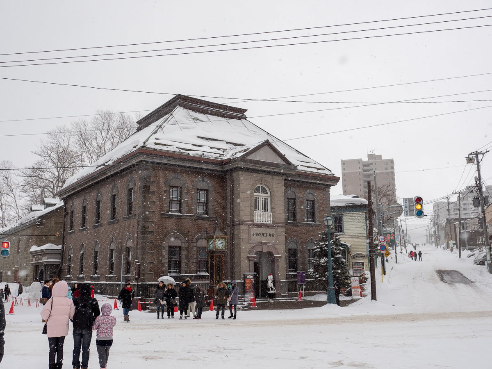

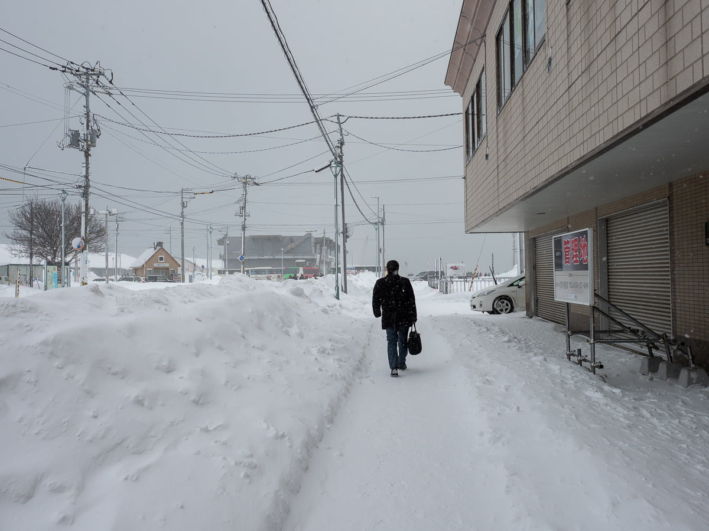

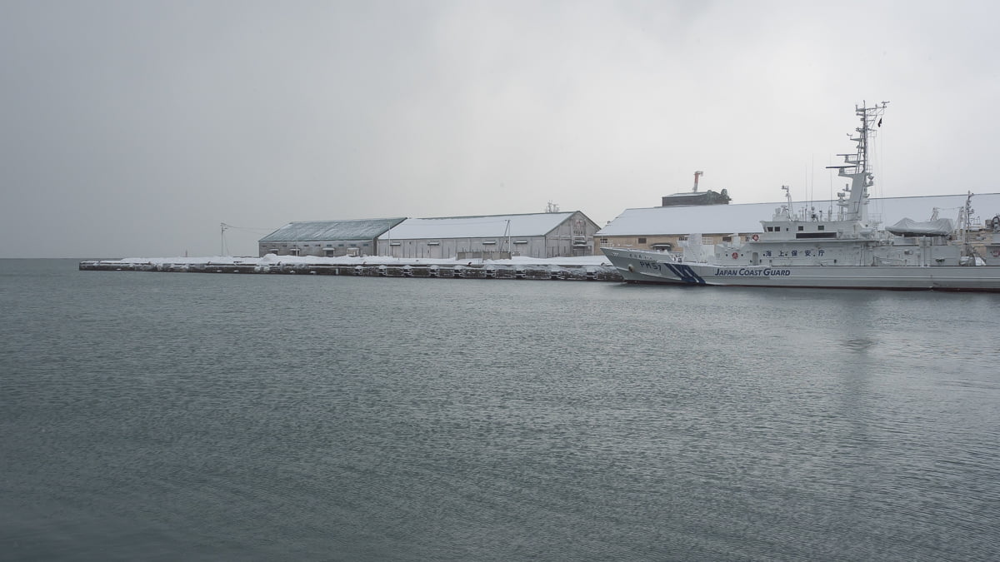

낮선 곳에서의 눈길 운전이 피로할 것이라 생각하여 첫 날은 덜 운전하는 코스로 계획했다. 오타루를 뒤로 하고 바로 숙소로 이동했다. 보통 하루 최대 150km 정도만 이동하도록 여행 코스를 잡는 것이 안전하다고 한다. 공항근처, 고속도로들은 제설이 잘 되어있어 큰 불편함은 없었다. 다만 위에 사진에서 보이는 것 처럼 휴게소, 각 시의 시내는 제설이 안되어 있어서 서행해야 한다.

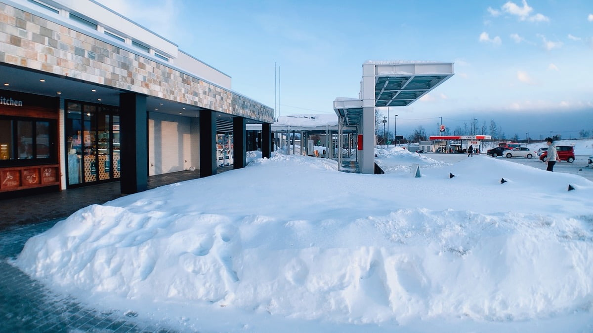

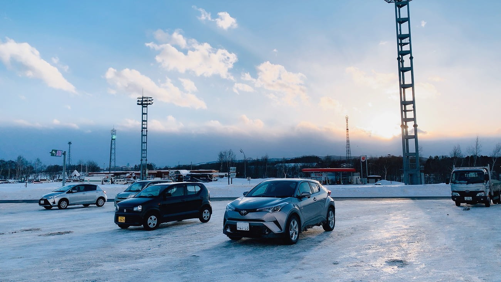

첫 번째 숙소는 [큐카무라 시코쓰코](http://www.booking.com/Share-SA7Kjy). 시코쓰호 옆에 딱 붙어있는 조금 오래되었지만 정원이 있는 조용하고 깔끔한 곳이다. 힐링을 위한 곳이라고 할까나? 여긴 숙박에 기본적으로 맛있는 아침과 저녁이 포함되어 있다. 아침엔 간단한 뷔페가 제공되고. 저녁에는 뷔페 + 특선요리코스가 제공된다. 작지만 깔끔한 온천도 있고 정말 만족스러웠던 곳이었다. 직원들도 친절했다.

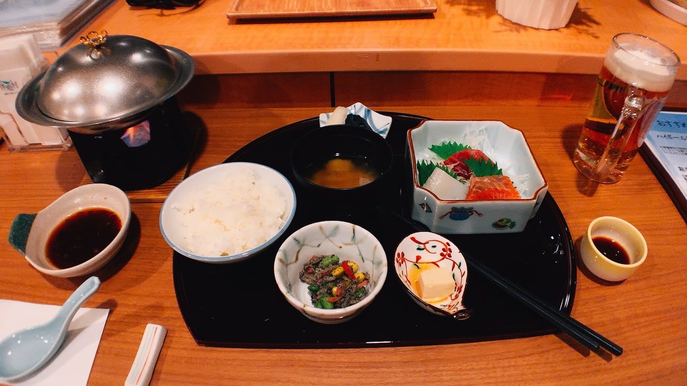

위 메뉴에서 맥주만 추가로 주문해서 마셨다. 맛있어서 남김없이 모두 먹었다 사실 이번 여행에서도 음식을 남겼던 적이 없던거 같다.
