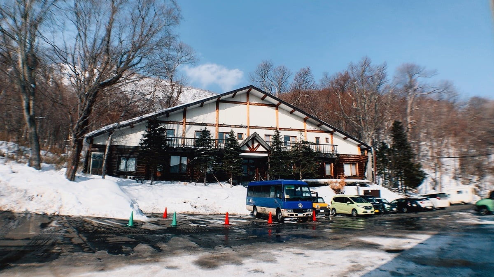
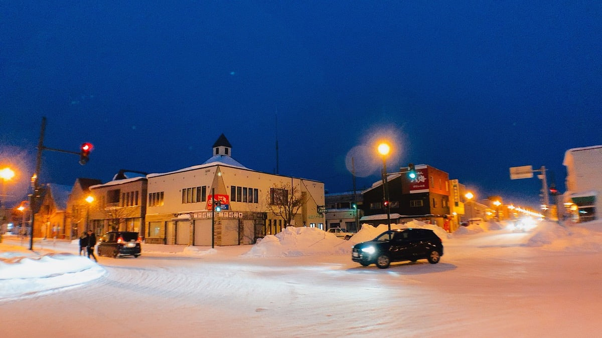

여느때처럼 느긋하게 준비한 뒤 숙소를 빠져나왔다. 이번 여행을 결심한 계기가 된 것은 비에이와 온천이었는데. 비에이는 오늘 가고. 온천은 사실 가고 싶었던 곳의 예약이 꽉 차서 아쉬워하고 있던 참이었다. 그런데 전 날 자기전에 온천 숙박업소의 웹 사이트를 둘러보다가 1인실의 경우 평일 오전엔 예약이 잘 없고 가면 거의 할 수 있다는 정보를 듣고. 씨코스호를 떠나 북쪽으로 향하기 전에 온천에 들렀다.

예상대로 차들은 모두 빠져나가고 없었고. 여유롭게 개인실을 2시간 빌릴 수 있었다. 가격은 4,500엔으로 대략 5만원 정도였지만 누구의 방해도 받지 않고 따듯한 물 속에서 씨코스호의 겨울을 보며 온천을 할 수 있었던 너무나도 행복한 시간이었다.

온천수는 종류에 따라 천차만별이겠지만 듣기로 좋은 물은 약간 미끈미끈한 느낌이 든다고 했다. 이 온천수도 그래서 신기했다. 2시간을 모두 온천수 안에서 있다가. 비에이로 향했다.

첫 해외여행때는 여행책에 굉장히 의존했다. 가고싶은 곳이 있는 페이지들에 포스트잇을 잔뜩 붙이고 항시 휴대하며 다녔었는데. 지금은 로밍을 하고. 구글맵을 보고 다닌다. 그러다 보니 종종 여행객에 최적화되지 않은 장소를 방문하게 되는데. 그런 상황에서 발생하는 헤프닝들이 단조로울 수 있는 여행을 매우 흥미롭게 만들었다.

아래 카페에서 직원분이 나에게 수줍게 한국말로 한국 여행도 갔었고 한국 좋아한다고 이야기해주셨을 때. 느꼈던 낮간지러움이 아직도 기억난다. 이야기를 듣다 테이크아웃 하고 카페를 빠져나왔는데. 다른 장소로 이동하다 그 때가 생각이 나서 피식했었다. 누가 알려주었거나 블로그만 맹신했던 예전에 이런 일들은 드물었고 오히려 실망했던 적이 많았다.

