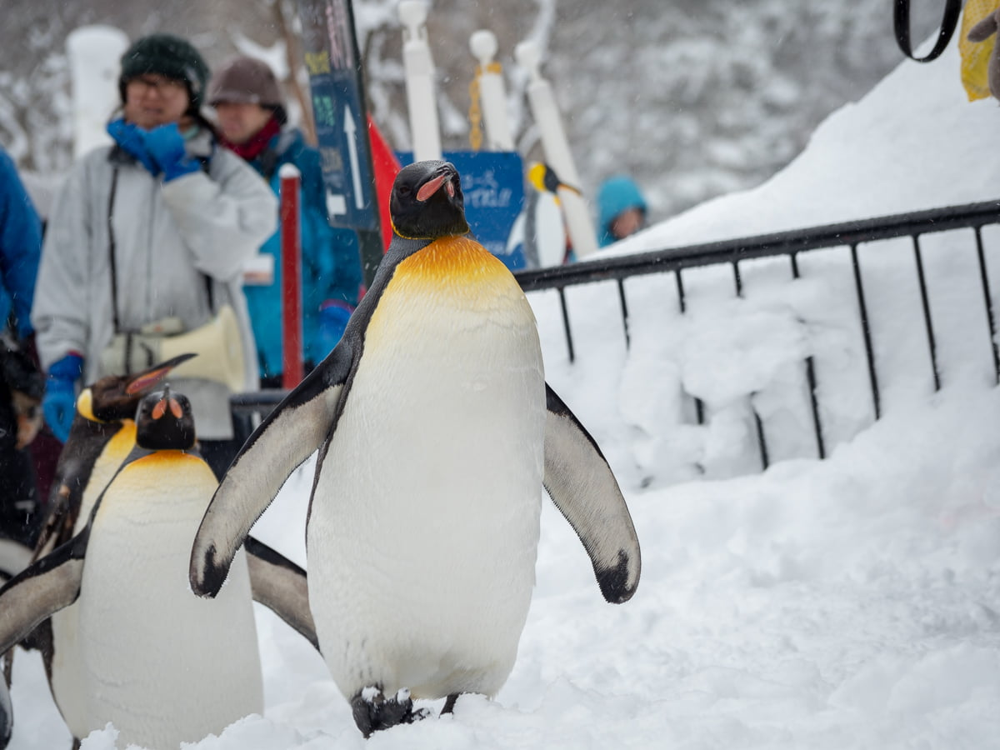
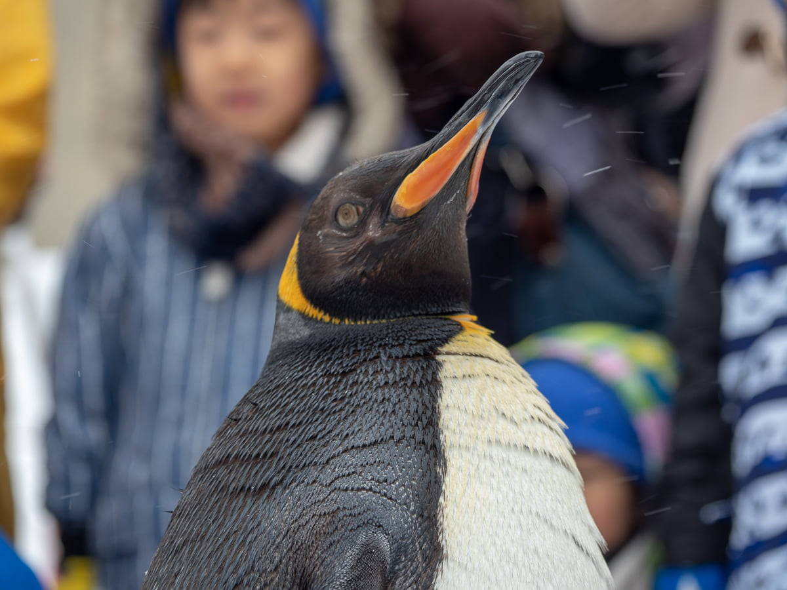

아침부터 폭우가 내렸다. 원래 이번 여행에는 비에이의 다양한 모습을 담으려 계획했기 때문에 별로 개의치 않았다. 전날 비에이로 들어가기 전에 샀던 방수팬츠를 입고 장비를 챙겨 나가는 동안 즐거웠다. 밭에 들어가면 눈이 허리춤까지 올 정도로 눈이 많이 왔는데. 역시 많이 겪어본 지역이라 그런지 제설이 잘 되어 있었고. 운전에는 전혀 불편함이 없었다.

어딜가던 조용한 곳을 찾던 나에겐 최적의 장소였다. 갓길에 차를 세우고 눈을 맞아가며 한참을 사진을 찍었다. 바람 소리마저 들리지 않았다. 내리는 눈 끼리 서로 부딫히는 스르륵 하는 소리만 들렸다. 그 조용함을 담았다가 필요할 때 어디서든 떠올릴 수 있었으면 하는 마음이 들었지만 할 수 있는건 있는 힘껏 숨쉬고 눈으로 보는 것 뿐이었다.

---

한참 구경을 끝내고 아사히카와 동물원으로 향했다. 펭귄산책으로 유명한 동물원인데 생각보다 규모도 크고 볼거리가 많았다. 한국에서 보기 힘든 동물들이 있어서 재미있게 구경하고 왔다.

동물원은 갈때마다 우리 안에 있는 동물들이 불쌍하단 생각밖에 안 드는데 여긴 동물들한테 잘 해주는것으로 보였다. 수명이 다 할때까지 잘 살수 있도록 책임만 진다면 그렇게까지 딱하게만 생각할 것은 아닌듯 싶다.

---

숙소로 돌아오는 중에 폭설에 뒤 덮힌 기찻길이 보였다. 너무 이뻐서 갓길에 안전하게 차를 세우고 허리 밑을 전부 포기한채로 기찻길 앞까지 왔다. 선로를 운행하고 있지 않아서 위험하진 않았다. 나중에 보면서 너무 맘에 들게 나와서 기분좋았던 사진이다.

사진을 건졌지만 하체가 촉촉히 젖은 채로 숙소에 돌아와야 했다. 방수팬츠 자체는 문제가 없었는데. 발목 부분에 눈이 들어오면서 생긴 불상사였다. 내일은 또 어떤 사진을 건질 수 있을까 기대하면서 오래된 다다미 방에서 잠이 들었다.
