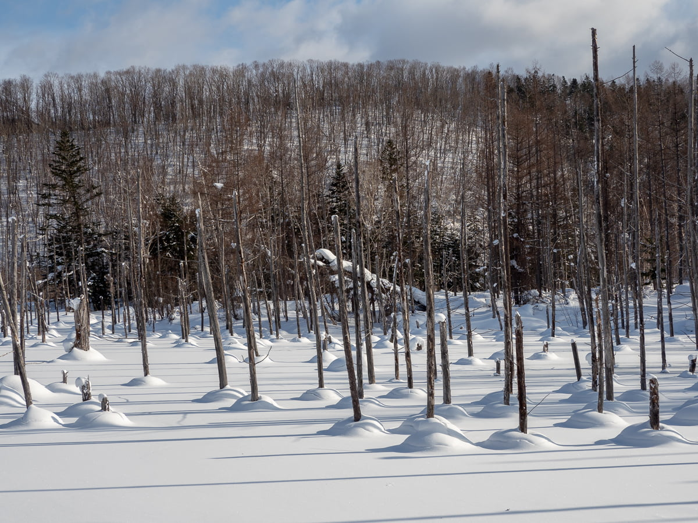

그날 아침엔 눈보라가 내리지 않았다. 겨울 홋카이도를 여행하기에 딱 좋은 날씨였다. 아침 일찍 준비를 하고 비에이 시가지 근처 ‘키타코보’ 카페를 목적지로 찍었다. 영업 시작시간이 아직 한참 남아서. 숙소 근처 흰수염폭포와 청의호수를 들렀다가 가기로 했다.

청의호수는 겨울에도 이쁘지만 눈이 쌓이지 않았을 때 보이는 푸른 물빛을 보는것도 상당히 이쁘다고 한다. 겨울에만 두번을 갔는데. 여름도 좋다지만 이제 다시 갈 수 있을지 모르겠다.

두 군데를 들르고 난 뒤에도 아직 영업시간이 되지 않아 비에이 시내를 이리저리 돌아다니며 사진을 찍었다.

---

카페에서 시간을 보내고 세븐스타 나무를 촬영하러 갔다. 목적지에 도착해서 주차장에 차를 대려고 진입하는데. 차 몇대가 이미 주차해 놓은 상태였다. 차가 없는 반대편에 차를 세우려고 들어가는 순간. 차가 눈을 단단히 뭉치는 소리가 났고 차는 더 이상 빠져나올 수 없는 상태가 되어버렸다.

차 안에서 당황한 가슴을 진정시키고 나와서 눈을 파 보기도 하고 자세제어장치를 끈 상태에서 차를 밟아봤지만 빠져나올 기미가 전혀 없었다. 결국 렉카를 불렀다. 세븐스타 나무를 들른 관광버스 5대가 왔다 갈때까지 그렇게 주차장에 갇힌 상태에서 2시간 정도를 기다렸다.

다행히 차는 무사히 빠져나올 수 있었지만. 그 날은 바로 숙소로 가고 싶었다. 나중에 렉카 비용은 약 13만원정도가 청구되었던것 같다. 근데 눈에 같힌 상태에서 오히려 상황이 웃기고 신선해서 나름 재미있었던듯 하다.
