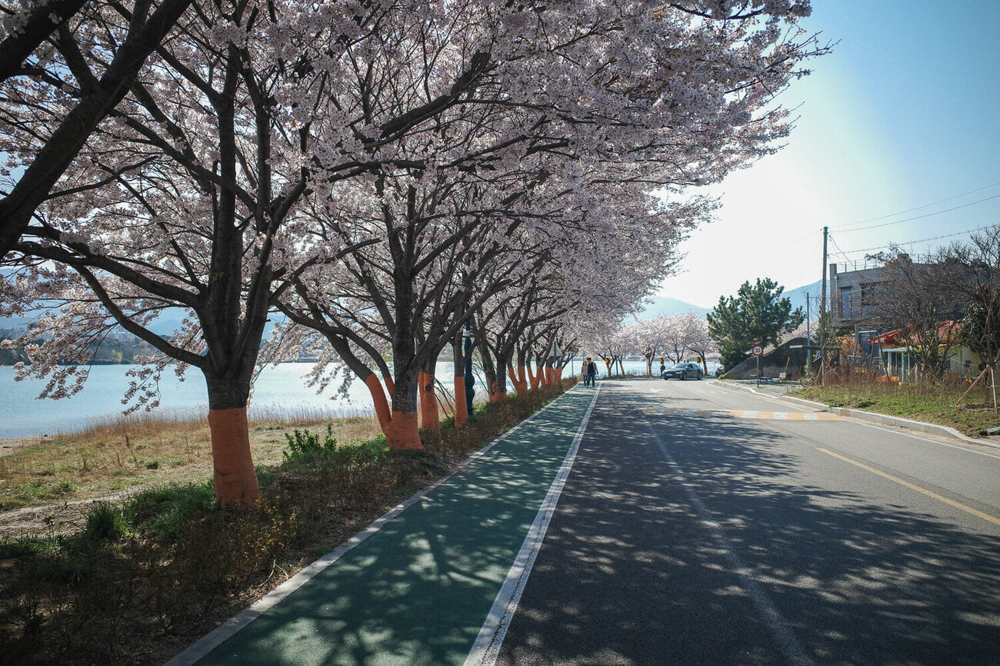

힘겨웠던 프로젝트가 끝나갈 무렵 지인들과 함께 속초로 여행을 갔다. 강원도는 멀고 교통이 불편하다는 인식 때문에 망설여 졌지만, 코로나 바이러스로 미국 출장이 취소되고 사회적 거리두기에 답답함을 느꼈던 터라 아무말 없이 다녀왔다.

강원도는 군 시절의 기억과 교통의 불편함으로 여행지 리스트에서 제외되곤 했다. 하지만 지금은 속초로 직접 갈 수 있는 고속도로도 생겼고. 고성 위쪽에 군사 통제에서 벗어난 인적 드문 해변가의 소식도 있어서 얼마 전부터 관심이 생겼다.

성남에서 출발하여 약 2시간정도만에 영랑호 앞 숙소에 도착할 수 있었다. airbnb 로 독채를 빌린줄 알고 있었는데. 옥탑방 전체였다. 방도 두개고 화장실 샤워실도 있고 무엇보다 풍경이 너무 마음에 들어서 크게 개의치 않았다.

숙소 앞쪽으로는 영랑호, 옆으로 조금만 나가면 바로 동해 바다가 있어서 편하게 놀다 올 수 있었다.

속초 중앙시장의 회 센터는 지하 1층에 있다. 수산시장을 갈 때마다 항상 호객행위와 덤테기를 쓰지 않을까 걱정했는데. 호객행위는 조금 있었지만 무시할만 했고. 덤테기는 딱히 없었던 거 같다. 국내산 농어 두 마리와 이것저것을 회로 먹었는데 너무 맛있었다.

**특히 국내산 농어는 정말 환상적인 맛이었다.**

오징어 순대, 아바이순대도 먹었는데. 오징어순대가 독특하고 맛있었다.

속초 시내 구경만으로는 1박 2일정도가 적절하다. 5월 쯤에 한번 더 올 생각인데 그땐 고성 윗쪽에 있는 군사 통제가 풀린 해변가를 다녀올까 한다.

