군사 통제 지역이였던 고성 근처 해변가들이 통제가 해제되고. 사람의 손이 덜 탄 바닷가들이라 이쁘더라 라는 소식은 한 2년 전 부터 계속 들었다. 하지만 교통이 만만치 않아 계속 가고싶다는 말만 해왔었다가 며칠 전에 다녀왔다.

사실 통제가 풀리고 사람들이 자유롭게 왕래한지는 시간이 많이 흘렀다고 한다. 그래도 누구나 갈 수 있는 곳들보다는 훨씬 자연의 모습을 잃어버리지 않고 있었다. 사람 손이 덜 타야 이쁜 자연환경이 남는 다는 것은 참 슬픈 현실이다.

고속도로 IC의 램프 구간 내에 조성된 작은 공원들이 그 것을 증명하고 있다. 몇 m차이로 극명하게 드러나지 않는가?. 하지만 나도 사람인지라 거들었다고 할 수 있다. 다만 최대한 자연을 해치지 않으려 노력할 뿐이다.

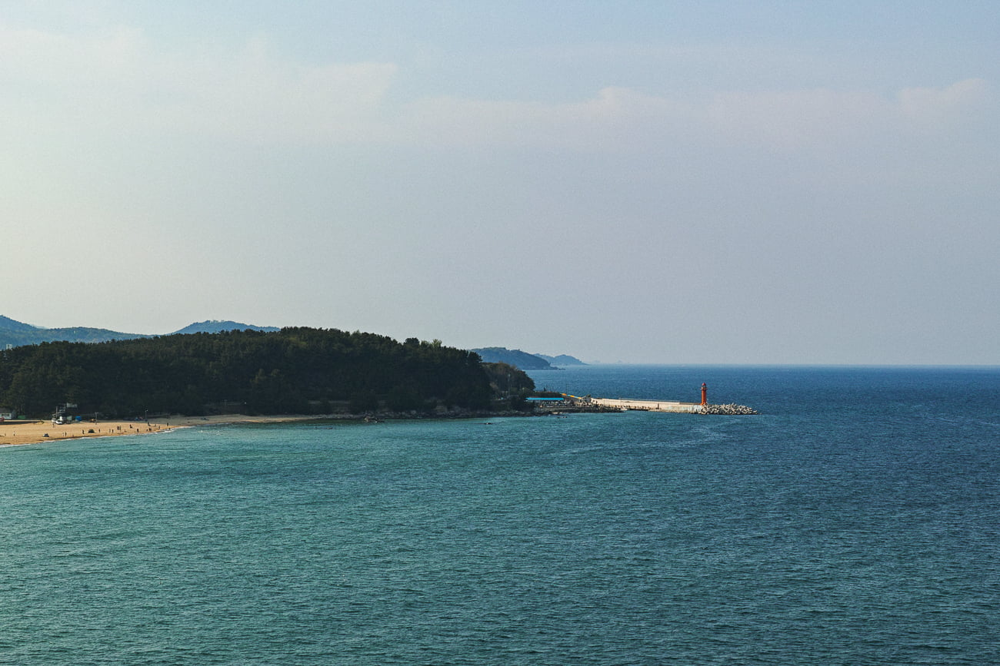

원래 고성 통일전망대를 다녀오려고 했으나. 현재 코로나 바이러스로 인하여 잠정적으로 폐쇄되었다고 한다. 해서 완전 북쪽까지는 못가고 화진포의 성을 다녀왔다.

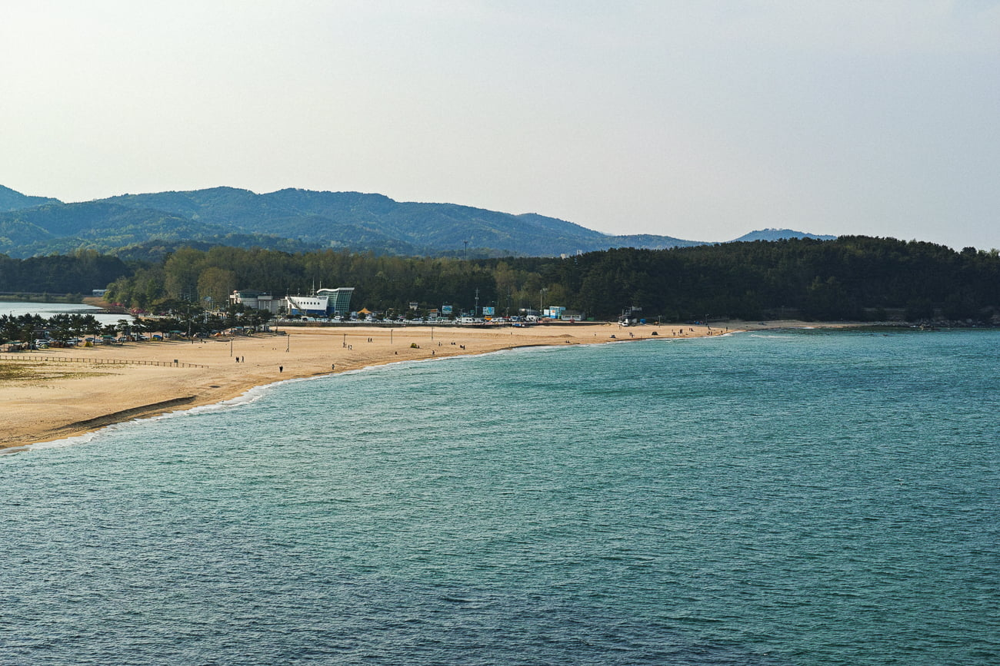

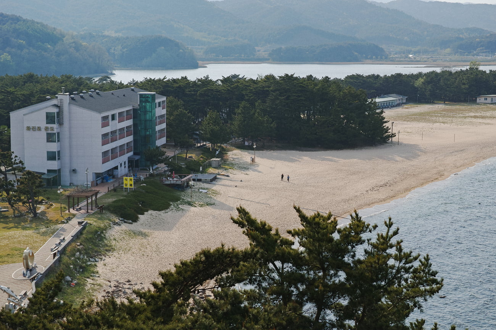

[화진포의 성](https://namu.wiki/w/%ED%99%94%EC%A7%84%ED%8F%AC%EC%9D%98%20%EC%84%B1)은 일제강점기 말 때 독일인 건축가에 의해 지어진 건물로. 원래는 영국 선교사들의 예배당으로 사용되다. 이후 김일성과 북한군 간부들의 휴양지로 사용했다고 한다.

전쟁 이후에는 한국군이 점령하여. 건물을 철거하고 재건축하여 육군 및 사병들의 휴양지로 사용하다. 지금은 일반에 공개하여 안보전시관으로 활용되고 있다.

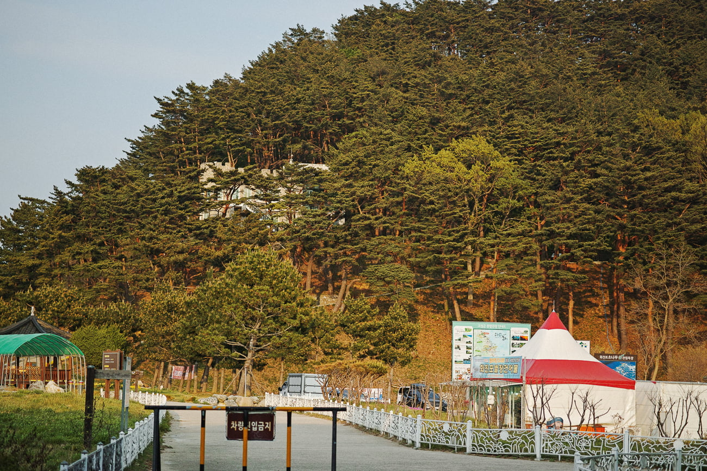

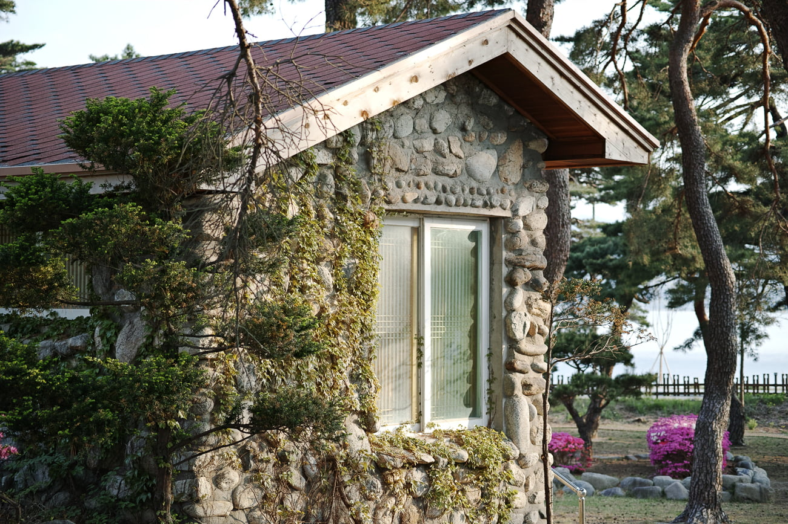

근처에 소나무숲길이 있는데 영국 선교사들이 골프연습을 하던 시설이 조그맣게 남아있다. 일단 별장으로 관리되던 곳이다 보니 말끔하게 정리되어 있어서 어떻게 찍어도 이쁜 사진이 나왔다.

이 곳 일대는 특이하게 산들이 모두 소나무로 덮여 있어서. 고요하고 산책하면 솔방울 밟는 소리가 너무 기분좋게 울리는 곳이었다.

---

이어서 남쪽으로 조금 내려와 송지호해수욕장에 갔다. 이 때가 해질녘이었는데 금색의 햇볓이 드리운 해변가의 풍경이 너무 좋았다. 이 곳은 해변가에서 조금 떨어진 곳에 죽도라는 작은 섬이 있는데. 그래서 상당히 이국적인 풍경을 담을 수 있었다.

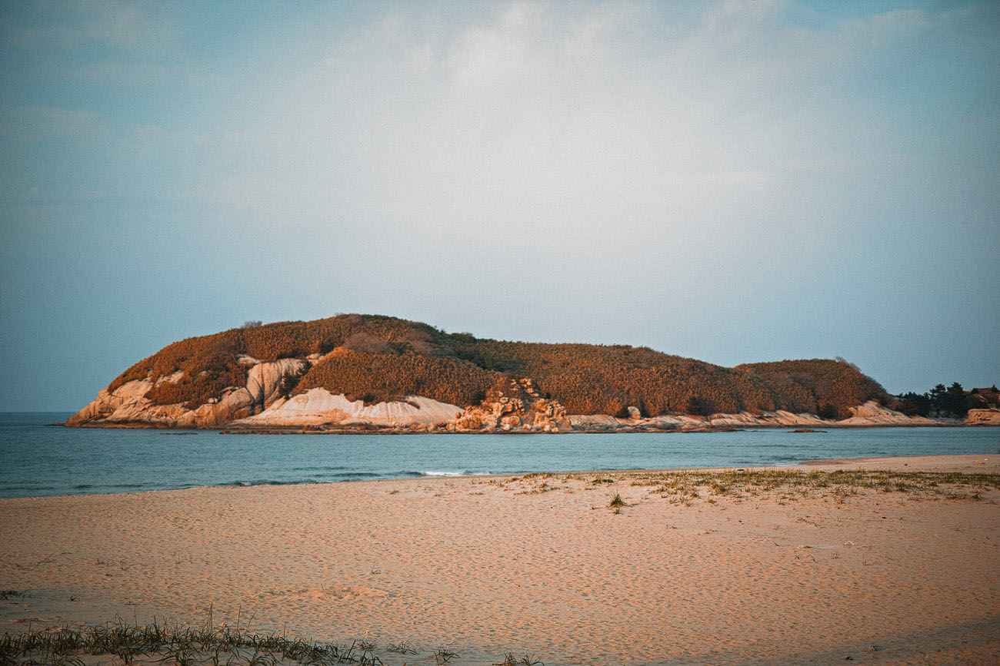

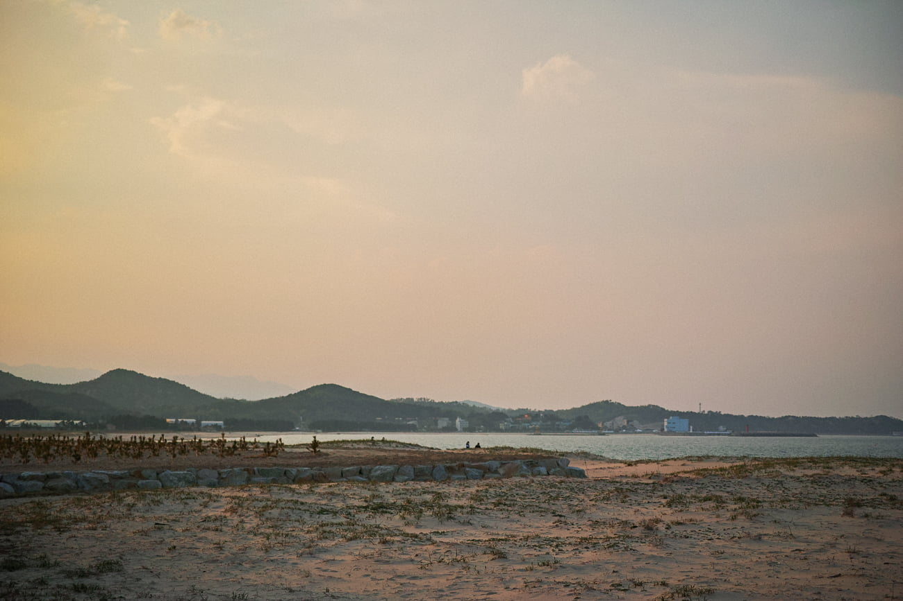

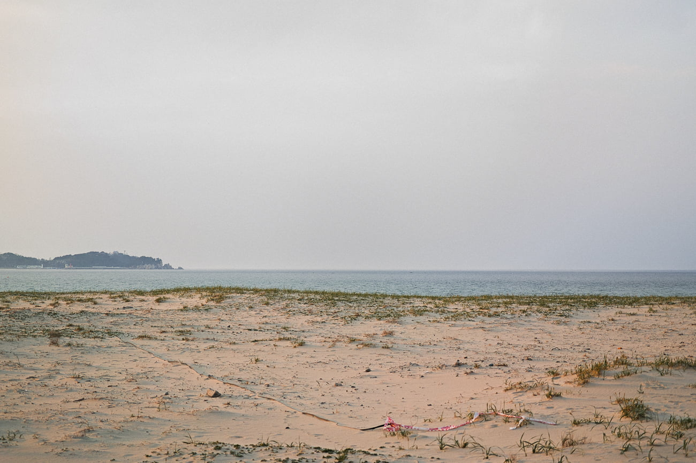

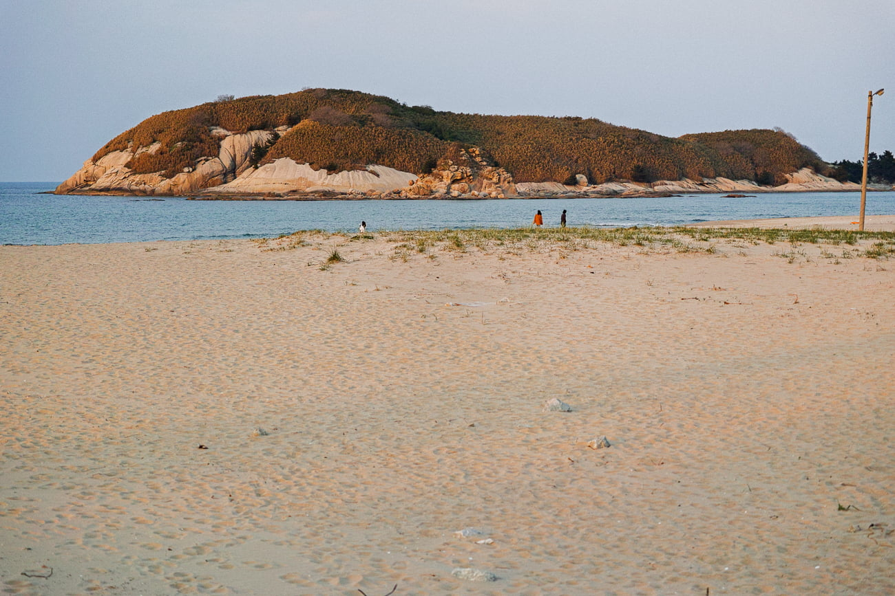

다만 바로 옆에 큰 호텔이 들어와서인지는 몰라도 해변가 안쪽에 공사 가벽과 쓰레기들이 방치되어 있었다. 이제 이 곳도 몇년 뒤에는 흔한 풍경이 되어 버릴 것이다. 그렇게 되기 전에 여러번 와서 풍경을 담아 가고 싶다.

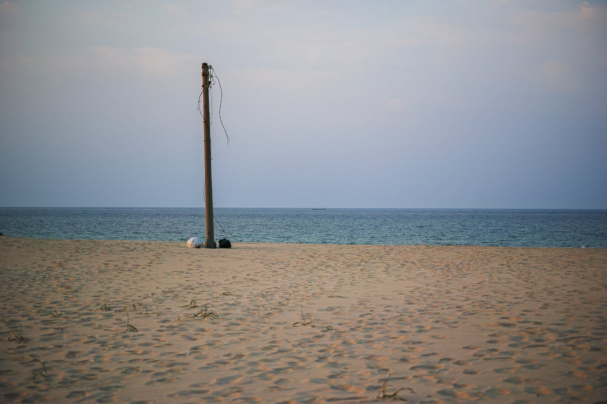

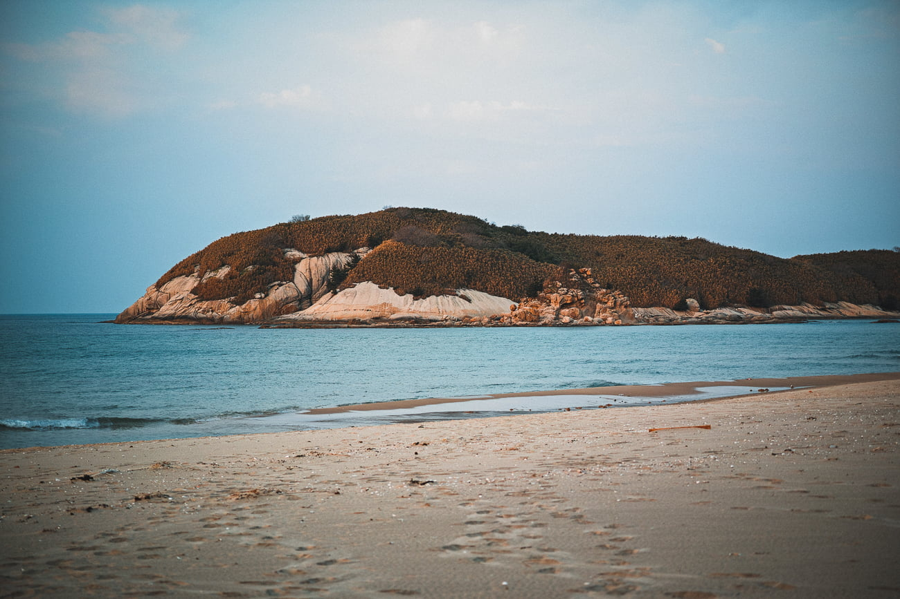

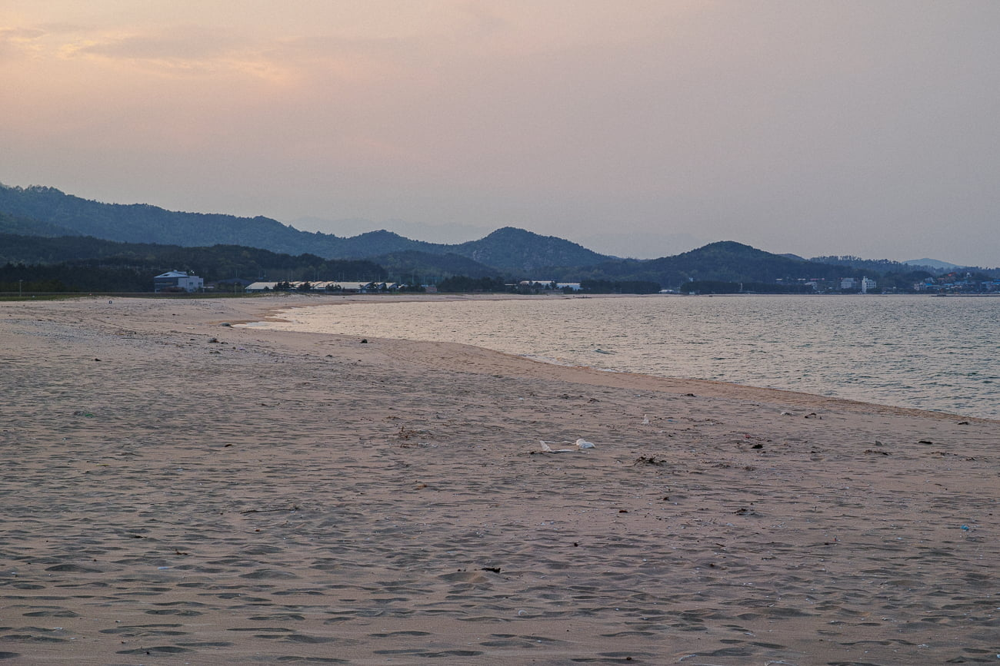

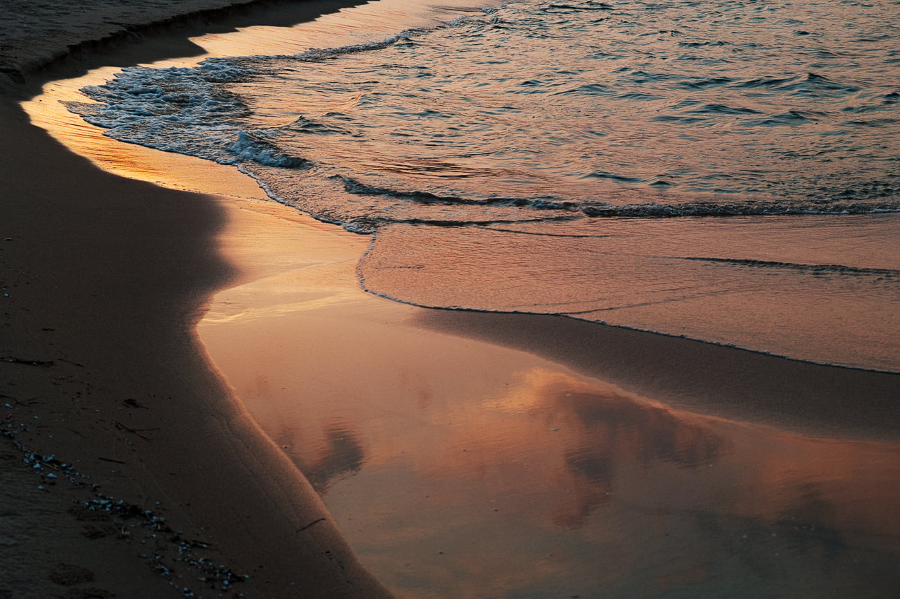
