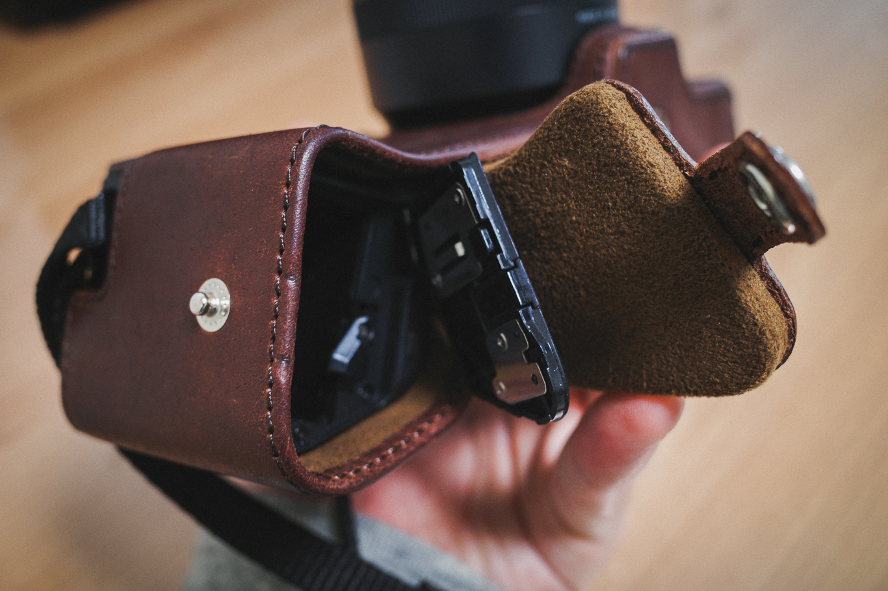
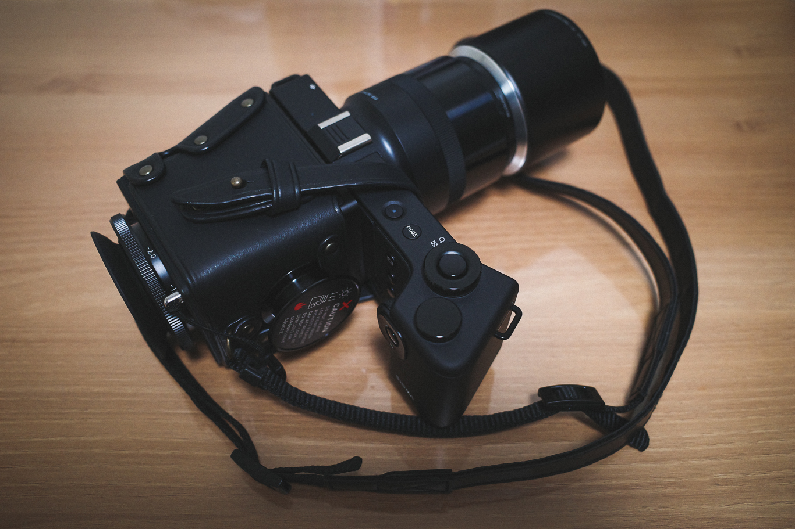

쓰던 카메라를 모두 팔고 한동안 GR3만으로 버티다 보니 망원에 대한 갈증이 생기기 시작했다. 커뮤니티에 종종 올라오는 질문 중 하나가 '스마트폰 카메라가 디지털 카메라를 따라잡지 않았나요?'인데. 화각에 따른 왜곡을 제외하고는 따라잡았다는 댓글을 달다 보니 더욱 더 망원이 그리웠던 것 같다.

그래서 시그마 FP의 포베온 버전을 기다리고 있었다. 라이카 75mm APO렌즈 조합이라면 무게는 안드로메다행이지만 부피는 작으니까 만족스러울 것으로 생각하고 구매하려고 했는데 포베온 버전의 개발이 무기한 연기되었다. 결국 기다리다 지쳐 시그마 DP3 Quattro 를 구입하게 되었다.

화각은 50mm로 풀 프레임 환산 75mm로 인물사진을 촬영하는데 안성맞춤이다. 화소는 33MP로 대형인화에도 크게 무리가 없고 실제로 포베온 센서의 특징으로 오히려 일반 베이어 레이어 센서보다 적은 화소에도 또렷한 이미지 품질을 보인다 한다. 중형에 필적한다고 하는데 2달정도 사용해보니 필적할 정도는 아니지만 확실히 이전에 사용했던 소니 미러리스보다 세부 묘사가 뛰어나다는것을 알 수 있었다.

특징적인 외관 때문에 핸들링이 불편하거나 하진 않지만 딱히 편하다는 생각도 들지 않는다. 체감되는 단점은 기존에 썼던 가방에 넣을 때 저 독특한 외관때문에 공간을 효율적으로 사용할 수 없다는 점이다. 여기에 1.2x 컨버전 렌즈를 끼운 상태라면 더욱 수납 효율이 떨어진다.

자동초점은 요즘 나오는 카메라들과 비교하면 형편없다. 오죽하면 자동초점 검출 범위를 근거리 중거리 원거리로 나눌 수 있는 기능까지 제공할까. 이 부분에서 호불호가 갈리는 것이라 보인다. 나의 경우 Mamiya, Leica등 수동 초점 카메라를 써왔어서 크게 불편하다는 생각이 들지 않았다.

빛이 충분한 낮엔 확실히 좋은 품질의 사진을 보여주니까. 쓰고 싶다는 생각이 든다. 저녁 실내에서 테스트 삼아 촬영해 보니 약간 힘들긴 한데. 보통 저녁에 실내에서 저조도일 때 망원화각의 사진을 찍을 필요가 없어서 그냥 GR3를 쓰면 되니까 문제가 되지 다았다. 카메라 하나에 모든 것을 원한다면 실망할 것이다.

보정 과정에서 필름을 스캔하던 시절이 떠올랐다. 이 말은 두 가지 의미를 내포하는데 하나는 색감을 만질 때 미리보기에서 색감이 반영되는 느낌이 마치 이전에 실버패스트를 사용할때의 느낌과 비슷했다는 점이고. 하나는 그 만큼 느리다는 것이다. 🤣

명부의 보정 관용도는 알려진대로 별로다. 따라서 촬영시 화이트홀이 생기지 않게 하는것이 중요하다. 암부의 경우 너무 어둡지 않으면 거의 대부분 살아난다. 다만 필름과 비교했을 때 DP3Q는 그린, 퍼플 노이즈가 패턴을 띄며 같이 살아난다. 이 노이즈는 SFF, Lightroom, Photoshop셋 다 완벽하게 잡기 어려운데. 컨텐츠를 소비하는 단말에 맞춰 사이즈를 줄일 때 대부분 크게 눈에 띄지 않는 선으로 정리된다.

사진 편집 툴에서 사진을 확대하고 노이즈를 보며 스트레스를 크게 받는 경우 구입을 한번 더 고려해보는것이 좋겠다. 처음엔 나도 스트레스를 받았는데 포베온 센서 특성 상 얻는 장점만큼 잃는 단점이라고 생각하니 크게 문제될 것이 없었고. 앞서 언급한대로 최종 컨텐츠에서는 그닥 거슬리지 않는 정도여서 괜찮았다.

케이스는 2개를 구입해봤는데 하나는 율리시스의 바디수트이고 나머지 하나는 외장 뷰파인더를 장착한채로 사용할 수 있는 가죽 케이스이다. 뷰파인더를 체결한 상태가 멋스러워서 한동안은 후자의 케이스를 씌운 상태로 사용할 거 같다. 율리시스 케이스는 외장 뷰파인더를 고려하지 않은 디자인이다. 이는 정품 가죽 케이스도 마찬가지인데 그래서 활용성이 떨어지는 거 같다.

만약 외장 뷰파인더를 사용하지 않을것이라면 적극 추천한다. 다만 현재 단종이어서 중고로 구할수 밖에 없는 것이 아쉽긴 하다.

뷰 파인더 케이스는 이 글을 쓰는 시점에도 판매하고 있어서 외장 뷰파인더를 쓰는 사용자에게 추천하는 케이스이다. 카메라 본체까지 덮지 않는 점이 아쉽긴 하지만 뷰파인더를 장착한 상태에서도 스트랩이 거슬리지 않게 연결되어서 안정적으로 사용할 수 있다. 그리고 뷰파인더 마개를 끼울 수 있게 되어있는데 이 부분이 무척 마음에 든다.

뷰파인더와 컨버전 렌즈까지 장착하면 사실 부피가 안드로메다로 가지만. 매일 들고다니는 것이 아니고 사진을 찍으려는 목적을 가지고 외출 할 때만 사용하는 것이라 부담스럽다는 생각이 아직은 들지 않는다. 취미로 하는 사진인데 이런 아기자기한 맛은 오히려 즐거움을 주는 부분이 아닐까 싶다.

뷰 파인더 케이스는 오늘 받아서 아직 실사용기는 없다. 앞으로의 글에서 다뤄 볼 예정이다 😁
